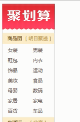
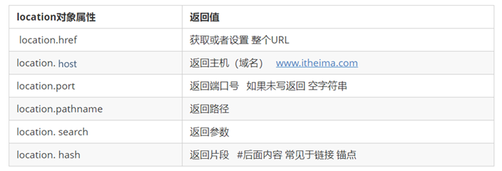

## 本资源由 itjc8.com 收集
# day04 - Web APIs

> 学习目标：
>
> 能够说出常用的3-5个键盘事件
>
> 能够知道如何获取当前键盘按下的是哪个键
>
> 能够知道浏览器的顶级对象window
>
> 能够使用window.onload事件
>
> 能够使用window.onresize事件
>
> 能够说出两种定时器的区别
>
> 能够使用location对象的href属性完成页面之间的跳转
>
> 能够使用location对象获取url中的参数部分
>
> 能够使用history提供的方法实现页面刷新

## 1.1. 常用的键盘事件

### 1.1.1 键盘事件


```js
    <script>
        // 常用的键盘事件
        //1. keyup 按键弹起的时候触发 
        document.addEventListener('keyup', function() {
            console.log('我弹起了');
        })

        //3. keypress 按键按下的时候触发  不能识别功能键 比如 ctrl shift 左右箭头啊
        document.addEventListener('keypress', function() {
                console.log('我按下了press');
        })
        //2. keydown 按键按下的时候触发  能识别功能键 比如 ctrl shift 左右箭头啊
        document.addEventListener('keydown', function() {
                console.log('我按下了down');
        })
        // 4. 三个事件的执行顺序  keydown -- keypress -- keyup
    </script>
```

### 1.1.2 键盘事件对象


**使用keyCode属性判断用户按下哪个键**

```js
    <script>
        // 键盘事件对象中的keyCode属性可以得到相应键的ASCII码值
        document.addEventListener('keyup', function(e) {
            console.log('up:' + e.keyCode);
            // 我们可以利用keycode返回的ASCII码值来判断用户按下了那个键
            if (e.keyCode === 65) {
                alert('您按下的a键');
            } else {
                alert('您没有按下a键')
            }
        })
        document.addEventListener('keypress', function(e) {
            // console.log(e);
            console.log('press:' + e.keyCode);
        })
    </script>
```

### 1.1.3 案例：模拟京东按键输入内容

当我们按下 s 键， 光标就定位到搜索框（文本框获得焦点）。


> 注意：触发获得焦点事件，可以使用 元素对象.focus()

```js
    <input type="text">
    <script>
        // 获取输入框
        var search = document.querySelector('input');
		// 给document注册keyup事件
        document.addEventListener('keyup', function(e) {
            // 判断keyCode的值
            if (e.keyCode === 83) {
                // 触发输入框的获得焦点事件
                search.focus();
            }
        })
    </script>
```

### 1.1.4 案例：模拟京东快递单号查询

要求：当我们在文本框中输入内容时，文本框上面自动显示大字号的内容。


```js
    <div class="search">
        <div class="con">123</div>
        <input type="text" placeholder="请输入您的快递单号" class="jd">
    </div>
    <script>
        // 获取要操作的元素
        var con = document.querySelector('.con');
        var jd_input = document.querySelector('.jd');
		// 给输入框注册keyup事件
        jd_input.addEventListener('keyup', function() {
				// 判断输入框内容是否为空
                if (this.value == '') {
                    // 为空，隐藏放大提示盒子
                    con.style.display = 'none';
                } else {
                    // 不为空，显示放大提示盒子，设置盒子的内容
                    con.style.display = 'block';
                    con.innerText = this.value;
                }
            })
        // 给输入框注册失去焦点事件，隐藏放大提示盒子
        jd_input.addEventListener('blur', function() {
                con.style.display = 'none';
            })
        // 给输入框注册获得焦点事件
        jd_input.addEventListener('focus', function() {
            // 判断输入框内容是否为空
            if (this.value !== '') {
                // 不为空则显示提示盒子
                con.style.display = 'block';
            }
        })
    </script>
```

## 1.2. BOM

### 1.2.1. 什么是BOM

​	BOM（Browser Object Model）即浏览器对象模型，它提供了独立于内容而与浏览器窗口进行交互的对象，其核心对象是 window。

​	BOM 由一系列相关的对象构成，并且每个对象都提供了很多方法与属性。

​	BOM 缺乏标准，JavaScript 语法的标准化组织是 ECMA，DOM 的标准化组织是 W3C，BOM 最初是Netscape 浏览器标准的一部分。


### 1.2.2. BOM的构成

BOM 比 DOM 更大，它包含 DOM。


### 1.2.3. 顶级对象window


### 1.2.4. window对象的常见事件

#### 页面（窗口）加载事件（2种）

**第1种**


window.onload 是窗口 (页面）加载事件，**当文档内容完全加载完成**会触发该事件(包括图像、脚本文件、CSS 文件等), 就调用的处理函数。


**第2种**


​	DOMContentLoaded 事件触发时，仅当DOM加载完成，不包括样式表，图片，flash等等。

​	IE9以上才支持！！！

​	如果页面的图片很多的话, 从用户访问到onload触发可能需要较长的时间, 交互效果就不能实现，必然影响用户的体验，此时用 DOMContentLoaded 事件比较合适。

```js
    <script>
        window.addEventListener('load', function() {
            var btn = document.querySelector('button');
            btn.addEventListener('click', function() {
                alert('点击我');
            })
        })
        window.addEventListener('load', function() {
            alert(22);
        })
        document.addEventListener('DOMContentLoaded', function() {
            alert(33);
        })
    </script>
```

#### 调整窗口大小事件


​	window.onresize 是调整窗口大小加载事件,  当触发时就调用的处理函数。

注意：

1. 只要窗口大小发生像素变化，就会触发这个事件。

2. 我们经常利用这个事件完成响应式布局。 window.innerWidth 当前屏幕的宽度

```js
    <script>
        // 注册页面加载事件
        window.addEventListener('load', function() {
            var div = document.querySelector('div');
        	// 注册调整窗口大小事件
            window.addEventListener('resize', function() {
                // window.innerWidth 获取窗口大小
                console.log('变化了');
                if (window.innerWidth <= 800) {
                    div.style.display = 'none';
                } else {
                    div.style.display = 'block';
                }
            })
        })
    </script>
    <div></div>
```


### 1.2.5. 定时器（两种）

window 对象给我们提供了 2 个非常好用的方法-定时器。

- setTimeout() 

- setInterval()  

#### setTimeout() 炸弹定时器

##### 开启定时器


> ```
> 普通函数是按照代码顺序直接调用。
> 
> 简单理解： 回调，就是回头调用的意思。上一件事干完，再回头再调用这个函数。
> 例如：定时器中的调用函数，事件处理函数，也是回调函数。
> 
> 以前我们讲的   element.onclick = function(){}   或者  element.addEventListener(“click”, fn);   里面的 函数也是回调函数。
> 
> ```


```js
    <script>
        // 回调函数是一个匿名函数
         setTimeout(function() {
             console.log('时间到了');

         }, 2000);
        function callback() {
            console.log('爆炸了');
        }
		// 回调函数是一个有名函数
        var timer1 = setTimeout(callback, 3000);
        var timer2 = setTimeout(callback, 5000);
    </script>
```

##### 案例：5秒后关闭广告




```js
<body>
    
    <script>
        // 获取要操作的元素
        var ad = document.querySelector('.ad');
		// 开启定时器
        setTimeout(function() {
            ad.style.display = 'none';
        }, 5000);
    </script>
</body>
```

##### 停止定时器


```js
    <button>点击停止定时器</button>
    <script>
        var btn = document.querySelector('button');
		// 开启定时器
        var timer = setTimeout(function() {
            console.log('爆炸了');
        }, 5000);
		// 给按钮注册单击事件
        btn.addEventListener('click', function() {
            // 停止定时器
            clearTimeout(timer);
        })
    </script>
```


#### setInterval() 闹钟定时器

##### 开启定时器


```js
    <script>
        // 1. setInterval 
        setInterval(function() {
            console.log('继续输出');
        }, 1000);
    </script>
```

##### 案例：倒计时


```js
    <div>
        <span class="hour">1</span>
        <span class="minute">2</span>
        <span class="second">3</span>
    </div>
    <script>
        // 1. 获取元素（时分秒盒子） 
        var hour = document.querySelector('.hour'); // 小时的黑色盒子
        var minute = document.querySelector('.minute'); // 分钟的黑色盒子
        var second = document.querySelector('.second'); // 秒数的黑色盒子
        var inputTime = +new Date('2019-5-1 18:00:00'); // 返回的是用户输入时间总的毫秒数

        countDown(); // 我们先调用一次这个函数，防止第一次刷新页面有空白 

        // 2. 开启定时器
        setInterval(countDown, 1000);
		
        function countDown() {
            var nowTime = +new Date(); // 返回的是当前时间总的毫秒数
            var times = (inputTime - nowTime) / 1000; // times是剩余时间总的秒数 
            var h = parseInt(times / 60 / 60 % 24); //时
            h = h < 10 ? '0' + h : h;
            hour.innerHTML = h; // 把剩余的小时给 小时黑色盒子
            var m = parseInt(times / 60 % 60); // 分
            m = m < 10 ? '0' + m : m;
            minute.innerHTML = m;
            var s = parseInt(times % 60); // 当前的秒
            s = s < 10 ? '0' + s : s;
            second.innerHTML = s;
        }
    </script>
```

##### 停止定时器


#### 案例：发送短信倒计时

​	点击按钮后，该按钮60秒之内不能再次点击，防止重复发送短信。


```js
    手机号码： <input type="number"> <button>发送</button>
    <script>
        var btn = document.querySelector('button');
		// 全局变量，定义剩下的秒数
        var time = 3; 
		// 注册单击事件
        btn.addEventListener('click', function() {
            // 禁用按钮
            btn.disabled = true;
            // 开启定时器
            var timer = setInterval(function() {
                // 判断剩余秒数
                if (time == 0) {
                    // 清除定时器和复原按钮
                    clearInterval(timer);
                    btn.disabled = false;
                    btn.innerHTML = '发送';
                } else {
                    btn.innerHTML = '还剩下' + time + '秒';
                    time--;
                }
            }, 1000);
        });
    </script>
```


### 1.2.6. this指向问题

​	this的指向在函数定义的时候是确定不了的，只有函数执行的时候才能确定this到底指向谁，一般情况下this的最终指向的是那个调用它的对象。

现阶段，我们先了解一下几个this指向

1. 全局作用域或者普通函数中this指向全局对象window（注意定时器里面的this指向window）

2. 方法调用中谁调用this指向谁
3. 构造函数中this指向构造函数的实例

```js
    <button>点击</button>
    <script>
        // this 指向问题 一般情况下this的最终指向的是那个调用它的对象
        // 1. 全局作用域或者普通函数中this指向全局对象window（ 注意定时器里面的this指向window）
        console.log(this);
        function fn() {
            console.log(this);
        }
        window.fn();
        window.setTimeout(function() {
            console.log(this);
        }, 1000);
        // 2. 方法调用中谁调用this指向谁
        var o = {
            sayHi: function() {
                console.log(this); // this指向的是 o 这个对象
            }
        }
        o.sayHi();
        var btn = document.querySelector('button');
        btn.addEventListener('click', function() {
                console.log(this); // 事件处理函数中的this指向的是btn这个按钮对象
            })
        // 3. 构造函数中this指向构造函数的实例
        function Fun() {
            console.log(this); // this 指向的是fun 实例对象
        }
        var fun = new Fun();
    </script>
```


### 1.2.7. location对象

#### 什么是 location 对象


#### URL


#### location 对象的属性




#### 案例：5分钟自动跳转页面


```js
    <button>点击</button>
    <div></div>
    <script>
        var btn = document.querySelector('button');
        var div = document.querySelector('div');
        btn.addEventListener('click', function() {
            // console.log(location.href);
            location.href = 'http://www.itcast.cn';
        })
        var timer = 5;
        setInterval(function() {
            if (timer == 0) {
                location.href = 'http://www.itcast.cn';
            } else {
                div.innerHTML = '您将在' + timer + '秒钟之后跳转到首页';
                timer--;
            }
        }, 1000);
    </script>
```

#### 案例：获取URL参数


```js
    <div></div>
	<script>
        console.log(location.search); // ?uname=andy
        // 1.先去掉？  substr('起始的位置'，截取几个字符);
        var params = location.search.substr(1); // uname=andy
        console.log(params);
        // 2. 利用=把字符串分割为数组 split('=');
        var arr = params.split('=');
        console.log(arr); // ["uname", "ANDY"]
        var div = document.querySelector('div');
        // 3.把数据写入div中
        div.innerHTML = arr[1] + '欢迎您';
    </script>
```

#### location对象的常见方法


```js
    <button>点击</button>
    <script>
        var btn = document.querySelector('button');
        btn.addEventListener('click', function() {
            // 记录浏览历史，所以可以实现后退功能
            // location.assign('http://www.itcast.cn');
            // 不记录浏览历史，所以不可以实现后退功能
            // location.replace('http://www.itcast.cn');
            location.reload(true);
        })
    </script>
```

### 1.2.8. navigator对象

​	navigator 对象包含有关浏览器的信息，它有很多属性，我们最常用的是 userAgent，该属性可以返回由客户机发送服务器的 user-agent 头部的值。

下面前端代码可以判断用户那个终端打开页面，实现跳转

```js
if((navigator.userAgent.match(/(phone|pad|pod|iPhone|iPod|ios|iPad|Android|Mobile|BlackBerry|IEMobile|MQQBrowser|JUC|Fennec|wOSBrowser|BrowserNG|WebOS|Symbian|Windows Phone)/i))) {
    window.location.href = "";     //手机
 } else {
    window.location.href = "";     //电脑
 }
```

### 1.2.9 history对象

​	window对象给我们提供了一个 history对象，与浏览器历史记录进行交互。该对象包含用户（在浏览器窗口中）访问过的URL。


history对象一般在实际开发中比较少用，但是会在一些 OA 办公系统中见到。


## 1.3. JS执行机制

以下代码执行的结果是什么？

```js
 console.log(1);
 
 setTimeout(function () {
     console.log(3);
 }, 1000);
 
 console.log(2);
```

以下代码执行的结果是什么？

```js
 console.log(1);
 
 setTimeout(function () {
     console.log(3);
 }, 0);
 
 console.log(2);
```


### 1.3.1 JS 是单线程


```js
	单线程就意味着，所有任务需要排队，前一个任务结束，才会执行后一个任务。如果前一个任务耗时很长，后一个任务就不得不一直等着。
	这样所导致的问题是： 如果 JS 执行的时间过长，这样就会造成页面的渲染不连贯，导致页面渲染加载阻塞的感觉。
```

### 1.3.2 同步任务和异步任务

​	单线程导致的问题就是后面的任务等待前面任务完成，如果前面任务很耗时（比如读取网络数据），后面任务不得不一直等待！！

​	为了解决这个问题，利用多核 CPU 的计算能力，HTML5 提出 Web Worker 标准，允许 JavaScript 脚本创建多个线程，但是子线程完全受主线程控制。于是，JS 中出现了**同步任务**和**异步任务**。

#### 同步

​	前一个任务结束后再执行后一个任务，程序的执行顺序与任务的排列顺序是一致的、同步的。比如做饭的同步做法：我们要烧水煮饭，等水开了（10分钟之后），再去切菜，炒菜。

#### 异步

​	你在做一件事情时，因为这件事情会花费很长时间，在做这件事的同时，你还可以去处理其他事情。比如做饭的异步做法，我们在烧水的同时，利用这10分钟，去切菜，炒菜。


> ```js
> JS中所有任务可以分成两种，一种是同步任务（synchronous），另一种是异步任务（asynchronous）。
> 
> 同步任务指的是：
> 	在主线程上排队执行的任务，只有前一个任务执行完毕，才能执行后一个任务；
> 异步任务指的是：
> 	不进入主线程、而进入”任务队列”的任务，当主线程中的任务运行完了，才会从”任务队列”取出异步任务放入主线程执行。
> ```


### 1.3.3 JS执行机制（事件循环）


### 1.3.4 代码思考题

```js
 console.log(1);
 document.onclick = function() {
   console.log('click');
 }

 setTimeout(function() {
   console.log(3)
 }, 3000)
 console.log(2);
```

