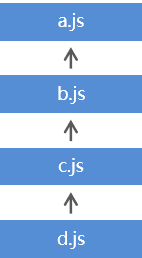
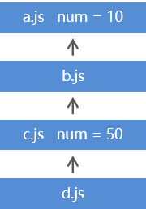
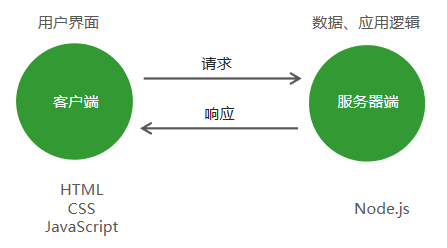
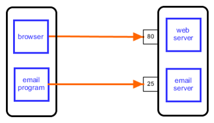
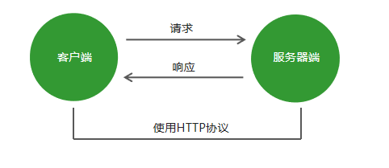
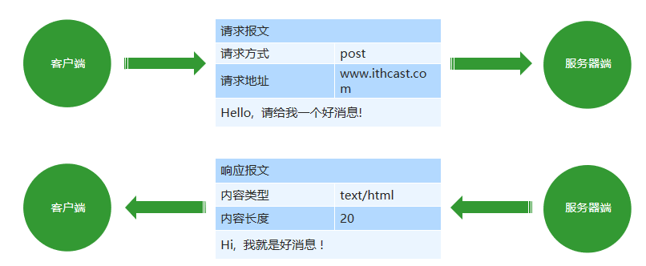
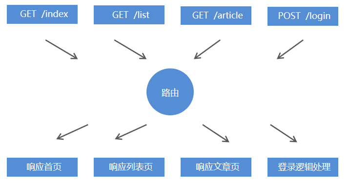
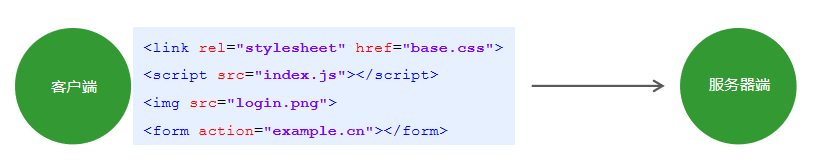
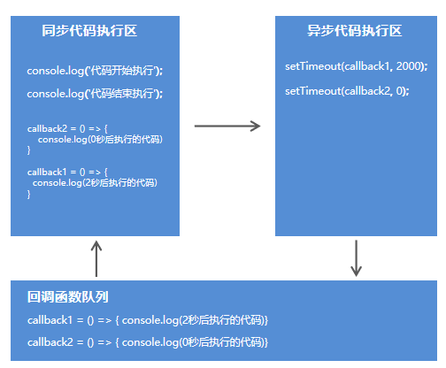

# 一、Node.js基础（day01）

## 1、Node开发概述

### 	1.1 Node是什么？

* <font color=red>Node是</font>一个基于Chrome V8引擎的JavaScript<font color=red>代码运行环境</font>


## 2、Node运行环境搭建

### 	2.1 Node.js运行环境安装

官网：https://nodejs.org/en/

（LTS = Long Term Support 长期支持版 稳定版）（选择这个）

（Current 拥有最新特性 实验版）

### 2.2 Node环境安装失败解决办法 (第二部分P124)

<font size=4>**1.错误代号<font color=red>2502、2503</font>**</font>

失败原因：系统帐户权限不足。

解决办法：

1. 以管理员身份运行powershell命令行工具
2. 输入运行安装包命令 msiexec /package node安装包位置

<font size=4>**2. 执行命令报错**</font>

失败原因：Node安装目录写入环境变量失败

解决办法：将Node安装目录添加到环境变量中


### 2.3 <font color=red>path环境变量</font>

存储系统中的目录，在命令行中执行命令的时候系统会自动去这些目录中查找命令的位置。


## 3、Node.js快速入门

### 3.1 Node.js的组成

* JavaScript 由三部分组成，<font color=blue>ECMAScript，DOM，BOM。</font>

* Node.js是由<font color=red>ECMAScript</font>及<font color=red>Node 环境</font>提供的一些<font color=red>附加API</font>组成的，包括文件、网络、路径等等一些更加强大的 API。

  

### 3.2 Node.js基础语法 (P125)

* 1. 所有ECMAScript语法在Node环境中都可以使用。

* 2. 在Node环境下执行代码，使用Node命令执行后缀为.js的文件即可

* 3. 命令行目录必须和当前js目录一致，用cd ../(上一层) （回车）然后再往下找，和html找目录一样，每找一层一个回车。 <font color=red>另一个方法就是在当前js下按shift，然后右击该js文件在powershell打开。接着node +空格+ 该目录路径（可输开头然后按tab键</font>

* 4. <font color=red>clear</font>可去除之前的全部命令行

* 5. 按 ↑ 可以重复上面的命令

  

### 3.3 Node.js全局对象global

在<font color=red>浏览器</font>中全局对象是<font color=red>window</font>，在<font color=red>Node</font>中全局对象是<font color=red>global。</font>

Node中全局对象下有以下方法，可以在任何地方使用，global可以省略。

* console.log()     在控制台中输出
* setTimeout()     设置超时定时器
* clearTimeout()  清除超时时定时器
* setInterval()      设置间歇定时器
* clearInterval()   清除间歇定时器


# 二、模块化加载及第三方包（P126)

## 1、Node.js模块化开发

### 1.1 JavaScript开发弊端

JavaScript在使用时存在两大问题，<font color=red>文件依赖</font>和<font color=red>命名冲突。</font>

                


### 1.2 软件中的模块化开发

一个功能就是一个模块，多个模块可以组成完整应用，抽离一个模块不会影响其他功能的运行。


### 1.3 Node.js中模块化开发规范

Node.js规定<font color=red>一个JavaScript文件</font>就是一个模块，模块<font color=red>内部定义的变量和函数</font>默认情况下在<font color=red>外部无法得到</font>

模块内部可以使用<font color=red>exports对象进行成员导出</font>， 使用<font color=red>require方法</font>导入其他模块。

                                            				

​		加法函数                                                                                  A模块（直接声明变量） = require（a.js）

​		减法函数																					A模块.加法（）

​		乘法函数                          ——————————>				  A模块.减法（）

​		除法函数																					（<font color=red>require的返回值就是exports的属性</font>）

exports.加法 = 加法

exports.减法 = 减法

（<font color=red>相当与把函数变为exports的属性</font>）       


### 1.4 模块成员导出   	

``` javascript
// a.js
  // 在模块内部定义变量
 let version = 1.0;
 // 在模块内部定义方法
 const sayHi = name => `您好, ${name}`;
 // 向模块外部导出数据 
 exports.version = version;
 exports.sayHi = sayHi;

```

### 1.5 模块成员的导入

``` javascript
 // b.js
  // 在b.js模块中导入模块a
 let a = require('./b.js');   //引号和./不能少
  // 输出b模块中的version变量
 console.log(a.version);
  // 调用b模块中的sayHi方法 并输出其返回值
 console.log(a.sayHi('黑马讲师')); 

```

导入模块时后缀可以省略(.js可以省略)


### 1.6 模块成员导出的另一种方式

``` javascript
module.exports.version = version;
module.exports.sayHi = sayHi;
```

<font color=red>exports</font>对象是<font color=red>module.exports</font>对象的别名(<font color=red>地址引用关系</font>)，他们指向同一个地址，如果他们两个的指向发生了变化，<font color=red>导出对象最终以module.exports对象为准</font>，此时exports对象不生效。


## 2、系统模块

### 2.1 什么是系统模块

<font color=red>Node运行环境提供的API</font>. 因为这些API都是以模块化的方式进行开发的, 所以我们又称Node运行环境提供的API为系统模块

eg：文件模块（fs）：读取文件、写入文件、创建文件夹


### 2.2 系统模块fs 文件操作

f：file 文件 ，s：system 系统，文件操作系统。

``` javascript
const fs = require('fs');  //模块的引入，这是第一步，必须的
```

**（1）读取文件内容**

``` javascript
fs.readFile('文件路径/文件名称'[,'文件编码'], callback);
```

**读取文件示例**

``` javascript
//读取上一级css目录下的base.css
fs.readFire(../css/base.css, 'utf-8'，(err,doc) => {
    //如果文件读取发生错误，参数err的值为错误对象，否则err的值为null
    //doc参数为文件内容
    if(err == null) {
        //输出文件内容
        console.log(doc)
    }
})
```

<font color=red>注：Node.js中API的第一个参数都是err</font>

<font color=red>注</font>：读取内容是硬盘在读取，需要时间，不能通过readFire的返回值获取，所以通过回调函数，等硬盘读取完通过回调函数获取文件内容(通过参数的形式传递过来)。


**（2）写入文件内容**

``` javascript
fs.writeFile('文件路径/文件名称', '数据', callback);
```


**示例**

``` javascript
 const content = '<h3>正在使用fs.writeFile写入文件内容</h3>';
 fs.writeFile('../index.html', content, err => {
   if (err != null) { 
       console.log(err);
       return;
   }
   console.log('文件写入成功');
 });
//这里的err参数和上面的readFile里的一样
```


### 2.3 系统模块path 路径操作

**为什么要进行路径拼接 **

* 不同操作系统的路径分隔符不统一

* /public/uploads/avatar (文件与文件之间)

* Windows 上是 \   /

* Linux 上是 /

  

``` javascript
const path = require('path') //第一步，path模块引入
```


**<font color=red>路径拼接</font>语法**

``` javascript
path.join('路径', '路径', ...)
          
//这个方法不是耗时操作，可以直接获取返回值
```

**示例**

``` javascript
// 导入path模块
 const path = require('path');
  // 路径拼接
 let finialPath = path.join('itcast', 'a', 'b', 'c.css');
  // 输出结果 itcast\a\b\c.css (window下是这个，Linux下的分隔符就不是这个)
 console.log(finialPath);

```


### 2.4 相对路径VS绝对路径 

* <font color=red>大多数情况下使用绝对路径</font>，因为相对路径有时候相对的是命令行工具的当前工作目录

* 在读取文件或者设置文件路径时都会选择绝对路径

* 使用<font color=red>__dirname</font>（两个下划线）获取当前文件(该文件所在的文件夹)所在的绝对路径

  eg: 01node.js 文件在Vscode 的node文件夹下，则直接写__dirname得到的就是Vscode\node,  再用 path.join(____dirname, '01node.js')拼接就是该文件的绝对目录。

  

## 3、第三方模块（包）

### 3.1 什么是第三方模块

<font color =red>别人写好的、具有特定功能的、我们能直接使用的模块</font>即第三方模块，由于第三方模块通常都是由多个文件组成并且被放置在一个文件夹中，所以又名<font color =red>包</font>。


**第三方模块有两种存在形式：**

* 以js文件的形式存在，提供实现项目具体功能的API接口。

* 以命令行工具形式存在，辅助项目开发

  

### 3.2  获取第三方模块

<font color=red>npmjs.com</font>：第三方模块的存储和分发仓库


<font color=red>npm (node package manager)</font> ： node的第三方模块管理工具

* 下载：npm install 模块名称
* 卸载：npm unintall  模块名称

全局安装与本地安装

* 命令行工具：全局安装
* 库文件：本地安装


### 3.3 第三方模块 nodemon （监控保存操作）

<font color =red>nodemon是一个命令行工具，用以辅助项目开发。</font>
在Node.js中，每次修改文件都要在命令行工具中重新执行该文件，非常繁琐。

可以监控文件的保存操作，当文件发生保存操作时就会重新执行该文件

**使用步骤**

1. 使用npm install nodemon <font color=red>–g</font> 下载它
2. 在命令行工具中用nodemon命令替代node命令执行文件
3. 要终止nodemon是在命令行输入Ctrl + c 


### 3.4 第三方模块 nrm（切换npm下载地址）

nrm ( npm registry manager )：<font color=red>npm下载地址切换工具</font>

npm默认的下载地址在国外，国内下载速度慢


**使用步骤**

1. 使用npm install nrm <font color=red>–g</font> 下载它
2. 查询可用下载地址列表 nrm ls
3. 切换npm下载地址: <font color=red>nrm use 下载地址名称</font>


### 3.5 第三方模块 <font color=red>Gulp</font>

基于node平台开发的<font color=red>前端构建工具</font>
将机械化操作编写成任务, 想要执行机械化操作时执行一个命令行命令任务就能自动执行了
<font color=red>用机器代替手工，提高开发效率。</font>

#### 1. **<font size=4>Gulp能做什么</font>**

* 项目上线，HTML、CSS、JS文件压缩合并

* 语法转换（es6、less ...）

* 公共文件抽离

* 修改文件浏览器自动刷新

  

#### 2. <font size=4>**Gulp使用步骤**</font>

1. 使用npm install gulp下载gulp库文件
2. 在项目根目录下建立gulpfile.js文件 （这个文件名不能变）
3. 重构项目的文件夹结构 src目录放置源代码文件 dist目录放置构建后文件
4. 在gulpfile.js文件中编写任务.
5. 在命令行工具中执行gulp任务


#### 3. **<font size=4>Gulp中提供的方法</font>**

* gulp.src()：获取任务要处理的文件 （<font color=red>src里面可以放路径，也可以放一个数组，数组里面存多个路径</font>）
* gulp.dest()：输出文件
* gulp.task()：建立gulp任务 (两个参数，第一个为任务名，第二个为回调函数)
* gulp.watch()：监控文件的变化

**示例**

``` javascript
const gulp = require('gulp');
  // 使用gulp.task()方法建立任务
 gulp.task('first', () => {
    // 获取要处理的文件
    gulp.src('./src/css/base.css') 
    // 将处理后的文件输出到dist目录
    .pipe(gulp.dest('./dist/css'));  //必须把要输出的代码放到.pipe下面
 });

```

<font color=red>这个任务该如何执行</font>: 

* 在命令行中下载一个命令行工具 ：<font color=red>npm install gulp-cli -g</font>    
* 然后就可以在项目的根目录下面执行任务：<font color=red>gulp first </font>（first就是上面的项目名称）
* <font color=red>注</font>：(如果提示Local gulp not found in，则在项目下执行npm install --save-dev gulp 作为项目的开发依赖（devDependencies）安装 再gulp)


#### 4. Gulp插件

* gulp-htmlmin ：html文件压缩
* gulp-csso ：压缩css
* gulp-babel ：JavaScript语法转化(ES6转化为ES5)
* gulp-less: less语法转化
* gulp-uglify ：压缩混淆JavaScript
* gulp-file-include 公共文件包含
* browsersync 浏览器实时同步

**插件使用步骤分三步：** （视频第二部分p138）

​	<font color=red>下载，引用，调用  (参考gulp官方文档)</font>

**示例**（详情查找前端学习资料node第一天代码中的gulpfile.js）：

``` javascript
const gulp = require('gulp');
const htmlmin = require('gulp-htmlmin');  //html压缩, 在命令行中npm install gulp-htmlmin 下载
const fileinclude = require('gulp-file-include'); //抽取公共部分 命令行中npm install --save-dev gulp-file-include下载
const less = require('gulp-less');  //如何在命令行下载看gulp文档
const csso = require('gulp-csso');  //如何在命令行下载看gulp文档
const babel = require('gulp-babel');
const uglify = require('gulp-uglify');
// html任务
// 1.html文件中代码的压缩操作
// 2.抽取html文件中的公共代码
gulp.task('htmlmin', () => {
	gulp.src('./src/*.html')   //*.html是指全部html文件
		.pipe(fileinclude())
		// 压缩html文件中的代码
		.pipe(htmlmin({ collapseWhitespace: true }))
		.pipe(gulp.dest('dist'));
});

//把公共部分剪切到common/header.html中，然后在需要这些公共部分的html中写上@@include('./common/header.html')

// css任务
// 1.less语法转换
// 2.css代码压缩
gulp.task('cssmin', () => {
	// 选择css目录下的所有less文件以及css文件
	gulp.src(['./src/css/*.less', './src/css/*.css'])
		// 将less语法转换为css语法
		.pipe(less())
		// 将css代码进行压缩
		.pipe(csso())
		// 将处理的结果进行输出
		.pipe(gulp.dest('dist/css'))
});

// js任务
// 1.es6代码转换
// 2.代码压缩
gulp.task('jsmin', () => {
	gulp.src('./src/js/*.js')
		.pipe(babel({
			// 它可以判断当前代码的运行环境 将代码转换为当前运行环境所支持的代码
            presets: ['@babel/env']
        }))
        .pipe(uglify())
        .pipe(gulp.dest('dist/js'))
});

// 复制文件夹
gulp.task('copy', () => {

	gulp.src('./src/images/*')
		.pipe(gulp.dest('dist/images'));

	gulp.src('./src/lib/*')
		.pipe(gulp.dest('dist/lib'))
});

// 构建任务(一次性执行上面所有任务)
gulp.task('default', ['htmlmin', 'cssmin', 'jsmin', 'copy']);


如果执行任务时出现Did you forget to signal async completion?，这个问题出现的原因是：gulp 4.0 的任务函数中，如果任务是同步的，需要使用 done 回调。这样做是为了让 gulp 知道你的任务何时完成。
方法一：添加完done回调就可以顺利执行了。
gulp.task('first', (done) => {
    console.log('这是我的第一个gulp 任务');
    // 使用 gulp.src 获取要处理的文件
    gulp.src('./src/css/base.css')
        // gulp.dest 输出要处理的文件
        .pipe(gulp.dest('dist/css'));
    done()
})
方法二：不使用 done 回调也可以正常编译，只需把 gulp 语句 return 返回就可以了
gulp.task('first', () => {
    console.log('这是我的第一个gulp 任务');
    // 使用 gulp.src 获取要处理的文件
    return gulp.src('./src/css/base.css')
        // gulp.dest 输出要处理的文件
        .pipe(gulp.dest('dist/css'));
})

```


## 4、package.json文件

### 4.1 node_modules文件夹的问题

（<font color=red>node_modules是gulp所依赖的一些文件</font>）

1. 文件夹以及文件过多过碎，当我们将项目整体拷贝给别人的时候,，传输速度会很慢很慢. 
2. 复杂的模块依赖关系需要被记录，确保模块的版本和当前保持一致，否则会导致当前项目运行报错


### 4.2 package.json文件的作用  (P142)

<font color=red>项目描述文件</font>，记录了当前项目信息，例如项目名称、版本、作者、github地址、当前项目依赖了哪些第三方模块等。

在项目的根目录下使用<font color=red>npm init -y</font>命令生成。(package.json默认下载在description文件夹下)

<font color=red>只要有package.json在，就会自动记录下npm下载的第三方模块</font>

<font color=blue>所有传项目的时候不用传node_modules文件，我们拿到一个项目是，直接在命令行输入npm install，就会自动去找package.json下的“dependencies”，这里存的就是需要下载的第三方模块和版本号等，电脑会自动下载然后生成node_modules文件夹</font>


### 4.3  项目依赖

* 在项目的开发阶段和线上运营阶段，都需要依赖的第三方包，称为项目依赖
* 使用npm install 包名命令下载的文件会默认被添加到 package.json 文件的 dependencies 字段中

``` javascript
{
    "dependencies": {
        "jquery": "^3.3.1“
    }
 } 
```


### 4.4  开发依赖

* 在项目的开发阶段需要依赖，线上运营阶段不需要依赖的第三方包，称为开发依赖
* 使用<font color=red>npm install 包名 --save-dev</font>命令将包添加到package.json文件的devDependencies字段中

``` javascript
{
    "devDependencies": {
        "gulp": "^3.9.1“
    }
 } 
```


当我们只想下载项目依赖是，只需<font color=red>npm install --production</font>，这样就只会下载dependencies下的模块包


### 4.5 package-lock.json文件的作用

<font color=red>这个文件主要记录模块与模块之间的依赖关系</font>

* 锁定包的版本，确保再次下载时不会因为包版本不同而产生问题
* 加快下载速度，因为该文件中已经记录了项目所依赖第三方包的树状结构和包的下载地址，重新安装时只需下载即可，不需要做额外的工作


<font color=red>package.json中scripts的作用</font>，当命令比较长时，我们可以取一个别名，这个别名就存在scripts中

eg：

``` javascript
"scripts": {
    "build": "nodemon app.js"
}
```

只要在命令行输入 <font color=red>npm run build</font>就可以执行nodemon app.js命令


## 5、 Node.js中模块的加载机制

### 5.1 模块查找规则-当模块拥有路径但没有后缀时

``` javascript
require('./find.js');
require('./find');
```

1. require方法根据模块路径查找模块，如果是完整路径，直接引入模块。
2. 如果模块后缀省略，先找同名JS文件再找同名JS文件夹
3. 如果找到了同名文件夹，找文件夹中的index.js
4. 如果文件夹中没有index.js就会去当前文件夹中的package.json文件中查找main选项中的入口文件
5. 如果找指定的入口文件不存在或者没有指定入口文件就会报错，模块没有被找到


### 5.2 模块查找规则-当模块没有路径且没有后缀时

``` javascript
require('find');
```

1. Node.js会假设它是系统模块
2. 如果不是，Node.js会去node_modules文件夹中
3. 首先看是否有该名字的JS文件
4. 再看是否有该名字的文件夹
5. 如果是文件夹看里面是否有index.js
6. 如果没有index.js查看该文件夹中的package.json中的main选项确定模块入口文件
7. 否则找不到报错


# 三、请求响应原理及HTTP协议（day02  P146开始）

## 1、服务器端基础概念

### 1.1 网站的组成

网站应用程序主要分为两大部分：客户端和服务器端。
客户端：在浏览器中运行的部分，就是用户看到并与之交互的界面程序。使用HTML、CSS、JavaScript构建。
服务器端：在服务器中运行的部分，负责存储数据和处理应用逻辑。


### 1.2 Node网站服务器 

能够提供网站访问服务的机器就是网站服务器，它能够接收客户端的<font color=red>请求</font>，能够对请求做出<font color=red>响应。</font>


### 1.3  IP地址

互联网中设备的唯一标识。
IP是Internet Protocol Address的简写，代表互联网协议地址.


### 1.4 域名

由于IP地址难于记忆，所以产生了域名的概念，所谓域名就是平时<font color=red>上网所使用的网址。</font>
http://www.itheima.com  =>  http://124.165.219.100/
虽然在地址栏中输入的是网址, 但是最终还是会将域名转换为ip才能访问到指定的网站服务器。


### 1.5 端口

端口是计算机与外界通讯交流的出口，用来区分服务器电脑中提供的不同的服务。(例如网站服务，邮件服务，数据库服务等)



## 2、创建web服务器

``` javascript
 // 引用系统模块
 const http = require('http');
  // 创建web服务器
 const app = http.createServer();
  // 当客户端发送请求的时候
 app.on('request', (req, res) => {
        //  响应
       res.end('<h1>hi, user</h1>');
 });
//两个参数，req是请求相关的一些基本信息，像请求地址和请求的IP等。res是response，是响应对象。用这个参数来做出响应。
  // 监听3000端口
 app.listen(3000);
 console.log('服务器已启动，监听3000端口，请访问 localhost:3000')

//去命令行用node（或nodemon执行这个文件），然后去浏览器访问即可
```


## 3、HTTP协议

### 3.1 HTTP协议的概念

<font color=red>超文本传输协议</font>（英文：HyperText Transfer Protocol，缩写：<font color=red>HTTP</font>）规定了如何从网站服务器传输超文本到本地浏览器，它基于客户端服务器架构工作，是客户端（用户）和服务器端（网站）<font color=red>请求和应答的标准。</font>




### 3.2  报文

<font color=red>在HTTP请求和响应的过程中传递的数据块就叫报文，包括要传送的数据和一些附加信息，并且要遵守规定好的格式。</font>



报文在浏览器开发者工具中的<font color=red>Network</font>中，刷新即可看到


### 3.3  请求报文

1. 请求方式 （Request Method）
   * GET     请求数据   (常见的GET请求就是通过<font color=red>直接输入网址</font>的方式)
   * POST   发送数据 （常见的是通过form表单域，form里面有两个常用属性，<font color=red>method</font>："post"和<font color=red>action</font>: "http://localhost:3000" ，action就是请求地址）（post请求更加安全）

(可以根据请求方式的不同来做不同的事情)

2. 请求地址 （Request URL）

   ``` javascript
    app.on('request', (req, res) => {
        req.headers  // 获取请求报文(要获取报文里具体的直接在后面加['名字'])
        req.url      // 获取请求地址（根据不同的请求地址为客户端响应不同的内容）
        req.method   // 获取请求方法（GET和POST）
    });
   
   ```

   

### 3.4  响应报文

1. <font color=red>HTTP状态码</font> （就是一种标识）

   * 200 请求成功

   * 404 请求的资源没有被找到

   * 500 服务器端错误

   * 400 客户端请求有语法错误

     (可以通过res.weiteHead(状态码)来设置这个状态码，在Network的Statues中可以看到)

2. 内容类型

   * text/plain (纯文本)

   * text/html

   * text/css

   * application/javascript

   * image/jpeg

   * application/json

     

``` javascript
app.on('request', (req, res) => {
     // 设置响应报文
     res.writeHead(200, {
         'Content-Type': 'text/html;charset=utf8'
     });
 });
//charset=utf8：这个是为了可以显示中文
```


## 4. HTTP请求与响应处理

### 4.1 请求参数

客户端向服务器端发送请求时，有时需要携带一些客户信息，客户信息需要通过请求参数的形式传递到服务器端，比如登录操作。


### 4.2 GET请求参数

* 参数被放置在浏览器地址栏中，例如：http://localhost:3000/<font color=red>?name=zhangsan&age=20</font>

* 参数获取需要借助系统模块url，url模块用来处理url地址

  ``` javascript
  const http = require('http');
   // 导入url系统模块 用于处理url地址
   const url = require('url');
   const app = http.createServer();
   app.on('request', (req, res) => {
       // 将url路径的各个部分解析出来并返回对象
       // true 代表将参数解析为对象格式
       let {query} = url.parse(req.url, true);
       console.log(query); 
       //此时，query.name 就是zhangsan， query.age为20
   });
   app.listen(3000);
  
  ```

  

### 4.3 POST请求参数

* 参数被放置在请求体（也就是请求报文）中进行传输
* 获取POST参数需要使用data事件和end事件
* 使用**querystring系统模块**中的parse方法将参数转换为对象格式

``` javascript
// 导入系统模块querystring 用于将HTTP参数转换为对象格式
 const querystring = require('querystring');
 app.on('request', (req, res) => {
     let postData = '';
     // 监听参数传输事件
     req.on('data', (chunk) => postData += chunk;); //拼接所有传递的参数
     // 监听参数传输完毕事件
     req.on('end', () => { 
         console.log(querystring.parse(postData)); 
         //此时querystring.parse(postData)里就是以对象形式的参数
     }); 
 });

```


### 4.4  路由

http://localhost:3000/index
http://localhost:3000/login
<font color=red>路由是指客户端请求地址与服务器端程序代码的对应关系。简单的说，就是请求什么响应什么。</font>

<font color=red>（路由其实就是一堆判断代码）</font>




**代码实现**

``` javascript
// 1.引入系统模块http
// 2.创建网站服务器
// 3.为网站服务器对象添加请求事件
// 4.实现路由功能
// 	1.获取客户端的请求方式
// 	2.获取客户端的请求地址
const http = require('http');
const url = require('url');

const app = http.createServer();

app.on('request', (req, res) => {
	// 获取请求方式
	const method = req.method.toLowerCase(); //将请求方式转化为小写
	// 获取请求地址
	const pathname = url.parse(req.url).pathname;

	res.writeHead(200, {
		'content-type': 'text/html;charset=utf8'
	});  //响应报文

	if (method == 'get') {

		if (pathname == '/' || pathname == '/index') {
			res.end('欢迎来到首页')
		}else if (pathname == '/list') {
			res.end('欢迎来到列表页')
		}else {
			res.end('您访问的页面不存在')
		}

	}else if (method == 'post') {

	}

});

app.listen(3000);
console.log('服务器启动成功')
```


### 4.5  静态资源

<font color=red>服务器端不需要处理，可以直接响应给客户端</font>的资源就是静态资源，例如CSS、JavaScript、image文件。


**静态文件访问**（P154）

我们把所有静态资源放到一个文件夹下（static文件夹），再创建一个public文件，放这里面。

``` java
const http = require('http');
const url = require('url');
const path = require('path');
const fs = require('fs');
const mime = require('mime'); //第三方模块，获得文件的打开类型

const app = http.createServer();

app.on('request', (req, res) => {
	// 获取用户的请求路径
	let pathname = url.parse(req.url).pathname;

	pathname = pathname == '/' ? '/default.html' : pathname;

	// 将用户的请求路径转换为实际的服务器硬盘路径
	let realPath = path.join(__dirname, 'public' + pathname);
	// 得到打开文件的类型
	let type = mime.getType(realPath)

	// 读取文件
	fs.readFile(realPath, (error, result) => {
		// 如果文件读取失败
		if (error != null) {
			res.writeHead(404, {
				'content-type': 'text/html;charset=utf8'
			})
			res.end('文件读取失败');
			return;
		}

		res.writeHead(200, {
			'content-type': type
		})

		res.end(result);
	});
});

app.listen(3000);
console.log('服务器启动成功')
```


### 4.6 动态资源

<font color=red>相同的请求地址不同的响应资源</font>，这种资源就是动态资源。

eg: http://www.itcast.cn/article?id=1

​      http://www.itcast.cn/article?id=2


### 4.7  客户端请求途径

**1. GET方式**                                                              **2. POST方式**

* 浏览器地址栏                                                    Form表单提交
* link标签的href属性
* script标签的src属性
* img标签的src属性
* Form表单提交

 

## 5、 Node.js异步编程

### 5.1 同步API, 异步API

<font color=red>同步API：只有当前API执行完成后，才能继续执行下一个API</font>

``` javascript
console.log('before'); 
console.log('after');
```

<font color=red>异步API：当前API的执行不会阻塞后续代码的执行</font>

``` javascript
console.log('before');
setTimeout(
   () => { console.log('last');
}, 2000);
console.log('after');
```


### 5.2 同步API, 异步API的区别（ 获取返回值 ）

<font color=red>同步API可以从返回值中拿到API执行的结果, 但是异步API是不可以的</font>

``` javascript
// 同步
  function sum (n1, n2) { 
      return n1 + n2;
  } 
  const result = sum (10, 20);
```

``` javascript
 // 异步
  function getMsg () { 
      setTimeout(function () { 
          return { msg: 'Hello Node.js' }
      }, 2000);
  }
  const msg = getMsg ();
```


### 5.3  回调函数

自己定义函数让别人去调用。

``` javascript
// getData函数定义
 function getData (callback) {}
  // getData函数调用
 getData (() => {});
```


### 5.4 使用回调函数获取异步API执行结果

``` javascript
function getMsg (callback) {
    setTimeout(function () {
        callback ({ msg: 'Hello Node.js' })
    }, 2000);
}
getMsg (function (msg) { 
    console.log(msg);
});
```

getMsg这个函数里面的异步API（setTimeout）执行完时，不要通过return的方式返回，因为拿不到，<font color=red>通过调用回调函数，把异步API要执行的任务通过<font color=blue>回调函数的参数</font>返回，然后再在getMsg的<font color=blue>实参</font>中去处理</font>


### 5.5 同步API, 异步API的区别（代码执行顺序）


**同步API从上到下依次执行，前面代码会阻塞后面代码的执行**

``` javascript
for (var i = 0; i < 100000; i++) { 
    console.log(i);
}
console.log('for循环后面的代码');
```


**异步API不会等待API执行完成后再向下执行代码**

``` javascript
console.log('代码开始执行'); 
setTimeout(() => { console.log('2秒后执行的代码')}, 2000);
setTimeout(() => { console.log('"0秒"后执行的代码')}, 0); 
console.log('代码结束执行');
```


### 5.6 代码执行顺序分析

``` javascript
console.log('代码开始执行');
setTimeout(() => {
    console.log('2秒后执行的代码');
}, 2000); 
setTimeout(() => {
    console.log('"0秒"后执行的代码');
}, 0);
console.log('代码结束执行');
```




### 5.7 Node.js中的异步API

``` javascript
fs.readFile('./demo.txt', (err, result) => {});
```

``` javascript
var server = http.createServer();
 server.on('request', (req, res) => {});
```

**如果异步API后面代码的执行依赖当前异步API的执行结果，但实际上后续代码在执行的时候异步API还没有返回结果，这个问题要怎么解决呢？**

需求：依次读取A文件、B文件、C文件


### 5.8  Promise

Promise出现的目的是<font color =red>解决</font>Node.js异步编程中<font color =red>回调地狱</font>的问题。

``` javascript
let promise = new Promise((resolve, reject) => {
    setTimeout(() => {
        if (true) {
            resolve({name: '张三'})
        }else {
            reject('失败了') 
        } 
    }, 2000);
});
promise.then(result => console.log(result); // {name: '张三'})
       .catch(error => console.log(error); // 失败了)

//resolve 和 reject 是两个函数，resolve是回调函数执行成功是调用的，reject是失败时执行的，下面的promise.then 是接收resolve传过来的参数， promise.catch 是接收reject 传过来的参数,这里采用了链式编程。
```


<font color=red>**promise改造回调地狱的方法**</font>

``` javascript
const fs = require('fs');

function p1() {
    return new Promise((resolve, reject) => {
        fs.readFile('01.txt', 'utf8', (err, result) => {
            resolve(result);
        });
    });
}

function p2() {
    return new Promise((resolve, reject) => {
        fs.readFile('02.txt', 'utf8', (err, result) => {
            resolve(result);
        });
    });
}

function p3() {
    return new Promise((resolve, reject) => {
        fs.readFile('03.txt', 'utf8', (err, result) => {
            resolve(result);
        });
    });
}

p1().then(result => {
        console.log(result);
        return p2()
    })
    .then((result) => {
        console.log(result);
        return p3()
    })
    .then((result) => {
        console.log(result);
    });
//依次调用三个文件
```


### 5.9 异步函数（async 和 await ）

异步函数是异步编程语法的终极解决方案，它可以让我们将<font color=red>异步代码写成同步的形式</font>，让代码不再有回调函数嵌套，使代码变得清晰明了。(ES7语法)

``` javascript
const fn = async () => {};
```

``` javascript
async function fn () {}
```


**<font size=4>async关键字</font>**

1. 普通函数定义前加async关键字 <font color=red>普通函数变成异步函数</font>
2. 异步函数<font color=red>默认返回promise对象</font>
3. 在异步函数内部使用<font color=red>return关键字</font>进行结果返回 结果会被包裹的promise对象中 return关键字<font color=red>代替了resolve方法</font>
4. 在异步函数内部使用<font color=red>throw关键字</font>抛出程序异常(类似reject)
5. 调用异步函数再链式调用then方法获取异步函数执行结果
6. 调用异步函数再链式调用catch方法获取异步函数执行的错误信息


<font size=4 color=red>**await关键字**</font>

1. await关键字<font color=red>只能出现在异步函数中</font>

2.  await promise <font color=red>await后面只能写promise对象</font> 写其他类型的API是不不可以的

3. await关键字可是<font color=red>暂停异步函数向下执行</font> 直到promise返回结果(这个结果是可以拿到的)

   (这样，我们就把异步函数写成了同步函数)

``` javascript
const fs = require('fs');

async function p1() {
    return '读取p1'
}

async function p2() {
    return '读取p2'
}

async function p3() {
    return '读取p2'
}

async function run() {
    let r1 = await p1();
    let r2 = await p2();
    let r3 = await p3();
    console.log(r1, r2, r3);
}

run();
```


### 5.10 异步函数的应用（最简单的解决回调地狱）

``` javascript
const fs = require('fs');

//改造现有的异步API，让其返回promise对象，从而支持异步函数的语法
const promisify = require('util').promisify;

//调用promisify方法改造fs.readFile 这个API，让其返回promise对象
const readFile = promisify(fs.readFile);

async function run() {
    let r1 =  await readFile('01.txt','utf8');
    let r2 =  await readFile('02.txt','utf8');
    let r3 =  await readFile('03.txt','utf8');
    console.log(r1, r2, r3);
}
```

