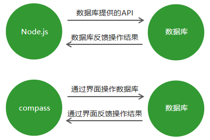
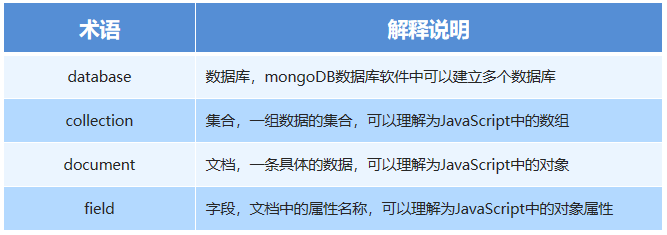
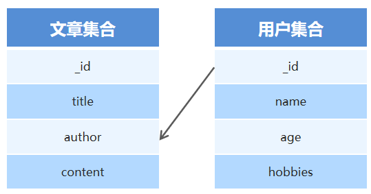
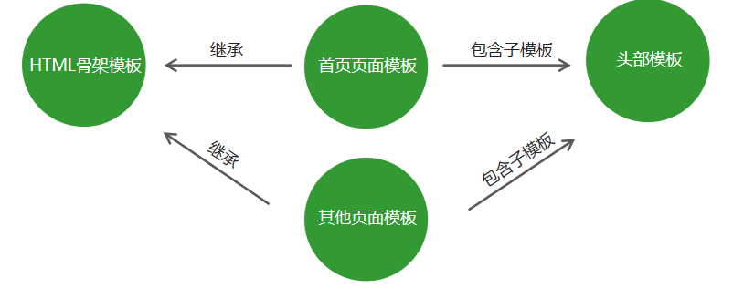
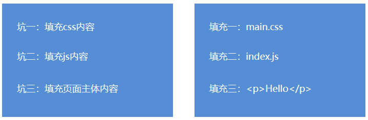
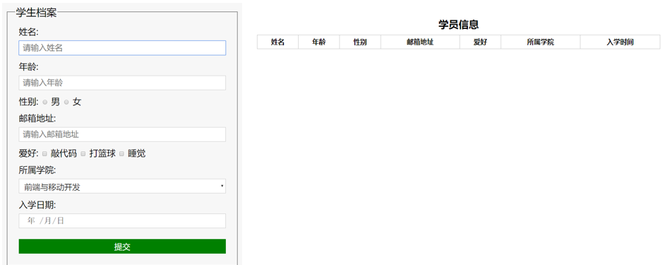

# 一、数据库概述及环境搭建（day03）

## 1.1  为什么要使用数据库

* 动态网站中的数据都是存储在数据库中的（动态网站就是传递不同的参数可以获取不同的页面）
* 数据库可以用来持久存储客户端通过表单收集的用户信息
* 数据库软件本身可以对数据进行高效的管理


## 1.2 什么是数据库

* 数据库即存储数据的仓库，可以将数据进行有序的分门别类的存储。<font color=red>它是独立于语言之外的软件，可以通过API去操作它。</font>
* 常见的数据库软件有：mysql、mongoDB、oracle。


## 1.3 MongoDB数据库下载安装

下载地址：https://www.mongodb.com/download-center/community

(不仅要下载MongoDB，还要下载他的可视化软件compass)


## 1.4 MongoDB可视化软件

MongoDB可视化操作软件，是<font color=red>使用图形界面操作数据库</font>的一种方式。

 


## 1.5 数据库相关概念

<font color=red>在一个数据库软件中可以包含多个数据仓库，在每个数据仓库中可以包含多个数据集合，每个数据集合中可以包含多条文档（具体的数据）。</font>




## 1.6 Mongoose第三方包

* 使用Node.js操作MongoDB数据库需要依赖Node.js第三方包mongoose
* 使用<font color=red>npm install mongoose</font>命令下载


## 1.7 启动MongoDB

在命令行工具中运行<font color=red>net start mongoDB</font>即可启动MongoDB，否则MongoDB将无法连接。(net stop mongodb是停止数据库)


## 1.8 数据库连接

使用mongoose提供的<font color=red>connect</font>方法即可连接数据库。

``` javascript
mongoose.connect('mongodb://localhost/playground',{})
     .then(() => console.log('数据库连接成功'))
     .catch(err => console.log('数据库连接失败', err));

//connect的第二个参数是可选择的，比如需要使用新的解析器时，写在这个括号里{useNewUrlParser:true}
```


## 1.9 创建数据库

在MongoDB中<font color=red>不需要显式创建数据库</font>(不需要用代码去特别的创建)，如果正在使用的数据库不存在，<font color=red>MongoDB会自动创建。</font>


# 二、MongoDB增删改查操作（P169）


**<font color=red size=5>数据库中所有的操作都是异步操作</font>**


## 2.1 创建集合

创建集合分为两步，一是对<font color=red>对集合设定规则</font>，二是<font color=red>创建集合</font>，创建mongoose.Schema构造函数的实例即可创建集合。（创建集合之前要先连接数据库）

``` javascript
// 设定集合规则
 const courseSchema = new mongoose.Schema({
     name: String,
     author: String,
     isPublished: Boolean
 });
  // 创建集合并应用规则
 const Course = mongoose.model('Course', courseSchema); // courses

//创建集合时里面的Course是集合名，但在数据库中，这个名字会变成courses，创建集合返回的是一个构造函数。
```


## 2.2 创建文档

创建文档实际上就是向<font color=red>集合中插入数据。</font>

分为两步：

1. 创建集合实例。
2. 调用实例对象下的<font color=red>save方法</font>将数据保存到数据库中。

``` javascript
// 创建集合实例
 const course = new Course({
     name: 'Node.js course',
     author: '黑马讲师',
     tags: ['node', 'backend'],
     isPublished: true
 });
  // 将数据保存到数据库中
 course.save();

//如果文档中没有数据在数据库中是看不到集合的
```


<font size=4>**方法二：**</font>

利用构造函数下的create方法

``` javascript
Course.create({name: 'JavaScript基础', author: '黑马讲师', isPublish: true}, (err, doc) => { 
     //  错误对象
    console.log(err)
     //  当前插入的文档
    console.log(doc)
});
```

``` javascript
Course.create({name: 'JavaScript基础', author: '黑马讲师', isPublish: true})
      .then(doc => console.log(doc))
      .catch(err => console.log(err))
```

<font color=red>create是异步操作，可以通过回调函数获得返回值，create方法可以返回promise对象，所有他也可以采用promise方法。</font>


## 2.3 mongoDB数据库导入数据

<font color=red>mongoimport –d 数据库名称 –c 集合名称 –-file 要导入的数据文件</font>

找到mongodb数据库的安装目录，将安装目录下的<font color=red>bin目录放置在环境变量中。</font>


## 2.4 查询文档

**1、find（）方法**

``` javascript
//  根据条件查找文档（条件为空则查找所有文档）
Course.find(name: 'lisi').then(result => console.log(result))  
//Course 为我们上面创造的集合构造函数
```

``` javascript
// 返回文档集合
[{
    _id: 5c0917ed37ec9b03c07cf95f,
    name: 'node.js基础',
    author: '黑马讲师‘
},{
     _id: 5c09dea28acfb814980ff827,
     name: 'Javascript',
     author: '黑马讲师‘
}]
```

**<font color=red>注</font>**：

​	无论返回的数据是多少，哪怕是0，find方法都是返回一个数组(一组数据)


**2、findOne（）**

``` javascript
//  根据条件查找文档
Course.findOne({name: 'node.js基础'}).then(result => console.log(result)) //若括号里为空，这查找第一条数据
```

``` javascript
// 返回文档
 {
    _id: 5c0917ed37ec9b03c07cf95f,
    name: 'node.js基础',
    author: '黑马讲师‘
}
//这个方法是返回一个数据文档
```


**3、其他方法**

``` javascript
 //  匹配大于 小于
 User.find({age: {$gt: 20, $lt: 50}}).then(result => console.log(result))
```

``` javascript
//  匹配包含
 User.find({hobbies: {$in: ['敲代码']}}).then(result => console.log(result))
```

``` javascript
//  选择要查询的字段  
 User.find().select('name email -_id').then(result => console.log(result))
//不想查询哪个字段在前面加一个-即可
```

``` javascript
// 将数据按照年龄进行升序排序
 User.find().sort('age').then(result => console.log(result))
//想要降序排列直接在age前加一个-（负号）
```

``` javascript
//  skip 跳过多少条数据  limit 限制查询数量
 User.find().skip(2).limit(2).then(result => console.log(result))
```


## 2.5 删除文档

``` javascript
// 删除单个
Course.findOneAndDelete({}).then(result => console.log(result))

//查找到一条文档并删除，返回删除的文档，如果查询条件匹配了多条文档，则删除第一个匹配的。
```

``` javascript
// 删除多个
User.deleteMany({}).then(result => console.log(result))

//及其注意，如果条件为空，则删除这个文档的全部数据，返回值为一个对象{n:4，ok:1}
```


## 2.6 更新文档

``` javascript
// 更新单个
User.updateOne({查询条件}, {要修改的值}).then(result => console.log(result))
```

``` javascript
// 更新多个
User.updateMany({查询条件}, {要更改的值}).then(result => console.log(result))
//如果第一个查询条件为空，则是更改所有文档

eg:User.updateMany({ age: { $in: [18, 20] } }, { age: 24 }).then(res => console.log(res));
//第一个查询条件不能写成({age:18 , age: 20});
```


## 2.7  mongoose验证

**在创建集合规则时，可以设置当前字段的验证规则，验证失败就则输入插入失败。**

* **required**: true    必传字段         (我们可以自定义报错信息：required：[true, '请输入信息']， 数组中的第二个就是报错信息，下面的规则也可以这样用)

* **minlength**：3    字符串最小长度

* **maxlength**: 20   字符串最大长度

* **min**: 2        数值最小为2

* **max**: 100   数值最大为100

* **enum**: ['html', 'css', 'javascript', 'node.js']     enum即为枚举，只能传数组里有的这些值，否则验证不通过

  ​	也可以传一个对象：enum: {values: ['html', 'css', 'javascript', 'node.js'] , message:'错误信息'}

* **trim**: true    去除字符串两边的空格

* **validate**:      自定义验证器 （具体参考下面代码）

* **default**:        默认值    (如果没传数据就可以采用这个默认值)

获取错误信息：error.errors['字段名称'].message（如果多个字段有错误信息，则用for ..in..循环）


eg:

``` javascript
const postSchema = new mongoose.Schema({
    name: {
        type: String,
        required: true,    //这里也可以是required:[true, '请输入名字']
        minlength: 3,
        //自定义验证器
        author: {
            type: String,
            validate: {
                validator: v => {
                    //返回布尔值
                    //true验证成功，false验证失败
                    //v 就是要验证的值
                    return v && v.lengrh > 4
                },
                //自定义错误信息
                message: '传入的值不符合验证'
            }
        }
        ........
    }
});

//错误信息获取
Post.create({title:'aa', age: 60, category: 'java', author: 'bd'})
	.then(result => console.log(result))
	.catch(error => {
		// 获取错误信息对象
		const err = error.errors;    //错误信息在errors下面的message属性中
		// 循环错误信息对象
		for (var attr in err) {
			// 将错误信息打印到控制台中
			console.log(err[attr]['message']); 
		}
	})
```


## 2.8 集合关联

通常<font color=red>不同集合的数据之间是有关系的</font>，例如文章信息和用户信息存储在不同集合中，但文章是某个用户发表的，要查询文章的所有信息包括发表用户，就需要用到集合关联。

* 使用**id**对集合进行**关联**
* 使用**populate方法**进行关联集合**查询**

 


<font size=5>**集合关联实现**</font>

``` javascript
// 用户集合
const User = mongoose.model('User', new mongoose.Schema({ name: { type: String } })); 
// 文章集合
const Post = mongoose.model('Post', new mongoose.Schema({
    title: { type: String },
    // 使用ID将文章集合和作者集合进行关联
    author: { type: mongoose.Schema.Types.ObjectId, ref: 'User' }
}));  
//创建文档的时候
Post.create({title: '123', author: '5c0caae....'}).then(res =>); //author后面的为关联的User的_id
//联合查询
Post.find()
      .populate('author')
      .then((err, result) => console.log(result));
```


## 2.9 案例：用户信息增删改查（P180开始）

**<font size=4>此案例包含所学的数据库和http协议知识</font>**

1. 搭建网站服务器，实现客户端与服务器端的通信

2. 连接数据库，创建用户集合，向集合中插入文档

3. 当用户访问/list时，将所有用户信息查询出来

4. 将用户信息和表格HTML进行拼接并将拼接结果响应回客户端

5. 当用户访问/add时，呈现表单页面，并实现添加用户信息功能

6. 当用户访问/modify时，呈现修改页面，并实现修改用户信息功能

   1. 添加页面路由，呈现页面

      1. 在点击修改按钮时，将用户ID传递到当前页面
      2. 从数据库中查询当前用户信息，将用户信息展示到页面中

   2. 实现用户修改功能

      1. 指定表单的请求地址以及请求方式

      2. 接受客户传递过来的修改信息，找到用户，将用户信息改为最新的

         

7. 当用户访问/delete时，实现用户删除功能


注意事项：

1. 将所有信息查询出来的时候，<font color=red>不能用User.find().then(result => {//拼接}</font>,  要采用异步API，在app.on('request', <font color=red>async</font>(req,res) {

   ..........

    <font color=red>let user = await User.find();  </font> 然后再去拼接字符串

   })  // 因为获取数据需要时间，一定得把数据完全获取到再去拼接，不然可能在拼接的时候数据还没拿到。

2. ​        // 重定向（在通过data和end事件处理完post传的参数之后，把参数存入数据库（这里同样需要 await User.create(user)），接着用重定向的方法跳转回list页面）

   ​        res.writeHead(301, {

   ​          Location: '/list'

   ​        });

3. let { pathname, query } = url.parse(req.url, true);  

   这个query里面有数据的id名（query.id）（get请求地址栏中我们得传id才拿得到）

4. 在post请求中，我们通过get请求的方式在地址栏传递参数也是可以的，这并不冲突。

   

# 三、模板引擎的基础概念（p187）

## 3.1 模板引擎

<font color=red>模板引擎是node.js的第三方模块。</font>
让开发者以更加<font color=red>友好的方式拼接字符串</font>，使项目代码更加清晰、更加易于维护。

``` javascript
// 未使用模板引擎的写法                                    
 var ary = [{ name: '张三', age: 20 }];
 var str = '<ul>';
 for (var i = 0; i < ary.length; i++) { 
    str += '<li>\
        <span>'+ ary[i].name +'</span>\
        <span>'+ ary[i].age +'</span>\
    </li>';
 }
 str += '</ul>'; 
 //使用模板引擎的写法
 <ul>
    {{each ary}}
        <li>{{$value.name}}</li>
        <li>{{$value.age}}</li>
    {{/each}}
 </ul>
```


## 3.2 art-template模板引擎

1. 在命令行工具中使用 <font color=red>npm install art-template</font> 命令进行下载
2. 使用<font color=red>const template = require('art-template')</font>引入模板引擎(这个require返回的template是一个方法)
3. 告诉模板引擎要拼接的数据和模板在哪 <font color=red>const html = template(‘模板路径’, 数据);</font>（这个模板路径的后缀是.art, 他是一个HTML文件，数据是以对象的形式， template方法<font color=red>返回拼接好的字符串</font>）
4. 使用模板语法告诉模板引擎，模板与数据应该如何进行拼接 

**注：**

​	这个template下的路径尽量是绝对路径：views：path.join( __dirname ,'views', 'index.art')   //利用系统模块path下的join来拼接路径（一般会把模板放到views目录下）


## 3.3 art-template代码示例

``` javascript
// 导入模板引擎模块
 const template = require('art-template');
 // 将特定模板与特定数据进行拼接
 const html = template('./views/index.art',{
    data: {
        name: '张三',
        age: 20
    }
 }); 
```

``` javascript
<div>
    <span>{{data.name}}</span>
    <span>{{data.age}}</span>
 </div>
```


# 四、模板引擎的语法（P188）

## 4.1 模板语法

* art-template同时支持两种模板语法：<font color=red>标准语法</font>和<font color=red>原始语法。</font>
* 标准语法可以让模板更容易读写，原始语法具有强大的逻辑处理能力。

标准语法： {{ 数据 }}

原始语法：<%=数据  %>


## 4.2 输出

将某项数据输出在模板中，标准语法和原始语法如下：

* 标准语法：{{ 数据 }}
* 原始语法：<%=数据 %>

``` javascript
<!-- 标准语法 -->
 <h2>{{value}}</h2>
 <h2>{{a ? b : c}}</h2>
 <h2>{{a + b}}</h2>

  <!-- 原始语法 -->
 <h2><%= value %></h2>
 <h2><%= a ? b : c %></h2>
 <h2><%= a + b %></h2>
```


## 4.3  原文输出

如果数据中**携带HTML标签**，**默认**模板引擎**不会解析**标签，会将其转义后输出。

* 标准语法：{{@ 数据 }}
* 原始语法：<%-数据 %>

``` javascript
<!-- 标准语法 -->
 <h2>{{@ value }}</h2>
 <!-- 原始语法 -->
 <h2><%- value %></h2>
```


## 4.4 条件判断

``` javascript
<!-- 标准语法 --> 
 {{if 条件}} ... {{/if}}
 {{if v1}} ... {{else if v2}} ... {{/if}}
 <!-- 原始语法 -->
 <% if (value) { %> ... <% } %>
 <% if (v1) { %> ... <% } else if (v2) { %> ... <% } %>
```


## 4.5 循环

* 标准语法：{{each 数据}} {{/each}}
* 原始语法：<% for() { %> <% } %>

``` javascript
<!-- 标准语法 -->
 {{each target}}
     {{$index}} {{$value}}   //这里的index为索引，value为值，比如value.name就是当前的name数据
 {{/each}}
  <!-- 原始语法 -->
 <% for(var i = 0; i < target.length; i++){ %>
     <%= i %> <%= target[i] %>
 <% } %>
```


## 4.6  子模版

使用子模板可以将网站公共区块(头部、底部)抽离到单独的文件中。

* 标准语法：{{include '模板'}}
* 原始语法：<%include('模板') %>

``` javascript
<!-- 标准语法 -->
 {{include './header.art'}}
  <!-- 原始语法 -->
 <% include('./header.art') %>
```


## 4.7 模板继承

使用模板继承可以将网站HTML骨架抽离到单独的文件中，其他页面模板可以继承骨架文件。

 

 


## 4.8 模板继承示例

``` javascript
<!doctype html>
 <html>
     <head>
         <meta charset="utf-8">
         <title>HTML骨架模板</title>
         {{block 'head'}}{{/block}}
     </head>
     <body>
         {{block 'content'}}{{/block}}
     </body>
 </html>
```

``` javascript
//index.art 首页模板
 {{extend './layout.art'}}
 {{block 'head'}} <link rel="stylesheet" href="custom.css"> {{/block}}
 {{block 'content'}} <p>This is just an awesome page.</p> {{/block}}
```


## 4.9 模板配置

1. 向模板中导入变量 **template.defaults.imports.变量名 = 变量值**; （通过这个方式在{{}}中就可以调用一些方法）

2. 设置模板根目录 **template.defaults.root = 模板目录**    （消除重复的代码）

   ``` javascript
   template.defaults.root = path.join(__dirname, 'views');   //这是根目录，下面再用template方法是直接写最下面这一级目录即可
   const html = template('06.art', {数据})；
   ```

3. 设置模板默认后缀 **template.defaults.extname = '.art'**    (这样写渲染模板的时候路径就不用写后缀了，例如 '06.art' 可以直接写成 '06')；


# 五、综合案例（P195）

## 5.1 案例介绍 – 学生档案管理

目标：模板引擎应用，强化node.js项目制作流程。

知识点：http请求响应、数据库、模板引擎、静态资源访问。

 


## 5.2  制作流程

1. 建立项目文件夹并生成项目描述文件（也就是package.json，记录项目依赖的模块 // npm init -y）
2. 创建网站服务器实现客户端和服务器端通信
3. 连接数据库并根据需求设计学员信息表  （npm install mongoose）（放model目录下）
4. 创建路由并实现页面模板呈递   （路由参考下面，呈递用模板引擎 npm install art-template ,模板文件放views目录下，css等静态资源文件放public目录下）
5. 实现静态资源访问
6. 实现学生信息添加功能
7. 实现学生信息展示功能


## 5.3 第三方模块 router (路由)

功能：实现路由

使用步骤：

1. 获取路由对象 (先用 npm install router 下载第三方模块)
2. 调用路由对象提供的方法创建路由
3. 启用路由，使路由生效

``` javascript
const getRouter = require('router')    //获取路由模块
const router = getRouter();            //通过方法得到路由对象router
router.get('/add', (req, res) => {     //如果这里是.post那就是post请求, 后面两个参数就是请求对象和响应对象
    res.end('Hello World!')
}) 
server.on('request', (req, res) => {   //启动路由，每次有请求时就会调用router函数
    router(req, res, () => {})            //会先判断请求地址，请求方式等，然后去调用路由
                                  //第三个参数为router执行完后调用的函数，为必选参数
})
```


## 5.4 第三方模块 serve-static

功能：实现**静态资源访问服务**

步骤：

1. 引入serve-static模块获取创建静态资源服务功能的方法 （npm install serve-static）
2. 调用方法创建静态资源服务并指定静态资源服务目录
3. 启用静态资源服务功能

``` javascript
const serveStatic = require('serve-static')
const serve = serveStatic('public')
server.on('request', () => { 
    serve(req, res, () => {})    //第三个参数和路由一样，也是必填参数
})
server.listen(3000)
```


## 5.5 添加学生信息功能步骤分析

1. 在模板的表单中指定请求地址与请求方式 (也就是method 和 action 属性)
2. 为每一个表单项添加name属性 (不然服务器端接收不到信息)
3. 添加实现学生信息功能路由 (表单是post请求)
4. 接收客户端传递过来的学生信息
5. 将学生信息添加到数据库中
6. 将页面重定向到学生信息列表页面 (用 res.writeHead(301, {Location: ‘地址’}))


## 5.6 学生信息列表页面分析

1. 从数据库中将所有的学生信息查询出来  （Student.find()）

2. 通过模板引擎将学生信息和HTML模板进行拼接 （通过 {{each students}}  表格标签 {{/each}}）

   (处理时间的第三方模块 npm install dateformat，使用方法查询npm官网  要用导入变量的方法，参考4.9)

3. 将拼接好的HTML模板响应给客户端


## 5.7 log

1. 配置模板根目录的时候放主文件app.js下进行

      template.defaults.root = path.join(__dirname, 'views');   // 这个dirname及其注意
      
      

2. 用户信息展示 /list  页面是先用 let student = await Student.find() 找出数据， 再通过template 模板引擎传递过去
3. post 请求中解析数据是req.on('data', param => {})  和  req.on('end', () => {}) , 这是请求数据，所以是**req**
