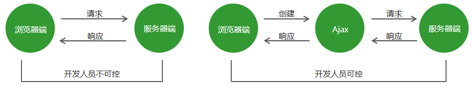
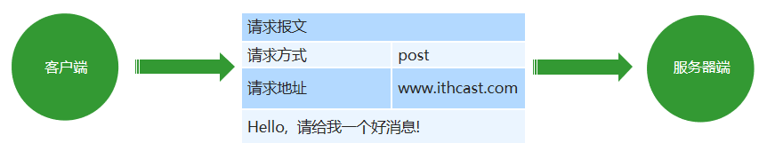
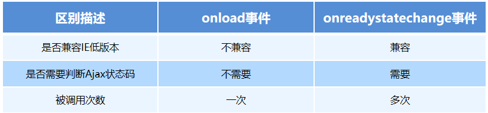
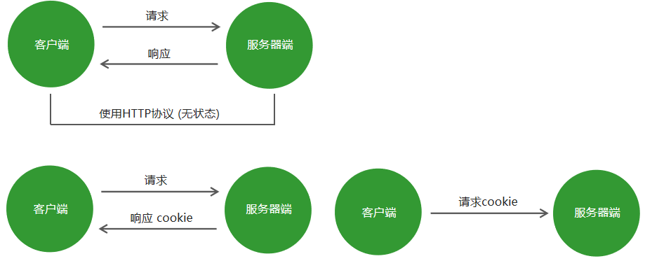

# Ajax编程基础

# 一、Ajax 基础（P278）

## 1.1 传统网站中存在的问题

* 网速慢的情况下，页面加载时间长，用户只能等待
* 表单提交后，如果一项内容不合格，需要重新填写所有表单内容
* 页面跳转，重新加载页面，造成资源浪费，增加用户等待时间


## 1.2 Ajax 概述

Ajax：标准读音 [ˈeɪˌdʒæks] ，中文音译：阿贾克斯

它是浏览器提供的一套方法，可以<font color=red>实现页面无刷新更新数据</font>，提高用户浏览网站应用的体验。

Ajax不是一项独立的技术，它也是JavaScript里面的一项知识点。


## 1.3 Ajax 的应用场景

1. 页面上拉加载更多数据
2. 列表数据无刷新分页（换页是只有列表页面数据发生变化，像头部，底部等不发生改变）
3. 表单项离开焦点数据验证
4. 搜索框提示文字下拉列表


## 1.4 Ajax 的运行环境(P279)

Ajax 技术<font color=red>需要运行在网站环境中才能生效</font>，当前课程会使用Node创建的服务器作为网站服务器。


# 二、Ajax 运行原理及实现（P280）

## 2.1 Ajax 运行原理

<font color=red>Ajax 相当于浏览器发送请求与接收响应的代理人</font>，以实现在不影响用户浏览页面的情况下，局部更新页面数据，从而提高用户体验。

 


## 2.2 Ajax 的实现步骤

1. 创建 Ajax 对象

``` javascript
var xhr = new XMLHttpRequest();
//XML指的是服务器端与客户端传输内容的数据格式，服务器端返回的一般是json数据格式，XML格式已经很少见，作为了解即可。
```

2. 告诉 Ajax 请求地址以及请求方式

``` javascript
xhr.open('get', 'http://www.example.com');
```

3. 发送请求

``` javascript
 xhr.send();
```

4.  获取服务器端给与客户端的响应数据（<font color=red>这个响应是需要时间的，这个时间我们无法确定，所以不能在send方法后面直接获取结果，要添加onload事件</font>，服务器端对客户端做出响应就会自动调用这个函数）

``` javascript
 xhr.onload = function () {
     console.log(xhr.responseText);
 }
//xhr下的responseText 属性就是服务器端返回的数据
```


## 2.3 服务器端响应的数据格式（P282）

在真实的项目中，服务器端<font color=red>大多数情况下会以 JSON 对象作为响应数据的格式</font>。当客户端拿到响应数据时，要将 JSON 数据和 HTML 字符串进行拼接，然后将拼接的结果展示在页面中。


**在 http 请求与响应的过程中，无论是请求参数还是响应内容，如果是对象类型，最终都会被转换为对象字符串进行传输。**

``` javascript
JSON.parse() // 将 json 字符串转换为json对象   JSON是window下的一个对象
```


## 2.4 请求参数传递(P283)

传统网站表单提交

``` javascript
 <form method="get" action="http://www.example.com">
     <input type="text" name="username"/>
     <input type="password" name="password">
 </form>
 <!– http://www.example.com?username=zhangsan&password=123456 -->
```


<font size=4>**请求参数传递**</font>

* **GET 请求方式**

  ``` javascript
  xhr.open('get', 'http://www.example.com?name=zhangsan&age=20');
  //get请求参数要我们自己拼接到请求地址后面
  ```

  

* **POST 请求方式**

  ``` javascript
  xhr.setRequestHeader('Content-Type', 'application/x-www-form-urlencoded') 
  xhr.send('name=zhangsan&age=20');
  
  //post请求参数放在请求体中，用send方法传递
  //setRequestHeader是设置报文头，设置请求参数格式的类型，
  ```

  **如果参数是name=zhangsan&age=20这种格式，则第二个参数的写法就是上面这种固定死的。**（拼接参数的时候一定注意，一定要完全拼接成上面这种格式，= & 都不能少）


## 2.5 请求报文

在 HTTP <font color=red>请求和响应的过程中传递的数据块就叫报文</font>，包括要传送的数据和一些附加信息，这些数据和信息要遵守规定好的格式。

 


## 2.6 请求参数的格式(P285)

1. application/x-www-form-urlencoded

   ``` javascript
   name=zhangsan&age=20&sex=男
   ```

2. application/json

   ``` javascript
   {name: 'zhangsan', age: '20', sex: '男'}
   ```

   在请求头中指定 Content-Type 属性的值是 application/json，告诉服务器端当前请求参数的格式是 json。

   ``` javascript
   JSON.stringify() // 将json对象转换为json字符串
   //用send方法传递是必须是字符串格式，所以要先转化
   ```

<font color=red>注意：get 请求是不能提交 json 对象数据格式的，传统网站的表单提交也是不支持 json 对象数据格式的。</font>

注：在服务器中，如果post请求是json格式，post请求的配置要更改，原来是app.use(bodyParser.urlencoded())，改为app.use(bodyParser.json())


## 2.7 获取服务器端的响应(P286)(该方法已过时，作为了解)

<font size=4>**Ajax 状态码**</font>

在创建ajax对象，配置ajax对象，发送请求，以及接收完服务器端响应数据，这个过程中的每一个步骤都会对应一个数值，这个数值就是ajax状态码。

0：请求未初始化(还没有调用open())

1：请求已经建立，但是还没有发送(还没有调用send())

2：请求已经发送

3：请求正在处理中，通常响应中已经有部分数据可以用了

4：响应已经完成，可以获取并使用服务器的响应了

``` javascript
xhr.readyState // 获取Ajax状态码
```


<font size=4>**onreadystatechange 事件**</font>

当 Ajax 状态码发生变化时将自动触发该事件。

在事件处理函数中可以获取 Ajax 状态码并对其进行判断，当状态码为 4 时就可以通过 xhr.responseText 获取服务器端的响应数据了。

``` javascript
// 当Ajax状态码发生变化时
 xhr.onreadystatechange = function () {
     // 判断当Ajax状态码为4时
     if (xhr.readyState == 4) {
         // 获取服务器端的响应数据
         console.log(xhr.responseText);
     }
 }
```

两种获取服务器端响应方式的区别

 


## 2.8 Ajax 错误处理(P287)

1. 网络畅通，服务器端能接收到请求，服务器端返回的结果不是预期结果。

   <font color=red>可以判断服务器端返回的状态码，分别进行处理。xhr.status 获取http状态码</font>

   

2. 网络畅通，服务器端没有接收到请求，返回404状态码。

   <font color=red>检查请求地址是否错误。</font>

   

3. 网络畅通，服务器端能接收到请求，服务器端返回500状态码。

   <font color=red>服务器端错误，找后端程序员进行沟通。</font>

   

4. 网络中断，请求无法发送到服务器端。

   <font color=red>会触发xhr对象下面的onerror事件，在onerror事件处理函数中对错误进行处理。</font>


**注：**

Ajax状态码：表示ajax请求的过程状态，是ajax对象返回的。

Http状态码：表示请求的处理结果，是服务器端返回的。


## 2.9 低版本 IE 浏览器的缓存问题(P288)

<font color=red>问题</font>：在低版本的 IE 浏览器中，Ajax 请求有严重的缓存问题，即在请求地址不发生变化的情况下，只有第一次请求会真正发送到服务器端，后续的请求都会从浏览器的缓存中获取结果。即使服务器端的数据更新了，客户端依然拿到的是缓存中的旧数据。

<font color=red>解决方案</font>：在请求地址的后面加请求参数，保证每一次请求中的请求参数的值不相同。 

``` javascript
xhr.open('get', 'http://www.example.com?t=' + Math.random());
```


# 三、Ajax 异步编程(P289)

## 3.1 同步异步概述

**同步**

*  一个人同一时间只能做一件事情，只有一件事情做完，才能做另外一件事情。
* 落实到代码中，就是上一行代码执行完成后，才能执行下一行代码，即代码逐行执行。

**异步**

* 一个人一件事情做了一半，转而去做其他事情，当其他事情做完以后，再回过头来继续做之前未完成的事情。
* 落实到代码上，就是异步代码虽然需要花费时间去执行，但程序不会等待异步代码执行完成后再继续执行后续代码，而是直接执行后续代码，当后续代码执行完成后再回头看异步代码是否返回结果，如果已有返回结果，再调用事先准备好的回调函数处理异步代码执行的结果。


## 3.2  Ajax封装(P290)

<font color=red>问题</font>：发送一次请求代码过多，发送多次请求代码冗余且重复。

<font color=red>解决方案</font>：将请求代码封装到函数中，发请求时调用函数即可。

``` javascript
//封装
function ajax (options) {
			// 存储的是默认值
			var defaults = {
				type: 'get',
				url: '',
				data: {},
				header: {
					'Content-Type': 'application/x-www-form-urlencoded'
				},
				success: function () {},
				error: function () {}
			};

			// 使用options对象中的属性覆盖defaults对象中的属性
			Object.assign(defaults, options);

			// 创建ajax对象
			var xhr = new XMLHttpRequest();
			// 拼接请求参数的变量
			var params = '';
			// 循环用户传递进来的对象格式参数
			for (var attr in defaults.data) {
				// 将参数转换为字符串格式
				params += attr + '=' + defaults.data[attr] + '&';
			}
			// 将参数最后面的&截取掉 
			// 将截取的结果重新赋值给params变量
			params = params.substr(0, params.length - 1);

			// 判断请求方式
			if (defaults.type == 'get') {
				defaults.url = defaults.url + '?' + params;
			}

			/*
				{
					name: 'zhangsan',
					age: 20
				}
				name=zhangsan&age=20
			 */

			// 配置ajax对象
			xhr.open(defaults.type, defaults.url);
			// 如果请求方式为post
			if (defaults.type == 'post') {
				// 用户希望的向服务器端传递的请求参数的类型
				var contentType = defaults.header['Content-Type']
				// 设置请求参数格式的类型
				xhr.setRequestHeader('Content-Type', contentType);
				// 判断用户希望的请求参数格式的类型
				// 如果类型为json
				if (contentType == 'application/json') {
					// 向服务器端传递json数据格式的参数
					xhr.send(JSON.stringify(defaults.data))
				}else {
					// 向服务器端传递普通类型的请求参数
					xhr.send(params);
				}

			}else {
				// 发送请求
				xhr.send();
			}
			// 监听xhr对象下面的onload事件
			// 当xhr对象接收完响应数据后触发
			xhr.onload = function () {

				// xhr.getResponseHeader()
				// 获取响应头中的数据
				var contentType = xhr.getResponseHeader('Content-Type');
				// 服务器端返回的数据
				var responseText = xhr.responseText;

				// 如果响应类型中包含applicaition/json
				if (contentType.includes('application/json')) {
					// 将json字符串转换为json对象
					responseText = JSON.parse(responseText)
				}

				// 当http状态码等于200的时候
				if (xhr.status == 200) {
					// 请求成功 调用处理成功情况的函数
					defaults.success(responseText, xhr);
				}else {
					// 请求失败 调用处理失败情况的函数
					defaults.error(responseText, xhr);
				}
			}
		}
//调用
		ajax({
			type: 'post',
			// 请求地址
			url: 'http://localhost:3000/responseData',
			success: function (data) {
				console.log('这里是success函数');
				console.log(data)
			}
		})

		/*
			请求参数要考虑的问题

				1.请求参数位置的问题

					将请求参数传递到ajax函数内部, 在函数内部根据请求方式的不同将请求参数放置在不同的位置

					get 放在请求地址的后面

					post 放在send方法中

				2.请求参数格式的问题

					application/x-www-form-urlencoded

						参数名称=参数值&参数名称=参数值

						name=zhangsan&age=20

					application/json

						{name: 'zhangsan', age: 20}

					1.传递对象数据类型对于函数的调用者更加友好
					2.在函数内部对象数据类型转换为字符串数据类型更加方便

		*/
```


# Ajax编程扩展

# 一、模板引擎(P296)

## 1.1 模板引擎概述

<font color=red>作用</font>：使用模板引擎提供的模板语法，可以将数据和 HTML 拼接起来。

<font color=red>官方地址</font>： https://aui.github.io/art-template/zh-cn/index.html


## 1.2 使用步骤

1. 下载 art-template 模板引擎库文件并在 HTML 页面中引入库文件（//在客户端安装中右键另存为该js文件）

   ``` javascript
   <script src="./js/template-web.js"></script>
   ```

   

2. 准备 art-template 模板

   ``` javascript
   <script id="tpl" type="text/html">    //id是为了区分是哪一个模板
        <div class="box"></div>          //type属性是让script标签解析为html语法
    </script>
   ```

   

3. 告诉模板引擎将哪一个模板和哪个数据进行拼接

   ``` javascript
   var html = template('tpl', {username: 'zhangsan', age: '20'});
   //tpl就是id
   ```

   

4. 将拼接好的html字符串添加到页面中

   ``` javascript
   document.getElementById('container').innerHTML = html;
   //container为容器
   ```

   

5. 通过模板语法告诉模板引擎，数据和html字符串要如何拼接

   ``` javascript
   <script id="tpl" type="text/html">
        <div class="box"> {{ username }} </div>
    </script>
   //该语法与node中的模板语法一致
   ```

   

# 二、案例(P297)

## 2.1 验证邮箱地址唯一性(P297)

1. 获取文本框并为其添加离开焦点事件(onblur)

2. 离开焦点时，检测用户输入的邮箱地址是否符合规则（正则表达式）

3. 如果不符合规则，阻止程序向下执行并给出提示信息

4. 向服务器端发送请求，检测邮箱地址是否被别人注册

5. 根据服务器端返回值决定客户端显示何种提示信息

   

邮箱的正则表达式：/^[A-Za-z\d]+([-_.][A-Za-z\d]+)*@([A-Za-z\d]+[-.])+[A-Za-z\d]{2,4}$/


## 2.2 搜索框内容自动提示(P298)

1. 获取搜索框并为其添加用户输入事件（<font color=red>oninput事件</font>，在文本框输入的时候触发）
2. 获取用户输入的关键字
3. 向服务器端发送请求并携带关键字作为请求参数
4. 将响应数据显示在搜索框底部

<font color=red>问题解决:</font>

1. 每输入一次就会触发oninput事件，会造成大量多余的请求，采用延迟定时器方法解决

``` javascript
var timer = null;
search.oninput = function() {
    clearTimeout(timer);
    var key = this.value;
    //判断值是否为空
    if(key.trim().length == 0) {
        list.style.display = 'none';
        return;
    }
    timer = setTimeout(function(){
        ajax(...)    //ajax代码
    }, 800)
}
```


## 2.3 省市区三级联动(P300)

1. 通过接口获取省份信息
2. 使用JavaScript获取到省市区下拉框元素
3. 将服务器端返回的省份信息显示在下拉框中
4. 为下拉框元素添加表单值改变事件（onchange）
5. 当用户选择省份时，根据省份id获取城市信息
6. 当用户选择城市时，根据城市id获取县城信息


# 三、FormData (P301)

## 3.1 FormData 对象的作用

1. <font color=red>模拟HTML表单，相当于将HTML表单映射成表单对象，自动将表单对象中的数据拼接成请求参数的格式。</font>
2. <font color=red>异步上传二进制文件</font>（比如图片文件和视频文件等等）


## 3.2 FormData 对象的使用

1. 准备 HTML 表单

   ``` javascript
    <form id="form">
        <input type="text" name="username" />
        <input type="password" name="password" />
        <input type="button"/>
   </form>
   ```

   

2. 将 HTML 表单转化为 formData 对象

   ``` javascript
   var form = document.getElementById('form'); 
   var formData = new FormData(form);
   ```

   

3. 提交表单对象

   ``` javascript
   xhr.send(formData);
   ```

   

<font color=red>注意：</font>

1. <font color=red>Formdata 对象不能用于 get 请求，因为对象需要被传递到 send 方法中，而 get 请求方式的请求参数只能放在请求地址的后面。</font>
2. <font color=red>服务器端 bodyParser 模块不能解析 formData 对象表单数据，我们需要使用 formidable 模块进行解析。</font>(具体见： 03-express框架 五、3.4)


## 3.3 FormData 对象的实例方法(P303)

1. 获取表单对象中属性的值

   ``` javascript
   formData.get('key');
   //key 就是表单控件的name属性名   eg：username
   ```

   

2. 设置表单对象中属性的值

   ``` javascript
   formData.set('key', 'value');
   //如果key存在，则覆盖该属性的值，如果不存在，则会创建该属性
   ```

   

3. 删除表单对象中属性的值

   ``` javascript
   formData.delete('key');
   ```

   

4. 向表单对象中追加属性值

   ``` javascript
   formData.append('key', 'value');
   ```

   

<font color=red>注意：</font>set 方法与 append 方法的区别是，在属性名已存在的情况下，set 会覆盖已有键名的值，append会保留两个值。


## 3.4 FormData 二进制文件上传 (P305)

音频，视频，图片等

``` javascript
<input type="file" id="file"/>
//选择文件的控件
```

``` javascript
var file = document.getElementById('file')
// 当用户选择文件的时候
 file.onchange = function () {
     // 创建空表单对象
     var formData = new FormData();
     // 将用户选择的二进制文件追加到表单对象中
     formData.append('attrName', this.files[0]);   //文件存储在file对象下的files														属性中，该属性是一个集合	
     // 配置ajax对象，请求方式必须为post
     xhr.open('post', 'www.example.com');
     xhr.send(formData);
 }
```


## 3.5 FormData 文件上传进度展示(P306)

``` javascript
// 当用户选择文件的时候
 file.onchange = function () {
     // 文件上传过程中持续触发onprogress事件
     xhr.upload.onprogress = function (ev) {
         // 当前上传文件大小/文件总大小 再将结果转换为百分数
         // 将结果赋值给进度条的宽度属性 
         bar.style.width = (ev.loaded / ev.total) * 100 + '%';
     }
 }
```


## 3.6 FormData 文件上传图片即时预览 (P307)

在我们将图片上传到服务器端以后，服务器端通常都会将图片地址做为响应数据传递到客户端，客户端可以从响应数据中获取图片地址，然后将图片再显示在页面中。

``` javascript
xhr.onload = function () {
     var result = JSON.parse(xhr.responseText);
     var img = document.createElement('img');
     img.src = result.src;
     img.onload = function () {
         document.body.appendChild(this);
     }
 }
```


# 四、同源政策 (P308)

## 4.1 Ajax请求限制

<font color=red>Ajax 只能向自己的服务器发送请求。</font>比如现在有一个A网站、有一个B网站，A网站中的 HTML 文件只能向A网站服务器中发送 Ajax 请求，B网站中的 HTML 文件只能向 B 网站中发送 Ajax 请求，但是 A 网站是不能向 B 网站发送 Ajax请求的，同理，B 网站也不能向 A 网站发送 Ajax请求。


## 4.2 什么是同源

如果两个页面拥有<font color=red>相同的协议、域名和端口</font>，那么这两个页面就属于同一个源，其中只要有一个不相同，就是不同源。http://www.example.com/dir/page.html

http://www.example.com/dir2/other.html：同源
http://example.com/dir/other.html：不同源（域名不同）
http://v2.www.example.com/dir/other.html：不同源（域名不同）
http://www.example.com:81/dir/other.html：不同源（端口不同）
https://www.example.com/dir/page.html：不同源（协议不同）


## 4.3 同源政策的目的

<font color=red>同源政策是为了保证用户信息的安全</font>，防止恶意的网站窃取数据。最初的同源政策是指 A 网站在客户端设置的 Cookie，B网站是不能访问的。


随着互联网的发展，同源政策也越来越严格，在不同源的情况下，其中有一项规定就是无法向非同源地址发送Ajax 请求，如果请求，浏览器就会报错。


## 4.4 使用 JSONP 解决同源限制问题 (P310)

jsonp 是 json with padding 的缩写，它不属于 Ajax 请求，但它可以模拟 Ajax 请求。

1. 将不同源的服务器端请求地址写在 script 标签的 src 属性中 (因为script标签的src是不受同源政策的影响的)

``` javascript
<script src="www.example.com"></script>
```

``` javascript
<script src=“https://cdn.bootcss.com/jquery/3.3.1/jquery.min.js"></script>
```


2.  服务器端响应数据必须是一个函数的调用，真正要发送给客户端的数据需要作为函数调用的参数。

``` javascript
const data = 'fn({name: "张三", age: "20"})';
 res.send(data);
```


3. 在客户端全局作用域下定义函数 fn (这个定义必须写在script标签上面)

``` javascript
function fn (data) { }
```


4. 在 fn 函数内部对服务器端返回的数据进行处理

``` javascript
function fn (data) { console.log(data); }
```

<font color=red size=4>jsonp代码：前端资料ajax第三天素材中</font>

## 4.5 JSONP 代码优化 (P312)

1. 客户端需要将函数名称传递到服务器端。(直接放在请求地址后面：?callback=fn)
2. 将 script 请求的发送变成动态请求。(例如点击按钮创建script标签，再添加src属性，然后将该标签放到body后面，记得src加载完删除掉)
3. 封装 jsonp 函数，方便请求发送。
4. 服务器端代码优化之 res.jsonp 方法。(P317)


<font color=red size=4>案例：腾讯天气</font>


## 4.6 CORS 跨域资源共享 (P320)

<font color=red>CORS</font>：全称为 <font color=red>Cross-origin resource sharing</font>，即跨域资源共享，它允许浏览器向跨域服务器发送 Ajax 请求，克服了 Ajax 只能同源使用的限制。(跨越也就是非同源)

jsonp是绕过ajax请求，而CORS不是

 

``` javascript
origin: http://localhost:3000
//origin是客户端自己的协力，域名和端口
```

``` javascript
Access-Control-Allow-Origin: 'http://localhost:3000'
 Access-Control-Allow-Origin: '*'
//这个可以理解为服务器端的白名单，如果客户端在白名单内，就可以跨域访问，服务器端就会返回Access-Control-Allow-Origin（*表示全部都是白名单）
//浏览器会自动核对响应头中是否有Access-Control-Allow-Origin，有就可以跨域访问，否则不行。
```

<font color=red>注：</font>

1. 客户端依旧用原来的Aajx代码，不需要改变，浏览器会帮我们做好这些

2. 服务器端要在res.header('Access-Control-Allow-Origin ', '*') 中设置允许哪些客户端访问我，

   res.header('Access-Control-Allow-Methods', 'get, post') 允许客户端用哪些请求方法访问我

Node 服务器端设置响应头示例代码：

``` javascript
app.use((req, res, next) => {
     res.header('Access-Control-Allow-Origin', '*');
     res.header('Access-Control-Allow-Methods', 'GET, POST');
     next();
 })
```


## 4.7 访问非同源数据 服务器端解决方案 (P321)

同源政策是浏览器给予Ajax技术的限制，服务器端是不存在同源政策限制。

 


## 4.8 cookie复习 (P322)

 


## 4.9 withCredentials属性 （P323）

在使用Ajax技术发送<font color=red>跨域请求</font>时，默认情况下不会在请求中携带cookie信息。

withCredentials：指定在涉及到跨域请求时，是否携带cookie信息，默认值为false （这是Ajax下的一个属性，要在客户端设置）

Access-Control-Allow-Credentials：true 允许客户端发送请求时携带cookie (这个要在服务器端的响应头中设置)


# jQuery中的Ajax

# 一、$.ajax()  (P324)

## 1.1 $.ajax()方法概述

``` javascript
$.ajax({
     type: 'get',
     url: 'http://www.example.com',
     data: { name: 'zhangsan', age: '20' },
     contentType: 'application/x-www-form-urlencoded',
     beforeSend: function () {    //在请求发生之前做的事，比如对参数格式进行验证
         return false             //如果return false则终止这次请求
     },
     success: function (response) {},   //服务器返回的数据，方法会自动将json字符串
    									//转化为json对象
     error: function (xhr) {}  //这个参数为ajax对象
});
```

``` javascript
{
     data: 'name=zhangsan&age=20'
 }
//可以一上面的json对象格式传递，也可以直接以拼接好的字符串传递，但注意，最终都是以字符串的形式传递
```

``` javascript
{
     contentType: 'application/json'
 }
//如果不用默认的字符串形式传递，这要改成这种json对象
```

``` javascript
JSON.stringify({name: 'zhangsan', age: '20'})
//如果contentType我们改成了json，那么data中我们就要先转化为json字符串形式
```


## 1.2 发送jsonp请求 (P327)

``` javascript
$.ajax({
    url: 'http://www.example.com',
    // 指定当前发送jsonp请求
    dataType: 'jsonp',
    // 修改callback参数名称 
    jsonp: 'cb',
    // 指定函数名称(也就是下面的success函数，如果我们要用其他函数名，要先在全局作用域下声明这个函数)
    jsonCallback: 'fnName',
    success: function (response) {} 
})
```


## 1.3 serialize方法 (P326)

作用：将表单中的数据<font color=red>自动拼接成字符串类型的参数</font>

``` javascript
var params = $('#form').serialize();
// name=zhangsan&age=30
```


<font color=red>项目常用：</font>

我们习惯用对象类型的数据，但jQuery没有这个方法，我们自己封装：

jQuery中有 serializeArry() 方法，将数据转化为数组，eg：[{name: 'zhangsan'}, {password: 123456}], 我们可以遍历这个数组，将数组里的值去除生成我们想要的对象。


## 1.4 $.get()、$.post()方法概述 (P328)

作用：$.get方法用于发送get请求，$.post方法用于发送post请求。

``` javascript
$.get('http://www.example.com', {name: 'zhangsan', age: 30}, function (response) {});
$.post('http://www.example.com', {name: 'lisi', age: 22}, function (response) {});
```


# 二、Todo案例  (P329)

## 2.1 为todo数据库添加账号

1. 使用mongo命令进入mongodb数据库
2. 使用use admin命令进入到admin数据中
3. 使用db.auth(‘root’, ‘root’)命令登录数据库
4. 使用use todo命令切换到todo数据库
5. 使用db.createUser({user: ‘itcast’, pwd: ‘itcast’, roles: [‘readWrite’]})创建todo数据库账号
6. 使用exit命令退出mongodo数据库


## 2.2 展示任务列表 (p330)

1. 准备一个放置任务列表的**数组**
2. 向服务器端发送请求，获取已存在的任务
3. 将已存在的任务存储在任务列表数组中
4. 通过模板引擎将任务列表数组中的任务显示在页面中


## 2.3 添加任务 (p331)

1. 为文本框绑定键盘抬起事件( keyup)，在事件处理函数中判断当前用户敲击的是否是回车键
2. 当用户敲击回车键的时候，判断用户在文本框中是否输入了任务名称
3. 向服务器端发送请求，将用户输入的任务名称添加到数据库中，同时将任务添加到任务数组中
4. 通过模板引擎将任务列表数组中的任务显示在页面中


## 2.4 删除任务 (P332)

1. 为删除按钮添加点击事件（利用事件委托）
2. 在事件处理函数中获取到要删任务的id （事先给每个人物添加data-id属性）
3. 向服务器端发送请求，根据ID删除任务，同时将任务数组中的相同任务删除
4. 通过模板引擎将任务列表数组中的任务重新显示在页面中


## 2.5 更改任务状态  (P333)

1. 为任务复选框添加onchange事件
2. 在事件处理函数中获取复选框是否选中（$(this).is(:checked)）
3. 向服务器端发送请求，将当前复选框的是否选中状态提交到服务器端
4. 将任务状态同时也更新到任务列表数组中
5. 通过模板引擎将任务列表数组中的任务重新显示在页面中并且根据任务是否完成为li元素添加completed类名


## 2.6 修改任务名称 (P334)

1. 为任务名称外层的label标签添加双击事件，同时为当前任务外层的li标签添加editing类名，开启编辑状态
2. 将任务名称显示在文本框中并让文本框获取焦点
3. 当文本框离开焦点时，将用户在文本框中输入值提交到服务器端，并且将最新的任务名称更新到任务列表数组中
4. 使用模板引擎重新渲染页面中的任务列表。


## 2.7 计算未完成任务数量 (P335)

1. 准备一个用于存储未完成任务数量的变量
2. 将未完成任务从任务数组中过滤出来 (数组下面有一个filter方法)
3. 将过滤结果数组的长度赋值给任务数量变量
4. 将结果更新到页面中


<font color=red>显示未完成任务:</font>

1. 为active按钮添加点击事件
2. 从任务列表数组中将未完成任务过滤出来
3. 使用模板引擎将过滤结果显示在页面中


<font color=red>清除已完成任务</font>

1. 为clear completed按钮添加点击事件
2. 向服务器端发送请求将数据库中的已完成任务删除掉
3. 将任务列表中的已完成任务删除调用
4. 使用模板引擎将任务列表中的最后结果显示在页面中


## 2.8 全局事件 (P336)

只要页面中有Ajax请求被发送，对应的全局事件就会被触发

``` javascript
.ajaxStart()     // 当请求开始发送时触发
.ajaxComplete()  // 当请求完成时触发
//这两个事件要绑定在document上
$(document).on('ajaxStart', function() {});
$(document).on('ajaxComplete', function() {});
```


## 2.9 NProgress

官宣：纳米级进度条，使用逼真的涓流动画来告诉用户正在发生的事情！

``` javascript
<link rel='stylesheet' href='nprogress.css'/>
<script src='nprogress.js'></script>
```

``` javascript
NProgress.start();  // 进度条开始运动，这个可以放在ajaxStart中
NProgress.done();   // 进度条结束运动，这个可以放在ajaxComplete中
```


# RESTful 和 XML

<font color=red>RESTful就是对请求地址的一种规范</font>

# 一、RESTful 风格的 API (P337)

## 1.1 传统请求地址回顾

``` javascript
GET http://www.example.com/getUsers         // 获取用户列表
GET http://www.example.com/getUser?id=1     // 比如获取某一个用户的信息
POST http://www.example.com/modifyUser      // 修改用户信息
GET http://www.example.com/deleteUser?id=1  // 删除用户信息
```


## 1.2 RESTful API 概述

一套关于设计请求的规范。

GET：      获取数据
POST：    添加数据
PUT：      更新数据
DELETE： 删除数据

<font color=red>注：</font>传统的表单是不支持put 和delete 请求方式的，但ajax 支持

users => /users
articles => /articles   // 地址中的名字和数据库中集合的名字一致


## 1.3 RESTful API 的实现 (P338)

GET： http://www.example.com/users   获取用户列表数据
POST：http://www.example.com/users   创建(添加)用户数据
GET：http://www.example.com/users/1  获取用户ID为1的用户信息
PUT：http://www.example.com/users/1  修改用户ID为1的用户信息
DELETE：http://www.example.com/users/1   删除用户ID为1的用户信息


# 二、 XML 基础 (P339)

## 2.1 XML是什么

XML 的全称是 <font color=red>extensible markup language，代表可扩展标记语言</font>，它的作用是传输和存储数据。

``` javascript
<students> 
     <student>
         <sid>001</sid>
         <name>张三</name>
         </student>
     <student>
         <sid>002</sid>
         <name>王二丫</name>
         </student>
 </students>
//这些标签与HTML标签不同，这些不是预定义标签，是开发者自己定义的。
```

