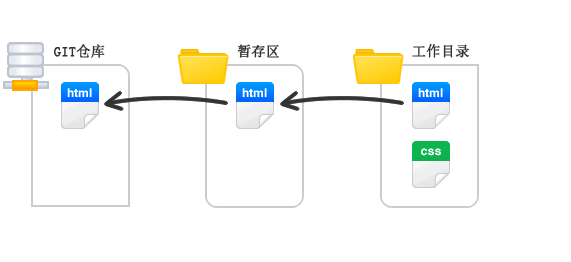
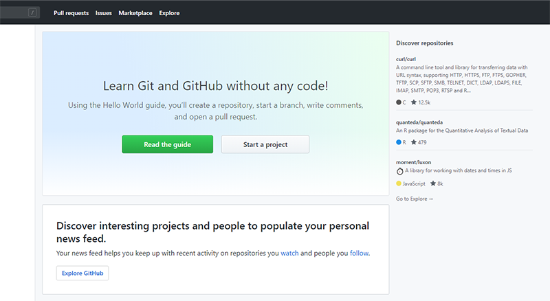
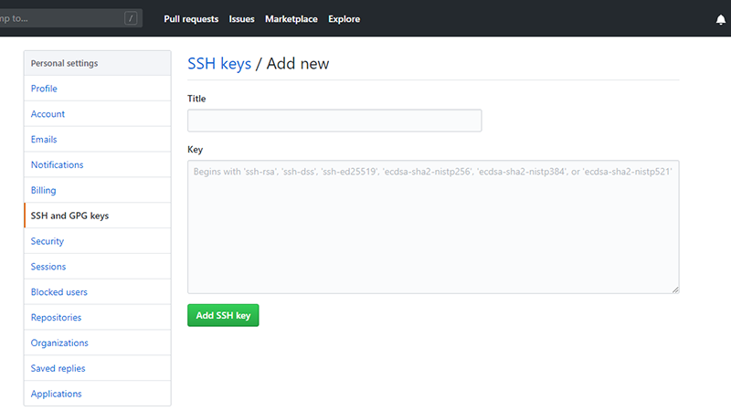

## 本资源由 itjc8.com 收集
## 1. Git基础

### 1.1 版本管理

#### 1.1.1 什么是版本管理

版本管理是一种记录文件变化的方式，以便将来查阅特定版本的文件内容。

#### 1.1.2 人为维护文档版本的问题

1. 文档数量多且命名不清晰导致文档版本混乱

2. 每次编辑文档需要复制，不方便

3. 多人同时编辑同一个文档，容易产生覆盖

### 1.2 Git 是什么

Git是一个版本管理控制系统（缩写VCS），它可以在任何时间点，将文档的状态作为更新记录保存起来，也可以在任何时间点，将更新记录恢复回来。

### 1.3 Git 安装

[下载地址](https://git-scm.com/downloads) 

在安装的过程中，所有选项使用默认值即可。

### 1.4 Git 基本工作流程

| git仓库                    | 暂存区             | 工作目录            |
| -------------------------- | ------------------ | ------------------- |
| 用于存放提交记录(项目状态) | 临时存放被修改文件 | 被Git管理的项目目录 |

### 1.5 Git 的使用

#### 1.5.1 Git 使用前配置 (p344)

在使用 git 前，需要告诉 git 你是谁，在向 git 仓库中提交时需要用到。

1. 配置提交人姓名：`git config --global user.name 提交人姓名`  （xhan）
2. 配置提交人姓名：`git config --global user.email 提交人邮箱`   (2396670743@qq.com)
3. 查看git配置信息：`git config --list`   

**注意**

1. 如果要对配置信息进行修改，重复上述命令即可。(或在此电脑用户中找到.gitconfig 中更改)

2. 配置只需要执行一次。

   

#### 1.5.2 提交步骤 (p345)

1. `git init` **初始化git仓库**

2. `git status` **查看文件状态**（一般是两种状态，被管理的文件和没管理的文件，提醒管理者哪些文件该放到暂存区中）

3. `git add 文件列表` **追踪文件** （也就是把想要管理的文件放暂存区中）

4. `git commit -m 提交信息`  **向仓库中提交代码 **（原则：每次提交只包含一个功能，功能中不要包含bug的修改）

5. `git log` **查看提交记录**

5. `git ls-files`**查看暂存区的所有文件。**

5. `rm .git/index`**清空暂存区所有文件**（所谓暂存区实质是.git目录下的index文件，只要将此文件删除，那么就可以认为暂存区被清空。）

   

#### 1.5.3 撤销 (p346)

- 用暂存区中的文件**覆盖工作目录中**的文件： `git checkout 文件` （这时候这个文件还在缓存区中）

- 将文件**从暂存区中删除**： `git rm --cached 文件` （rm为remove，cached为缓存）
- 将 git 仓库中指定的**更新记录恢复出来，并且覆盖暂存区和工作目录**：`git reset --hard commitID`  （reset为复位的意思，ID可以用git log 查看）

注：恢复B中的文件，那么B之后的**C、D提交记录会被全部删除**

## 2. Git进阶

### 2.1 分支 (P349)

为了便于理解，大家暂时可以认为分支就是当前工作目录中代码的**一份副本**。

使用分支，可以让我们**从开发主线上分离出来，以免影响开发主线。**

#### 2.1.1 分支细分

1. 主分支（master）：第一次向 git 仓库中提交更新记录时自动产生的一个分支。

   

   

   

2. 、开发分支（develop）：作为开发的分支，基于 master 分支创建。

   

   

3. 功能分支（feature）：作为开发具体功能的分支，基于开发分支创建 （feature为特点的意思）

   

   

**功能分支 -> 开发分支 -> 主分支**

#### 2.1.2 分支命令 (P350)

- `git branch` **查看**分支

- `git branch 分支名称` **创建**分支  （基于当前所在分值创建分支）

- `git checkout 分支名称` **切换**分支  (切换分支前必须先将该分支文件提交到Git仓库，否则该分支的文件会随着切换分支跑到其他分支中去)

- `git merge 来源分支` **合并**分支  (如果是主分支要合并开发分支，则我们要先切换到主分支，来源分支则是开发分支。合并之后开发分支依然还在)

- `git branch -d 分支名称` **删除**分支（分支被合并后才允许删除）（-D 强制删除）

  注：分支与分支之间在开发时是应该没有联系的

  

### 2.2 暂时保存更改 (P353) 

在git中，可以暂时提取分支上所有的改动并存储，让开发人员得到一个干净的工作副本，临时转向其他工作。

使用场景：分支临时切换

- **存储临时改动**：`git stash`

- **恢复改动**：`git stash pop` (一定要确保是在自己想要的分支恢复，否则在其他分支恢复也是可以执行的)

  

## 3. Github

在版本控制系统中，大约90%的操作都是在本地仓库中进行的：暂存，提交，查看状态或者历史记录等等。除此之外，如果仅仅只有你一个人在这个项目里工作，你永远没有机会需要设置一个远程仓库。

只有当你需要和你的开发团队共享数据时，设置一个远程仓库才有意义。你可以把它想象成一个 “文件管理服务器”，利用这个服务器可以与开发团队的其他成员进行数据交换。

### 3.1 注册 （P354）

1. 访问[github](https://github.com/)首页，点击 Sign up 连接。（注册）

   

2. 填写用户名、邮箱地址、GitHub登陆密码

   

3. 选择计划

   

4. 填写 GitHub 问题

   

5. 验证邮箱

   

6. GitHub 个人中心

   

### 3.2 多人协作开发流程 （P355）

- A在自己的计算机中创建本地仓库
- A在github中创建远程仓库
- A将本地仓库推送到远程仓库
- B克隆远程仓库到本地进行开发 （B克隆一次就够了，后续就可以直接从仓库拉取代码）
- B将本地仓库中开发的内容推送到远程仓库
- A将远程仓库中的最新内容拉去到本地

### 3.3 创建仓库

1. 填写仓库基本信息

   

2. 将本地仓库推送到远程仓库

   

   1. git **push** 远程仓库地址 分支名称   (比如master)

   2. **创建远程仓库别名**：git remote add 远程仓库地址别名 远程仓库地址  （remote为远端，别名我们一般起名为origin）

   3. git push 远程仓库地址别名 分支名称

   4. git push -u 远程仓库地址别名 分支名称

       -u 记住推送地址及分支，下次推送只需要输入git push即可
   
       

### 3.4 拉取操作

#### 3.4.1 克隆仓库

克隆远端数据仓库到本地：`git clone 仓库地址`

注：如果B要向A仓库提交代码，需要A邀请B加入合作才可，具体参考视频P360

#### 3.4.2 拉取远程仓库中最新的版本

拉取远程仓库中最新的版本：`git pull 远程仓库地址 分支名称`

与clone命令的区别: pull 命令是已经在有本地仓库的基础上进行的，clone命令是完全克隆远程仓库，是在没有目的仓库的基础上进行，clone命令只在第一次拉取用到，后续用pull。

注：当远程仓库版本高于本地仓库时，本地仓库是不能向远程仓库提交的，需先拉取最新版本到本地，再进行提交

### 3.5 解决冲突 (P362)

在多人同时开发一个项目时，如果两个人修改了同一个文件的同一个地方，就会发生冲突。冲突需要人为解决。

### 3.6 跨团队协作 (P363)

1. 程序员 C fork仓库  （fork为叉子，也就是复制一份）

2. 程序员 C 将仓库克隆在本地进行修改

3. 程序员 C 将仓库推送到远程

4. 程序员 C 发起pull reqest

5. 原仓库作者审核

6. 原仓库作者合并代码

   

### 3.7 ssh免登陆 (P364)

https协议仓库地址：https://github.com/itcast-frontEnd/git-demo.git

生成秘钥：`ssh-keygen`

秘钥存储目录：C:\Users\用户\\.ssh

公钥名称：id_rsa.pub

私钥名称：id_rsa

注：在github 我们保存了公钥，在本地电脑保存了私钥，他们会自己配对，实现ssh 免登陆。

### 3.8 GIT忽略清单

将不需要被git管理的文件名字添加到此文件中，在执行git命令的时候，git就会忽略这些文件。

git忽略清单文件名称：**.gitignore**  (创建这个文件，在这个文件中写入不想管理的文件或文件夹)

将工作目录中的文件全部添加到暂存区：`git add .`  (注意后面有一个点)

### 3.9 readme 仓库说明

在根目录下创建readme.md 文件，然后提交到远程仓库即可。

# 4、如何在Github找项目

## 4.1 搜索方式

1. 名字中包含的内容（也就是仓库名字）：`in:name 关键字(eg:spring boot)` 
2. 还可以加条件，比如stars数大于3000的(或者加forks数)： `in:name 关键字 stars:>3000 forks:>1000`  等等条件

3. 搜索readme的内容：`in:readme 关键字`  （后面依旧可以加stars和forks限定等）
4. 搜索描述的内容：`in:description 关键字 language:java pushed:>2019-09-03`  （可加限定，语言、时间也可限定、pushed就是指19年9月3日之后更新过的）
