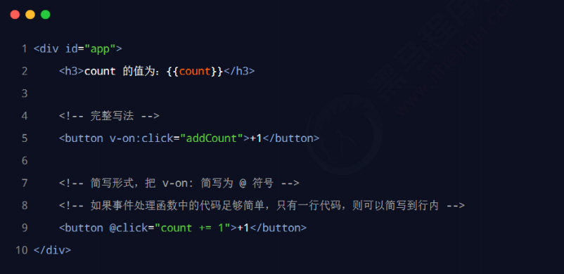
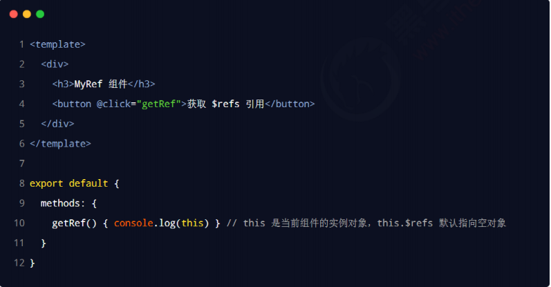
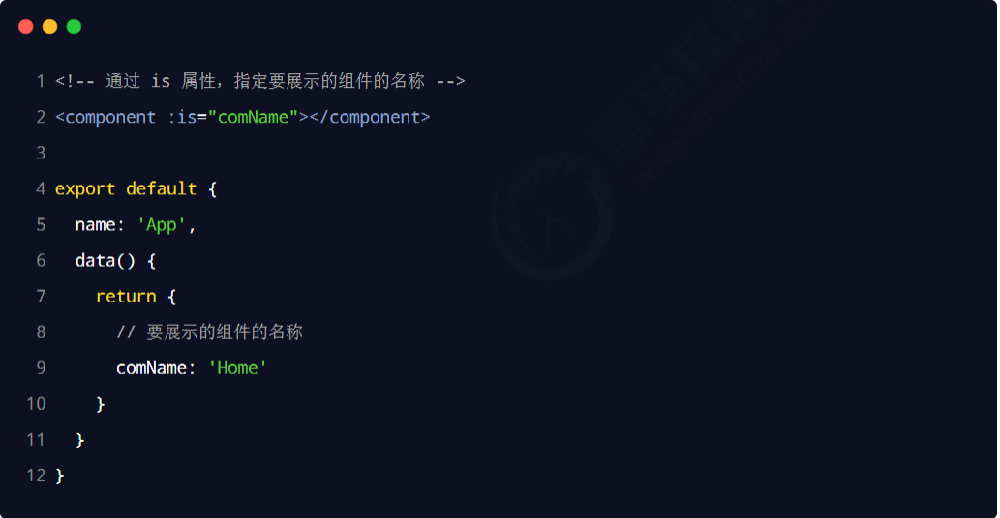
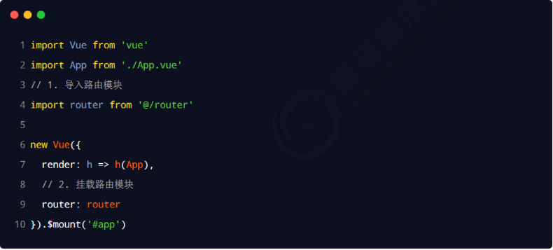
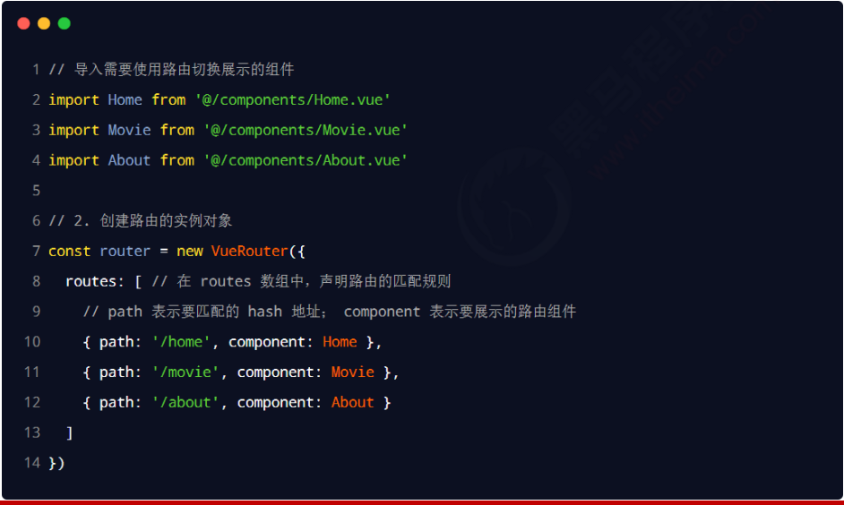

# Day01 前端工程化与webpack

## 一、前端工程化

### 1、实际的前端开发

* <font color=red>模块化</font>（js 的模块化、css 的模块化、资源的模块化）
* <font color=red>组件化</font>（复用现有的 UI 结构、样式、行为）
* <font color=red>规范化</font>（目录结构的划分、编码规范化、接口规范化、文档规范化、 Git 分支管理）
* <font color=red>自动化</font>（自动化构建、自动部署、自动化测试）


### 2. 什么是前端工程化

前端工程化指的是：在<font color=red>企业级的前端项目开发</font>中，把前端开发所需的<font color=red>工具、技术、流程、经验</font>等进行规范化、标准化。

企业中的 Vue 项目和 React 项目，都是基于<font color=red>工程化的方式</font>进行开发的。

好处：前端开发<font color=red>自成体系</font>，有一套<font color=red>标准的开发方案和流程。</font>


### 3. 前端工程化的解决方案

早期的前端工程化解决方案：

* <font color=red>grunt</font>（ https://www.gruntjs.net/ ） 

* <font color=red>gulp</font>（ https://www.gulpjs.com.cn/ ）

  

目前主流的前端工程化解决方案：

* <font color=red>webpack</font>（ https://www.webpackjs.com/ ） (<font color=red>现在常用</font>)

* <font color=red>parcel</font>（ https://zh.parceljs.org/ ）(这个主要是开发第三方包时用到)

  

## 二、webpack 的基本使用

### 1. 什么是 webpack

**概念**：webpack 是<font color=red>前端项目工程化的具体解决方案。</font>

**主要功能**：它提供了友好的<font color=red>前端模块化开发支持</font>，以及<font color=red>代码压缩混淆、处理浏览器端 JavaScript 的兼容性、性能优化</font>等强大的功能。

**好处**：让程序员把<font color=red>工作的重心</font>放到具体功能的实现上，提高了前端<font color=red>开发效率和项目的可维护性</font>。

**注意**：目前 Vue，React 等前端项目，基本上都是基于 webpack 进行工程化开发的。


### 2. 创建列表隔行变色项目（p6）

① 新建项目空白目录，并运行<font color=red> npm init –y</font>命令，初始化包管理配置文件 <font color=red>package.json</font>

② 新建<font color=red> src</font> 源代码目录

③ 新建 src -> <font color=red>index.html</font> 首页和 <font color=red>src -> index.js</font> 脚本文件

④ 初始化首页基本的结构

⑤ 运行<font color=red> npm install jquery –S</font> 命令，安装 jQuery (这里的-S就是让这个包放入dependencies里，不写也可，写了语义明确)

⑥ 通过 ES6 模块化的方式导入 jQuery，实现列表隔行变色效果 (在index.js中写<font color=red> import $ from 'jQuery'</font>，这样就有$接收了jQuery)


### 3. 在项目中安装 webpack

在终端运行如下的命令，安装 webpack 相关的两个包：


<font color=red>npm install webpack@5.42.1 webpack-cli@4.7.2 -D </font>

（-D是告诉npm把这两个包的信息记录到package.json中的devDependencies 中）


**<font color=red>注：</font>**开发和上线之后都要用到的包记录到dependencies节点中（-S）。只在开发阶段会用到的包记录到devDependencies节点中（-D）。


### 4. 在项目中配置 webpack (p7)

① 在项目根目录中，创建名为<font color=red> webpack.config.js</font> 的 webpack 配置文件，并初始化如下的基本配置：

``` javascript
moudle.exports = {
    mode: 'development' //mode 用来指定构建模式。可选值有development和production
    					//代表开发和产品模式
}
```

② 在 <font color=red>package.json 的 scripts 节点下</font>，新增<font color=red> dev 脚本</font>如下：

``` javascript
"scripts": {
    "dev": "webpack" //script 节点下的脚本，可以通过 npm run 执行，例npm run dev
}
```

③ 在终端中运行<font color=red> npm run dev</font> 命令，启动 webpack 进行项目的打包构建


#### 4.1 mode 的可选值

<font color=red>mode 节点</font>的可选值有两个，分别是：

① development

* <font color=red>开发环境</font>

* <font color=red>不会</font>对打包生成的文件进行<font color=red>代码压缩和性能优化</font>

*  打包<font color=red>速度快</font>，适合在开发阶段使用

② production

*  <font color=red>生产环境</font>

* <font color=red>会</font>对打包生成的文件进行<font color=red>代码压缩和性能优化</font>

* 打包<font color=red>速度很慢</font>，仅适合在项目发布阶段使用


#### 4.2 webpack.config.js 文件的作用

webpack.config.js 是 webpack 的配置文件。webpack 在真正开始打包构建之前，会<font color=red>先读取这个配置文件</font>，从而基于给定的配置，对项目进行打包。


注意：由于 webpack 是<font color=red>基于 node.js 开发出来的打包工具</font>，因此在它的配置文件中，支持使用 node.js 相关的语法和模块进行 webpack 的个性化配置。


#### 4.3 webpack 中的默认约定

在 webpack 4.x 和 5.x 的版本中，有如下的默认约定：

① 默认的打包入口文件为 src -> index.js

② 默认的输出文件路径为 dist -> main.js


注意：可以在 webpack.config.js 中修改打包的默认约定


#### 4.4 自定义打包的入口与出口

在 webpack.config.js 配置文件中，通过<font color=red> entry 节点指定打包的入口</font>。通过 <font color=red>output 节点指定打包的出口</font>。

示例代码如下：

 


## 三、webpack 中的插件(p10)

<font color=red size=4>该插件遇到的相关问题见视频p11</font>

### 1. webpack 插件的作用

通过安装和配置第三方的插件，可以<font color=red>拓展 webpack 的能力</font>，从而让 webpack <font color=red>用起来更方便</font>。最常用的

webpack 插件有如下两个：

① <font color=red>webpack-dev-server</font>

*  类似于 node.js 阶段用到的 nodemon 工具

* 每当修改了源代码，webpack 会自动进行项目的打包和构建

② <font color=red>html-webpack-plugin</font>

* webpack 中的 HTML 插件（类似于一个模板引擎插件）

* 可以通过此插件自定制 index.html 页面的内容


### 2. webpack-dev-server

<font color=red>webpack-dev-server </font>可以让 webpack <font color=red>监听项目源代码的变化</font>，从而进行<font color=red>自动打包构建</font>。


#### 2.1 安装 webpack-dev-server

运行如下的命令，即可在项目中安装此插件：

``` javascript
npm install webpack-dev-server@3.11.2 -D
```


#### 2.2 配置 webpack-dev-server

① 修改 <font color=red>package.json</font> -> <font color=red>scripts</font> 中的 <font color=red>dev </font>命令如下：


② 再次运行<font color=red> npm run dev</font> 命令，重新进行项目的打包

③ 在浏览器中访问<font color=red> http://localhost:8080 </font>地址，查看自动打包效果


注意：webpack-dev-server 会启动一个<font color=red>实时打包的 http 服务器</font>


<font color=red>注：</font>

1、我们在webpack.config.js指定的output中的<font color=red>bundle.js文件没有生成在物理磁盘中（文件夹），而是放在了内存中</font>，我们看不到，但确实存在。(放在内存中是因为速度快，不用频繁读取磁盘而影响性能)

2、因此index.html中要引用内存中的bundle.js（src="/bundle.js"）,并且，我们<font color=red>不能直接访问index.html页面，这是file协议，不是http协议，要访问他指定的端口（localhost:8080）</font>(这些在cmd命令行中都是可以看到的)


#### 2.3 打包生成的文件哪儿去了？（p11）

① 不配置 webpack-dev-server 的情况下，webpack 打包生成的文件，会存放到<font color=red>实际的物理磁盘上</font>

* 严格遵守开发者在 webpack.config.js 中指定配置

* 根据 output 节点指定路径进行存放

② 配置了 webpack-dev-server 之后，打包生成的文件<font color=red>存放到了内存中</font>

* 不再根据 output 节点指定的路径，存放到实际的物理磁盘上

* <font color=red>提高了实时打包输出的性能</font>，因为内存比物理磁盘速度快很多


#### 2.4 生成到内存中的文件该如何访问？

webpack-dev-server <font color=red>生成到内存中的文件，默认放到了项目的根目录中，而且是虚拟的、不可见的。</font> 

* 可以直接用<font color=red> / 表示项目根目录，后面跟上要访问的文件名称</font>，即可访问内存中的文件

* 例如<font color=red> /bundle.js</font> 就表示要访问 webpack-dev-server 生成到内存中的 bundle.js 文件


### 3. html-webpack-plugin (p12)

<font color=red>作用</font>:把我们指定的目录放到根目录下面。

html-webpack-plugin 是 <font color=red>webpack 中的 HTML 插件</font>，可以通过此插件<font color=red>自定制 index.html 页面的内容。</font>

需求：通过 html-webpack-plugin 插件，将 src 目录下的 index.html 首页，<font color=red>复制到项目根目录中一份！</font>


#### 3.1 安装 html-webpack-plugin

运行如下的命令，即可在项目中安装此插件：

<font color=red>npm install html-webpack-plugin@5.3.2 -D</font>


#### 3.2 配置 html-webpack-plugin


#### 3.3 解惑 html-webpack-plugin

① 通过 HTML 插件复制到项目根目录中的 index.html 页面，<font color=red>也被放到了内存中</font>

② HTML 插件在生成的 index.html <font color=red>页面，自动注入</font>了打包的 bundle.js 文件


### 4. devServer 节点(p14)

在 webpack.config.js 配置文件中，可以通过<font color=red> devServer 节点</font>对 webpack-dev-server 插件进行更多的配置，示例代码如下:


注意：凡是修改了 webpack.config.js 配置文件，或修改了 package.json 配置文件，<font color=red>必须重启实时打包的服务器</font>，否则最新的配置文件无法生效！


## 四、webpack 中的 loader(p15)

### 1. loader 概述

在实际开发过程中，webpack 默认只能打包处理以 .js 后缀名结尾的模块。其他<font color=red>非 .js 后缀名结尾的模块</font>，webpack 默认处理不了，<font color=red>需要调用 loader 加载器才可以正常打包</font>，否则会报错！


loader 加载器的作用：<font color=red>协助 webpack 打包处理特定的文件模块</font>。比如：

* css-loader 可以打包处理 .css 相关的文件

* less-loader 可以打包处理 .less 相关的文件

* babel-loader 可以打包处理 webpack 无法处理的高级 JS 语法


### 2. loader 的调用过程


### 3. 打包处理 css 文件(p16)

① 运行 <font color=red>npm i style-loader@3.0.0 css-loader@5.2.6 -D </font>命令，安装处理 css 文件的 loader

② 在 webpack.config.js 的 <font color=red>module -> rules 数组</font>中，添加 loader 规则如下：


其中，<font color=red>test </font>表示<font color=red>匹配的文件类型</font>，<font color=red> use </font>表示对应<font color=red>要调用的 loader</font>

test中的 \ 为转义字符 

注意：

* use 数组中指定的 loader <font color=red>顺序是固定的</font>

* 多个 loader 的调用顺序是：<font color=red>从后往前调用</font>

（具体的运行顺序视频详细讲解）


### 4. 打包处理 less 文件（p17）

① 运行<font color=red> npm i less-loader@10.0.1 less@4.1.1 -D</font> 命令

​	(这个less是less-loader的内置依赖项)

② 在 webpack.config.js 的<font color=red> module -> rules 数组</font>中，添加 loader 规则如下：


### 5. 打包处理样式表中与 url 路径相关的文件

关于base64图片的回顾（p18）

① 运行<font color=red> npm i url-loader@4.1.1 file-loader@6.2.0 -D </font>命令

② 在 webpack.config.js 的<font color=red> module -> rules 数组</font>中，添加 loader 规则如下：


其中 ? 之后的是<font color=red> loader 的参数项：</font> 

* limit 用来指定<font color=red>图片的大小</font>，单位是字节（byte） 

* 只有 ≤ limit 大小的图片，才会被转为 base64 格式的图片

  <font color=red>注：</font>转化为base64图片的好处是在页面一上来请求那些标签时会同时请求base64图片，但缺点就是文件体积会变大，所以小图片可以用base64，大图片不用。


### 6. 打包处理 js 文件中的高级语法

webpack 只能打包处理<font color=red>一部分</font>高级的 JavaScript 语法。对于那些 webpack 无法处理的高级 js 语法，需要<font color=red>借助于 babel-loader</font> 进行打包处理。例如 webpack 无法处理下面的 JavaScript 代码：


#### 6.1 安装 babel-loader 相关的包

运行如下的命令安装对应的依赖包：

<font color=red>npm i babel-loader@8.2.2 @babel/core@7.14.6 @babel/plugin-proposal-decorators@7.14.5 -D </font>

在 webpack.config.js 的 module -> rules 数组中，添加 loader 规则如下：


#### 6.2 配置 babel-loader

在项目<font color=red>根目录下</font>，创建名为<font color=red> babel.config.js </font>的配置文件，定义<font color=red> Babel 的配置项</font>如下：


详情请参考 Babel 的官网 https://babeljs.io/docs/en/babel-plugin-proposal-decorators


## 五、打包发布(p24)

### 1. 为什么要打包发布

<font color=red>项目开发完成之后</font>，需要使用 webpack <font color=red>对项目进行打包发布</font>，主要原因有以下两点：

① 开发环境下，打包生成的文件<font color=red>存放于内存中</font>，无法获取到最终打包生成的文件

② 开发环境下，打包生成的文件<font color=red>不会进行代码压缩和性能优化</font>


<font color=red>为了让项目能够在生产环境中高性能的运行</font>，因此需要对项目进行打包发布。


### 2. 配置 webpack 的打包发布

在<font color=red> package.json</font> 文件的 <font color=red>scripts </font>节点下，新增 build 命令如下：


<font color=red>--mode</font> 是一个参数项，用来指定 webpack 的<font color=red>运行模式</font>。production 代表生产环境，会对打包生成的文件进行<font color=red>代码压缩和性能优化。</font>


注意：通过 --mode 指定的参数项，会<font color=red>覆盖</font> webpack.config.js 中的 mode 选项。


### 3. 把 JavaScript 文件统一生成到 js 目录中

在 <font color=red>webpack.config.js</font> 配置文件的<font color=red> output 节点</font>中，进行如下的配置：


### 4. 把图片文件统一生成到 image 目录中

修改 webpack.config.js 中的 <font color=red>url-loader </font>配置项，<font color=red>新增 outputPath 选项</font>即可指定图片文件的输出路径：

``` javascript
{test: /\.jpg|png|gif$/, use:'url-loader?limit=470$outputPath=images'}
```


### 5. 自动清理 dist 目录下的旧文件

为了在每次打包发布时自动清理掉 dist 目录中的旧文件，可以安装并配置 clean-webpack-plugin 插件：

<font color=red>（具体操作可在 npmjs 网页中查找）</font>


## 六、Source Map(p28)

### 1. 生产环境遇到的问题

前端项目在投入生产环境之前，都需要对 JavaScript 源代码进行压缩混淆，从而减小文件的体积，提高文件的加载效率。此时就不可避免的产生了另一个问题：

对压缩混淆之后的代码除错（debug）是一件极其困难的事情

* 变量被替换成没有任何语义的名称

* 空行和注释被剔除


### 2. 什么是 Source Map

<font color=red>Source Map 就是一个信息文件，里面储存着位置信息</font>。也就是说，Source Map 文件中存储着压缩混淆后的代码，所对应的<font color=red>转换前的位置。</font>

有了它，出错的时候，除错工具将<font color=red>直接显示原始代码，而不是转换后的代码</font>，能够极大的方便后期的调试。


### **3. webpack** **开发环境下的** Source Map

在<font color=red>开发环境下</font>，webpack <font color=red>默认启用了 </font>Source Map 功能。当程序运行出错时，可以直接在控制台<font color=red>提示错误行的位置</font>，并<font color=red>定位到具体的源代码：</font>


#### 3.1 默认 Source Map 的问题

开发环境下默认生成的 Source Map，<font color=red>记录的是生成后的代码的位置。会导致运行时报错的行数与源代码的行数不一致的问题。</font>示意图如下：


#### 3.2 解决默认 Source Map 的问题

开发环境下，推荐在 webpack.config.js 中添加如下的配置，即可保证运行时报错的行数与源代码的行数保持一致：


### **4. webpack** **生产环境下的** Source Map

在<font color=red>生产环境下</font>，如果<font color=red>省略了 devtool 选项</font>，则最终生成的文件中<font color=red>不包含 Source Map</font>。这能够<font color=red>防止原始代码</font>通 过 Source Map 的形式<font color=red>暴露给别有所图之人</font>。


#### 4.1 只定位行数不暴露源码

在生产环境下，如果<font color=red>只想定位报错的具体行数，且不想暴露源码。</font>此时可以<font color=red>将 devtool 的值设置为nosources-source-map。</font>实际效果如图所示：


#### 4.2 定位行数且暴露源码

在生产环境下，如果<font color=red>想在定位报错行数的同时，展示具体报错的源码。</font>此时可以<font color=red>将 devtool 的值设置为source-map。</font>实际效果如图所示：


采用此选项后：你应该将你的服务器配置为，<font color=red>不允许普通用户访问 source map 文件！</font>


### 5. Source Map 的最佳实践

① <font color=red>开发环境下：</font>

* 建议把 devtool 的值设置为<font color=red> eval-source-map</font>

* 好处：可以精准定位到具体的错误行

② <font color=red>生产环境下：</font>

* 建议<font color=red>关闭 Source Map</font> 或将 devtool 的值设置为<font color=red> nosources-source-map</font>

* 好处：防止源码泄露，提高网站的安全性


## 七、总结

### 1、实际开发中需要自己配置 webpack 吗？

答案：不需要！ 

* 实际开发中会<font color=red>使命令行工具（俗称 CLI）一键生成</font>带有 webpack 的项目

* 开箱即用，所有 webpack 配置项都是现成的！

* 我们只需要知道 webpack 中的基本概念即可！


### 2、总结

① 能够掌握 webpack 的基本使用

* 安装、webpack.config.js、修改打包入口

② 了解常用的 plugin 的基本使用

* webpack-dev-server、html-webpack-plugin

③ 了解常用的 loader 的基本使用

* loader 的作用、loader 的调用过程

④ 能够说出 Source Map 的作用

* 精准定位到错误行并显示对应的源码

* 方便开发者调试源码中的错误


## 八、拓展（p31）

### 1、@ 的作用

@ 代表src 目录开始，我们可以用@ <font color=red>从外往里一层层找</font>，而<font color=red>不用 ../../ 一层层往外找。</font>

得在webpack.config.js 中配置

``` javascript
resolve: {
        alias: {
            "@": path.join(__dirname, './src')
        }
    }
//找文件是可以直接 @/css/index.css 等等
```


### 2、安装vue-devtools 调试工具（p32）


# Day02 Vue基础入门(p33)

## 一、vue 简介

### 1. 什么是 vue

官方给出的概念：Vue (读音 /vjuː/，类似于 view) 是一套用于<font color='red'>构建用户界面</font>的前端<font color='red'>框架</font>。


### **2. vue 的两个特性**

vue 框架的特性，主要体现在如下两方面：

①<font color='red'> 数据驱动视图</font>

②<font color='red'> 双向数据绑定</font>


#### **2.1 数据驱动视图**

在使用了 vue 的页面中，vue 会<font color='red'>监听数据的变化</font>，从而<font color='red'>自动重新渲染</font>页面的结构。示意图如下：


<font color='red'>好处</font>：当页面数据发生变化时，页面会<font color='red'>自动</font>重新渲染！

<font color='red'>注意</font>：数据驱动视图是<font color='red'>单向的数据绑定。</font>


#### **2.2 双向数据绑定**

在<font color='red'>填写表单时</font>，双向数据绑定可以辅助开发者在<font color='red'>不操作 DOM 的前提下，自动</font>把用户填写的内容<font color='red'>同步到数据源</font>中。示意图如下：


<font color='red'>好处</font>：开发者不再需要手动操作 DOM 元素，来获取表单元素最新的值！


#### **2.3 MVVM**(p35)

<font color='red'>MVVM</font> 是 vue 实现<font color='red'>数据驱动视图</font>和<font color='red'>双向数据绑定</font>的核心原理。MVVM 指的是 <font color='red'>M</font>odel、<font color='red'>V</font>iew 和 <font color='red'>V</font>iew<font color='red'>M</font>odel，

它把每个 HTML 页面都<font color='red'>拆分成了这三个部分</font>，如图所示：


在 MVVM 概念中：

<font color='red'>Model</font> 表示当前页面渲染时所<font color='red'>依赖的数据源。</font>

<font color='red'>View </font>表示当前页面所渲染的 <font color='red'>DOM 结构。</font>

<font color='red'>ViewModel</font> 表示 vue 的实例(也就是Vue本身)，它是 MVVM 的<font color='red'>核心</font>。


#### **2.4 MVVM 的工作原理**

<font color='red'>ViewModel 作为 MVVM 的核心</font>，是它把当前页面的<font color='red'>数据源</font>（Model）和<font color='red'>页面的结构</font>（View）连接在了一起。


当<font color='red'>数据源发生变化时</font>，会被 ViewModel 监听到，VM 会根据最新的数据源<font color='red'>自动更新</font>页面的结构

当<font color='red'>表单元素的值发生变化时</font>，也会被 VM 监听到，VM 会把变化过后最新的值<font color='red'>自动同步</font>到 Model 数据源中


### **3. vue 的版本**

当前，vue 共有 3 个大版本，其中：

<font color='red'>2.x 版本的 vue 是目前企业级项目开发中的主流版本</font>

3.x 版本的 vue 于 2020-09-19 发布，生态还不完善，尚未在企业级项目开发中普及和推广

1.x 版本的 vue 几乎被淘汰，不再建议学习与使用


总结：

<font color='red'>3.x 版本的 vue 是未来企业级项目开发的趋势；</font>

2.x 版本的 vue 在未来（1 ~ 2年内）会被逐渐淘汰；


## 二、vue 的基本使用（p36）

### **1. 基本使用步骤**

① 导入 vue.js 的 script 脚本文件 (<font color='red'>一导入该脚本，在window 全局下就会有Vue 这个构造函数</font>)

② 在页面中声明一个将要被 vue 所控制的 DOM 区域

③ 创建 vm 实例对象（vue 实例对象）


<font color='red'>注</font>：这个<font color='red'>el</font> 指定的如果存在多个控制范围，那么Vue只会控制第一个。


## 三、vue 的调试工具 (p37)

**安装 vue-devtools 调试工具**


## 四、vue 的指令与过滤器(p38)

### **1. 指令的概念**

<font color='red'>指令（Directives）</font>是 vue 为开发者提供的<font color='red'>模板语法</font>，用于<font color='red'>辅助开发者渲染页面的基本结构。</font>


vue 中的指令<font color='red'>按照不同的用途</font>可以分为如下 6 大类：

① <font color='red'>内容渲染</font>指令

② <font color='red'>属性绑定</font>指令

③ <font color='red'>事件绑定</font>指令

④ <font color='red'>双向绑定</font>指令

⑤ <font color='red'>条件渲染</font>指令

⑥ <font color='red'>列表渲染</font>指令


#### **1.1 内容渲染指令**

<font color='red'>内容渲染指令</font>用来辅助开发者<font color='red'>渲染 DOM 元素的文本内容</font>。常用的内容渲染指令有如下 3 个：

* v-text

* {{ }}

* v-html


##### **<font size=4>v-text</font>**

用法示例：


注意：v-text 指令<font color='red'>会覆盖元素内默认的值。</font>(因此实际开发基本不会使用)


##### **<font size=4>{{ }} 语法</font>**

vue 提供的 {{ }} 语法，专门用来<font color='red'>解决 v-text 会覆盖默认文本内容的问题</font>。这种 {{ }} 语法的专业名称是<font color='cornflowerblue'>插值表达式</font>（英文名为：<font color='red'>Mustache</font>）。


注意：相对于 v-text 指令来说，<font color='red'>插值表达式在开发中更常用一些！</font>因为它不会覆盖元素中默认的文本内容。它只是一个<font color='red'>占位符。</font>


##### <font size=4>**v-html**</font>

`v-text `指令和`插值表达式`只能渲染<font color='red'>纯文本内容</font>。如果要把<font color='red'>包含 HTML 标签的字符串</font>渲染为页面的 HTML 元素，则需要用到 `v-html` 这个指令：


最终渲染结果为：


#### **1.2 属性绑定指令**

插值表达式{{}} 只能用在内容节点中，如果需要<font color='red'>为元素的属性动态绑定属性值</font>，则需要用到 <font color='red'>v-bind </font>属性绑定指令。用法示例如下：


**属性绑定指令的简写形式**

由于 <font color='red'>v-bind 指令</font>在开发中使用<font color='red'>频率非常高</font>，因此，vue 官方为其提供了<font color='red'>简写形式</font>（简写为英文的 **<font color='red'>:</font>** ）。


**使用 Javascript 表达式**

在 vue 提供的模板渲染语法中，<font color='red'>除了支持绑定简单的数据值之外</font>，还<font color='red'>支持 Javascript 表达式的运算</font>，例如：


#### **1.3 事件绑定指令**

vue 提供了 <font color='red'>v-on 事件绑定</font>指令，用来辅助程序员为 DOM 元素绑定事件监听。语法格式如下：


注意：原生 DOM 对象有 <font color='cornflowerblue'>onclick、oninput、onkeyup 等原生事件</font>，替换为 vue 的事件绑定形式后，

分别为：<font color='red'>v-on:click、v-on:input、v-on:keyup</font>


通过 v-on 绑定的事件处理函数，需要<font color='red'>在 methods 节点中进行声明</font>：


<font size=5>注：</font> 在<font color='red'>methods中要访问到data 中的数据源</font>，可以通过 <font color='red'>vm.count </font>来拿到，但在vm中，<font color='red'>this就代表vm，这二者全等</font>，所以<font color='red'>推荐用this</font>来拿到数据源中的数据。


##### <font size=4>**事件绑定的简写形式**</font>

由于<font color='red'> v-on 指令</font>在开发中使用频率非常高，因此，vue 官方为其提供了<font color='red'>简写形式</font>（简写为英文的<font color='red'> **@** </font>）。




##### <font size=4>**事件参数对象**</font>

在原生的 DOM 事件绑定中，可以在事件处理函数的形参处，接收事件参数对象 event。同理，在 v-on 指令（简写为 @ ）所绑定的事件处理函数中，同样可<font color='red'>以接收到事件参数对象 event</font>，示例代码如下


##### <font size=4>**绑定事件并传参**</font>

在使用 v-on 指令绑定事件时，可以使用<font color='red'> **( )** </font>进行传参，示例代码如下：


##### <font size=4>**$event**</font> (p47)

<font color='red'>$event </font>是 vue 提供的<font color='red'>特殊变量</font>，用来表示<font color='red'>原生的事件参数对象 event</font>。$event 可以解决事件参数对象 event <font color='red'>被覆盖的问题</font>。示例用法如下：


注: 在我们<font color='red'>需要用到这个DOM元素的时候</font>，我们可以把这个事件对象e（MouseEvent）传过去，当不传任何参数的时候，下面我们声明的函数默认带有这个事件对象e。e.target 就是那个DOM元素。


##### <font size=4>**事件修饰符**</font>

在事件处理函数中调用 <font color='red'>event.preventDefault() 或 event.stopPropagation()</font> 是非常常见的需求。因此，

vue 提供了<font color='red'>事件修饰符</font>的概念，来辅助程序员更方便的<font color='red'>对事件的触发进行控制</font>。常用的 5 个事件修饰符如下：


语法格式如下：


##### <font size=4>按键修饰符</font>

在监听<font color='red'>键盘事件</font>时，我们经常需要<font color='red'>判断详细的按键</font>。此时，可以为<font color='red'>键盘相关的事件</font>添加<font color='red'>按键修饰符</font>，例如：


#### **1.4 双向绑定指令**(p51)

vue 提供了<font color='red'> v-model 双向数据绑定</font>指令，用来辅助开发者在<font color='red'>不操作 DOM</font> 的前提下，<font color='red'>快速获取表单的数据。</font>(表单中的数据和数据源中的某一份数据进行双向绑定，其中一个变，另一个跟着变化)


<font color='red'>注：</font>区分与v-bind: 指令，该指令是单向绑定，只是数据源数据向页面绑定。使用v-model 时在底层是监听了value 的变化，所以就不用再使用value了，没有意义。

> <font color='red'>只有表单元素才能使用v-model 指令</font>，像div 这些元素，虽然可以呈现数据，但用户不能修改，无法和用户交互，只有表单才能和用户交互。

> 我们<font color='red'>常见的表单元素</font>就是 input  textarea select

> <font color='red'>v-model 绑定的时候，底层会判断是什么类型的表单</font>，如果是text 则数据会绑定给value 属性，如果是复选框，则会绑定给checked 属性

##### <font size=4>**v-model 指令的修饰符**</font>

<font color='red'>为了方便对用户输入的内容进行处理</font>，vue 为 v-model 指令提供了 3 个修饰符，分别是：


示例用法如下：


#### **1.5 条件渲染指令**

<font color='red'>条件渲染指令</font>font>用来辅助开发者<font color='red'>按需控制 DOM 的显示与隐藏。</font>条件渲染指令有如下两个，分别是：

> v-if

> v-show

示例用法如下：


##### <font size=4>**v-if 和 v-show 的区别**</font>

实现原理不同：

* v-if 指令会<font color='red'>动态地创建或移除 DOM 元素</font>，从而控制元素在页面上的显示与隐藏；

* v-show 指令会动态为元素<font color='red'>添加或移除 style="display: none;"</font> 样式，从而控制元素的显示与隐藏；

性能消耗不同：

v-if 有<font color='red'>更高的切换开销</font>，而 v-show 有<font color='red'>更高的初始渲染开销</font>。因此：

* 如果需要<font color='red'>非常频繁地切换</font>，则使用<font color='red'> v-show </font>较好

* 如果在<font color='red'>运行时条件很少改变</font>，则使用 <font color='red'>v-if</font> 较好

(这些只是面试回答的，实际开发两个都随便用，更倾向都用v-if)


##### <font size=4>**v-else**</font>

v-if 可以<font color='red'>单独使用，或配合</font> v-else 指令一起使用：


注意：v-else 指令<font color='red'>必须配合 v-if </font>指令一起使用，否则它将不会被识别！


##### <font size=4>**v-else-if**</font>

v-else-if 指令，顾名思义，充当 v-if 的“<font color='red'>else-if 块</font>”，可以连续使用：


#### **1.6 列表渲染指令**

vue 提供了<font color='red'> v-for </font>列表渲染指令，用来辅助开发者<font color='red'>基于一个数组来循环渲染一个列表结构。</font>v-for 指令需要使用 <font color='red'>item in items </font>形式的特殊语法，其中：

* items 是待循环的数组

* item 是被循环的每一项

  <font color='red'>注：</font><font color='cornflowerblue'>要循环生成什么，就在什么DOM元素上加这个v-for 指令 </font>


##### <font size=4>**v-for 中的索引**</font>

v-for 指令还支持一个<font color='red'>可选的第二个参数</font>，即<font color='red'>当前项的索引</font>。语法格式为 <font color='red'>(item, index) in items</font>，示例代码如下：


注意：v-for 指令中的 <font color='red'>item 项</font>和<font color='red'> index 索引</font>都是形参，可以根据需要进行<font color='red'>重命名</font>。例如 (user, i) in userlist


##### <font size=4>**使用 key 维护列表的状态**</font>

当<font color='red'>列表的数据变化</font>时，默认情况下，vue 会<font color='red'>尽可能的复用</font>已存在的 DOM 元素，从而<font color='red'>提升渲染的性能</font>。但这种默认的性能优化策略，会导致<font color='red'>有状态的列表无法被正确更新。</font>

为了给 vue 一个提示，以便它能跟踪每个节点的身份，从而在保证<font color='red'>有状态的列表被正确更新</font>的前提下，<font color='red'>提升渲染的性能</font>。此时，需要为每项提供一个<font color='red'>唯一的 key 属性：</font>


##### <font size=4>**key 的注意事项**</font>

① key 的值只能是<font color='red'>字符串或数字</font>类型

② key 的值<font color='red'>必须具有唯一性</font>（即：key 的值不能重复）

③ 建议把<font color='red'>数据项 id 属性的值</font>作为 key 的值（因为 id 属性的值具有唯一性）

④ 使用<font color='red'> index 的值</font>当作 key 的值<font color='red'>没有任何意义</font>（因为 index 的值不具有唯一性）

⑤ 建议使用 v-for 指令时<font color='red'>一定要指定 key 的值</font>（既提升性能、又防止列表状态紊乱）


### **2. 过滤器**（p65）

<font color='red'>过滤器（Filters）</font>(本身是个函数)是 vue 为开发者提供的功能，常用于<font color='red'>文本的格式化</font>。过滤器可以用在两个地方：<font color='red'>插值表达式和 v-bind 属性绑定。</font>

过滤器应该被添加在 JavaScript 表达式的<font color='red'>尾部</font>，由“<font color='red'>管道符</font>”进行调用，示例代码如下：


<font color='red'>注：</font>加了过滤器之后， | 前面的值会传给后面的过滤器函数，由过滤器函数处理后的<font color='red'>返回值</font>(所以<font color='red'>过滤器函数一定要return</font>) 作为渲染的值


#### **2.1 定义过滤器**

在创建 vue 实例期间，可以<font color='red'>在 filters 节点中定义</font>过滤器，示例代码如下：


#### **2.2** **私有过滤器和全局过滤器**

在 filters 节点下定义的过滤器，称为<font color='red'>“私有过滤器”</font>，因为它<font color='red'>只能在当前 vm 实例所控制的 el 区域内使用。</font>

如果希望在<font color='red'>多个 vue 实例之间共享过滤器</font>，则可以按照如下的格式定义<font color='red'>全局过滤器</font>：

（工作中一般定义全局过滤器）


<font color='red'>注：</font>如果全局过滤器和私有过滤器名字冲突，这调用的是私有过滤器。


#### **2.3 连续调用多个过滤器**

过滤器可以<font color='red'>串联地</font>进行调用，例如：


示例代码如下：


#### **2.4 过滤器传参**

过滤器的<font color='red'>本质是 JavaScript 函数</font>，因此可以接收参数，格式如下：


示例代码如下：


#### **2.5 过滤器的兼容性**

过滤器仅在 vue 2.x 和 1.x 中受支持，在 <font color='red'>vue 3.x</font> 的版本中<font color='red'>剔除了过滤器</font>相关的功能。

在企业级项目开发中：

* 如果使用的是 2.x 版本的 vue，则依然可以使用过滤器相关的功能

* 如果项目已经升级到了 3.x 版本的 vue，官方建议使用<font color='red'>计算属性或方法</font>代替被剔除的过滤器功能

具体的迁移指南，请参考 vue 3.x 的官方文档给出的说明：

https://v3.vuejs.org/guide/migration/filters.html#migration-strategy


## 五、 品牌列表案例

参考ppt 和视频


# Day03 Vue基础入门(p69)

## 一、侦听器

### **1.** **什么是** **watch** 侦听器

<font color='red'>watch 侦听器</font>允许开发者<font color='red'>监视数据的变化</font>，从而<font color='red'>针对数据的变化做特定的操作。</font>

语法格式如下：


### **2.** **使用** **watch** 检测用户名是否可用(典型应用场景)

监听 username 值的变化，并使用 axios 发起 Ajax 请求，<font color='red'>检测当前输入的用户名是否可用</font>：

``` js
watch: {
// 监听 username 值的变化
async username(newVal) {
if (newVal === '') return
// 使用 axios 发起请求，判断用户名是否可用
const { data: res } = await axios.get('https://www.escook.cn/api/finduser/' + newVal)
console.log(res)
} }
```


### **3. immediate** 选项

默认情况下，组件在初次加载完毕后不会调用 watch 侦听器。如果想让 watch 侦听器<font color='red'>立即被调用</font>，则需要<font color='red'>使用 immediate 选项</font>。示例代码如下：

(<font color='red'>注：</font>使用<font color='red'>方法(函数)</font>的侦听器<font color='red'>不会</font>在页面一上来就调用侦听器，如果要一上来就调用，则要<font color='red'>改用对象声明</font>的格式 )


### **4. deep** 选项

如果<font color='red'> watch 侦听的是一个对象</font>，如果<font color='red'>对象中的属性值发生了变化</font>，则<font color='red'>无法被监听到</font>。此时需要使用 <font color='red'>deep 选项</font>，代码示例如下：


### **5.** 监听对象单个属性的变化

如果只想监听<font color='red'>对象中单个属性的变化</font>，则可以按照如下的方式定义 watch 侦听器：

``` js
watch: {
    'info.username'(newVal) {
        console.log(newVal);
    }
}
```

这是<font color='red'>用方法(函数)声明</font>的侦听器（<font color='red'>实际开发能用方法就用方法</font>），用对象声明也可，代码如下：


## 二、计算属性

### **1.** **什么是计算属性**

计算属性指的是<font color='red'>通过一系列运算之后</font>，最终得到一个<font color='red'>属性值</font>。

这个<font color='red'>动态计算</font>出来的属性值<font color='red'>可以被模板结构或 methods 方法使用</font>。示例代码如下：


<font color='red'>注：</font>记住computed 中的计算属性要return


### **2.** **计算属性的特点**

① 虽然计算属性在<font color='red'>声明的时候</font>被定义为<font color='red'>方法</font>，但是计算属性的<font color='red'>本质是一个属性</font>

② 计算属性<font color='red'>会缓存计算的结果</font>，只有计算属性<font color='red'>依赖的数据变化时</font>，才会<font color='red'>重新进行运算</font>


## 三、axios (p76)

axios 是前端最火的，<font color='red'>专注于数据请求</font>的库

### 1、axios 基本使用

先导入库文件，导入之后会在全局下挂载一个方法 axios

或装包：npm install axios -S  然后导入：import axios from 'axios'

``` js
axios({
    method: '请求方式',
    url: '请求地址'，
    //URL 中的查询参数（通常指get 参数）
    params: {},
      
    //请求体参数
    data: {}
}).then((result) => {
    console.log(result);  //result.data 才是真实的数据
});

axios 方法返回的是一个promise 对象，可以用变量接收，或直接调用 .then 方法
```

<font color='red'>注：</font>axios 在请求到数据之后，在真正的数据之外，<font color='red'>套了一层壳</font>，只有里面的 <font color='red'>data 对象才是真实的数据</font>

<font color='red'>重点：</font>

1. 如果调用某个方法的<font color='red'>返回值是Promise 示例</font>，则前面可以添加 <font color='red'>await</font>（本来返回的是promise 对象，加完await 之后就是返回数据了（套壳后的数据，不是真实数据）
2. await 只能用在被 async "修饰"的方法中

``` js
async function() {
    const {data: res} = await axios({    //用解构赋值得到真实数据, 用 : 进行重命名
     method: '请求方式',
     url: '请求地址'，
     //URL 中的查询参数（通常指get 参数）
     params: {},
      
     //请求体参数
     data: {}
	 });

	console.log(res); //这个res 就是返回的真实数据
}
```


### 2、直接发起get 和 post 请求

<font color='red'>GET:</font>

```js
async function() {
    const {data: res} = {
        await axios.get('url地址', { params: {'参数'} });  //对象里套一个params对象
    }
}
```

<font color='red'>POST:</font>

``` js
async function() {
    const {data: res} = {
        await axios.post('url地址', { /*直接放post参数*/ });
    }
}
```

put 和 delete 请求类似。


### 3、借助脚手架解决ajax请求跨域问题(尚硅谷p96)

**请求的几个常见方法：**

1. xhr  ：  new XMLHttpRequest()    xhr.open()   xhr.send() 等方法
2. jQuery：$.ajax({})   $.get  $.post
3. <font color='red'>axios</font>: 使用最多，最推荐
4. fetch：它和xhr 平级，原生就有，window下就有挂载，也是返回promise，但包了两层promise，得调两个.then 拿数据。最致命的是他有兼容性问题，IE不兼容


看到报错信息有<font color='red'>CORS</font> 就知道是跨域问题，跨域请求客户端能发出去，服务器端也能收到，但服务器端不会返回数据。

**解决方案：**

1、<font color='red'>cors</font>：客户端不用干嘛，让<font color='cornflowerblue'>服务器</font>端在<font color='cornflowerblue'>返回响应的时候加几个响应头</font>。

2、<font color='cornflowerblue'>jsonp</font>：利用script src，运用很巧妙，需要前后端人员配合，只能解决get请求，**实际开发基本不会使用**，但面试喜欢问。

3、<font color='red'>配置一个代理服务器</font>：开发中运用比较多

```js
比如客户端是http//localhost:8080 则配置一个http//localhost:8080的服务器，通过8080服务器和其他服务器进行数据传输，服务器与服务器之间不用ajax，不存在同源政策。
1、nginx方法：这是一个经典的方法，但需要对后端知识有所了解。
2、vue-cli：借助它来开启。去vuejs 找到vue-cli 查看配置参考。（devServer.proxy）
  在vue.config.js 中配置：
  devServer: {
    proxy: 'http://localhost:4000'
  }
  //代理服务器的地址和我们客户端地址会默认保持一致，不用我们管，上面这个端口号写我们要拿数据的那   个服务器的端口号，这个配置只能写到端口号，不能往后写。

  // 最后我们请求的时候端口及之前的地址要写代理服务器，也就是和客户端一致，端口号后面的和要请求服务器一致
```

<font color='red'>注意点：</font>

1. 代理服务器8080<font color='cornflowerblue'>不会把所有请求都发给服务器</font>，当客户端要请求的<font color='cornflowerblue'>数据它有的时候</font>（也就是<font color='cornflowerblue'>public</font>文件夹下有的都算是8080的）。

2. <font color='cornflowerblue'>只能配置一个代理，不能配置多个</font>

   

<font size=4><font color='red'>配置代理的方式二：</font></font>（p97）

```js
1、参考vuejs 中的 vue cli
在vue.config.js 中配置：
devServer: {
    proxy: {
      '/api': {      
        target: 'http://localhost:4000',
        pathRewrite:{ '^/api':''}
        ws: true,    //用于支持websocket
        changeOrigin: true  //用于控制请求头中的host值
      },
      '/foo': {
        target: 'http://localhost:4001'  //配置多个代理
        pathRewrite:{ '^/foo':''}
      }
    }
  }
注：
1、'/api' 表示客户端以/api 开头的请求地址 代理服务器才会去向服务器端发送请求。以/api 开头是指   端口号后面: localhost:8080/api/students

2、pathRewrite 官方配置里没有，但必须写，不然代理服务器向服务器请求时地址会带上/api，这个对象的   第一个属性是一个正则表达式，值为空，表示把/api 改为 ''

3、记住在组件中请求的时候地址前面的部分写代理服务器的
```


## 四、vue-cli

### **1.** **什么是单页面应用程序**

<font color='red'>单页面应用程序</font>（英文名：<font color='red'>S</font>ingle<font color='red'> P</font>age <font color='red'>A</font>pplication）简称 SPA，顾名思义，指的是一个 Web 网站中只有唯一的一个 HTML 页面，所有的功能与交互都在这唯一的一个页面内完成。

例如资料中的这个 Demo 项目：


### **2.** **什么是** **vue-cli**

<font color='red'>vue-cli 是 Vue.js 开发的标准工具。</font>它简化了程序员基于 webpack 创建工程化的 Vue 项目的过程。


引用自 vue-cli 官网上的一句话：

程序员可以<font color='red'>专注在撰写应用上</font>，而<font color='red'>不必</font><font color='red'>花好几天去纠结 webpack 配置</font>的问题。

中文官网：https://cli.vuejs.org/zh/


### **3.** **安装和使用**

vue-cli 是 npm 上的一个<font color='red'>全局包，使用 npm install</font> 命令，即可方便的把它安装到自己的电脑上：

<font color='cornflowerblue'>npm install -g</font> <font color='red'>@vue/cli</font>


基于 vue-cli 快速生成工程化的 Vue 项目：

<font color='red'>vue create 项目的名称</font>

(具体过程视频 p81)


vue 项目中 <font color='red'>src 目录</font>的构成：

```
assets 文件夹：存放项目中用到的静态资源文件，例如：css 样式表、图片资源
components 文件夹：程序员封装的、可复用的组件，都要放到 components 目录下
main.js 是项目的入口文件。整个项目的运行，要先执行 main.js
App.vue 是项目的根组件。
```


### **4. vue** **项目的运行流程**(p85)

在工程化的项目中，vue 要做的事情很单纯：通过 <font color='red'>main.js </font>把 <font color='red'>App.vue </font>渲染到 <font color='red'>index.html</font> 的指定区域中。

其中：

① <font color='red'>App.vue</font> 用来编写待渲染的<font color='red'>模板结构</font>

② <font color='red'>index.html</font> 中需要预留一个 <font color='red'>el 区域</font>

③ <font color='red'>main.js</font> 把 App.vue 渲染到了 index.html 所预留的区域中


## 五、vue 组件(p87)

### **1.** **什么是组件化开发**

<font color='red'>组件化开发</font>指的是：根据<font color='red'>封装</font>的思想，把页面上<font color='red'>可重用的 UI 结构封装为组件</font>，从而方便项目的开发和维护。


### **2. vue** **中的组件化开发**

vue 是一个<font color='red'>支持组件化开发</font>的前端框架。

vue 中规定：<font color='red'>组件的后缀名</font>是<font color='red'> .vue</font>。之前接触到的 App.vue 文件本质上就是一个 vue 的组件。


### **3. vue** **组件的三个组成部分**

每个 .vue 组件都由 3 部分构成，分别是：

* <font color='red'>template</font> -> 组件的<font color='red'>模板结构</font>

* <font color='red'>script</font> -> 组件的<font color='red'> JavaScript 行为</font>

* <font color='red'>style</font> -> 组件的<font color='red'>样式</font>


其中，每个组件中<font color='red'>必须包含 template </font>模板结构，而<font color='red'> script 行为和 style 样式是可选的</font>组成部分。


#### **3.1 template**

vue 规定：每个组件对应的<font color='red'>模板结构</font>，需要定义到 `<template> 节点`中。


注意： 

* template 是 vue 提供的<font color='red'>容器标签</font>，只起到<font color='red'>包裹性质的作用</font>，它不会被渲染为真正的 DOM 元素

* template 中<font color='red'>只能包含唯一的根节点</font>


#### **3.2 script**

vue 规定：开发者可以在 <script> 节点中封装<font color='red'>组件的 JavaScript 业务逻辑。</font>

<script> 节点的基本结构如下：


#### **.vue** **组件中的** **data** **必须是函数**

vue 规定：.vue 组件中的 <font color='red'>data 必须是一个函数</font>，<font color='red'>不能</font>直接指向一个<font color='red'>数据对象。</font>

因此在组件中定义 data 数据节点时，下面的方式是<font color='red'>错误</font>的： 


会导致<font color='red'>多个组件实例共用同一份数据的问题</font>，请参考官方给出的示例：

https://cn.vuejs.org/v2/guide/components.html#data-必须是一个函数

正确定义：

```js
data() {
    return {
        //return的这个对象就是数据源
    }
}
```


#### **3.3 style**

vue 规定：组件内的 <style> 节点是<font color='red'>可选的</font>，开发者可以在 <style> 节点中<font color='red'>编写样式美化当前组件的 UI 结构。</font>

<script > 节点的基本结构如下：


**让** **style** **中支持** **less** **语法**

在 <style> 标签上添加<font color='red'> lang="less" </font>属性，即可使用 less 语法编写组件的样式：


### **4.** **组件之间的**父子关系


组件在被封装好之后，<font color='red'>彼此之间是相互独立的</font>，不存在父子关系。    

在<font color='red'>使用</font>组件的时候，根据<font color='red'>彼此的嵌套</font>关系，形成了<font color='red'>父子关系、兄弟关系</font>


#### **4.1** **使用组件的**三个步骤


注：components 里面的Left 是简写， 实际是： 'Left': Left   因为键值一样，所以简写。'Left' 可以改名字。


#### **4.2** **通过** **components** **注册的是**私有子组件

例如：

在<font color='red'>组件 A</font> 的 components 节点下，<font color='red'>注册</font>了<font color='red'>组件 F。</font>

则组件 F<font color='red'> 只能</font>用在组件 A 中；<font color='red'>不能</font>被用在<font color='red'>组件 C</font> 中。


#### **4.3** **注册**全局组件

在 vue 项目的<font color='red'> main.js</font> 入口文件中，通过 <font color='red'>Vue.component() </font>方法，可以注册全局组件。示例代码如下：


### **5.** **组件的** props (重点)(p96)

props 是组件的<font color='red'>自定义属性</font>，在<font color='red'>封装通用组件</font>的时候，合理地使用 props 可以极大的<font color='red'>提高组件的复用性！</font>

它的语法格式如下：


这个props 的值可以直接在插值表达式 {{ 自定义属性 }} 中使用 

```js
// A组件中
export default {
    props: ['init']
}

// B组件中
<template>
    <A init="9"></A>   //这样，B就可以自定义init的值，传到A 组件中
</template>
    
```

<font color='red'>注：</font>

1. A 组件是封装这，B 组件是使用者
2. B 组件中直接写 init="9" , 这个9 是<font color='red'>字符串</font>， 我们可以用<font color='red'>v-bind </font>绑定属性， :init="9"  这时，v-bind绑定后面写的是js语法，是<font color='red'>数字类型</font>的9.
3. <font color='red'>props </font>中的数据和<font color='red'>data </font>数据<font color='red'>一样</font>，在模板中渲染使用。但<font color='red'>props 的值是只读的，不可写，data是可读可写</font>


#### **5.1 props** **是只读的**

vue 规定：组件中封装的自定义属性是<font color='red'>只读的</font>，程序员<font color='red'>不能直接修改</font> props 的值。否则会直接报错：


要想修改 props 的值，可以<font color='red'>把 props 的值转存到 data 中</font>，因为 data 中的数据都是可读可写的！


#### **5.2 props** **的** **default** **默认值**

<font color='red'>注：</font>像这些<font color='red'>精细的设定</font>，就<font color='red'>不能</font>再用<font color='red'>数组</font>来设置props 值了，要改为<font color='red'>对象</font>

在声明自定义属性时，可以通过 <font color='red'>default </font>来<font color='red'>定义属性的默认值。</font>示例代码如下：


#### **5.3 props** **的** **type** **值类型**

在声明自定义属性时，可以通过 <font color='red'>type 来定义属性的值类型</font>。示例代码如下：


#### **5.4 props** **的** **required** **必填项**

在声明自定义属性时，可以通过 <font color='red'>required 选项</font>，将属性设置为<font color='red'>必填项</font>，强制用户必须传递属性的值。示例代

码如下：


### **6.** **组件之间的样式冲突问题**

默认情况下，写在<font color='red'> .vue 组件中的样式会全局生效</font>，因此很容易造成<font color='red'>多个组件之间的样式冲突问题。</font>

导致组件之间样式冲突的根本原因是：

① 单页面应用程序中，所有组件的 DOM 结构，都是基于<font color='red'>唯一的 index.html 页面</font>进行呈现的

② 每个组件中的样式，都会<font color='red'>影响整个 index.html 页面</font>中的 DOM 元素


#### **6.1**思考：如何解决组件样式冲突的问题

为每个组件<font color='red'>分配唯一的自定义属性</font>(当前组件所以标签都是这个自定义属性)，在编写组件样式时，通过<font color='red'>属性选择器</font>来控制<font color='red'>样式的作用域</font>，示例代码如下：


#### **6.2 style** **节点的** **scoped** **属性**

为了提高开发效率和开发体验，vue <font color='red'>为 style 节点提供了 scoped 属性</font>，从而防止组件之间的样式冲突问题：


#### **6.3** **/deep/** **样式穿透**

如果给当前组件的 style 节点添加了 scoped 属性，则<font color='red'>当前组件的样式对其子组件是不生效的</font>。如果想让某些样

式对子组件生效，可以使用<font color='red'> /deep/ 深度选择器。</font>


<font color='red'>注：</font>/deep/ 的使用场景：当使<font color='red'>用第三方组件库</font>的时候，需要修改组件默认样式的时候。


### 7、组件的实例对象

1. 我们自己写的组件只是个模板结构，最终是package.json 中的一个包 "vue-template-compiler" 转化为js 代码在页面中呈现。
2. 我们封装的组件就是一个模板（就好比构造函数），在其他组件中用标签调用是才创建组件的实例化对象（好比于new）


### 8、mixin (尚硅谷p67)

功能：可以把多个组件共用的配置提取成一个混入对象

```js
使用方式：
第一步：定义混合（在src 下创建mixin.js）
(script 中的所有节点都可以定义在里面)
export const mixin = {
    methods: {
        .....
    }
}
第二步：使用混合
（1）全局混入：Vue.mixin()   //在main.js中导入然后使用。
（2）局部混入：mixin:['xxx']  //哪个组件要用就在哪导入，使用数组的方式
```


# Day04 生命周期&数据共享(p105)

## 一、组件的生命周期

### **1.** **生命周期** **&** **生命周期函数**

<font color='red'>生命周期</font>（Life Cycle）是指一个组件从<font color='red'>创建</font> -><font color='red'> 运行</font> -> <font color='red'>销毁</font>的整个阶段，<font color='red'>强调的是一个时间段。</font>

<font color='red'>生命周期函数</font>：是由 vue 框架提供的<font color='red'>内置函数</font>（各个时间点对应的函数），会伴随着组件的生命周期，<font color='red'>自动按次序执行。</font>


注意：<font color='red'>生命周期</font>强调的是<font color='red'>时间段</font>，<font color='red'>生命周期函数</font>强调的是<font color='red'>时间点。</font>


### **3.** **组件生命周期函数的分类**


<font color='red'>注：</font>

1. mount 就是渲染到页面
2. 这 8 个时间点对应 8 个生命周期函数，可以在函数里写代码，如果没写代码，就执行空函数，这8个函数依次执行。


### **4.** **生命周期图示** (p106-p110)

可以参考 vue 官方文档给出的“生命周期图示”，进一步理解组件生命周期执行的过程：

https://cn.vuejs.org/v2/guide/instance.html#生命周期图示

(参考视频生命周期各函数详细解读)


#### 各生命周期函数

1. `beforeCreate`： <font color='cornflowerblue'> 不太重要</font>

2. <font color='red'>created</font>： <font color='cornflowerblue'>很重要</font>。我们经常在这个阶段 <font color='red'>发起 Ajax 拿数据。</font>（在该函数中调methods 中的方法）

3. `beforeMount`：<font color='cornflowerblue'>没什么意义</font>。这里一样<font color='red'>操作不了DOM 元素</font>，虽然也可以发起ajax 请求，但ajax 请求早点发更好，所以这个函数<font color='red'>几乎不会被用到</font>

4. <font color='red'>mounted</font>：<font color='cornflowerblue'>较为重要</font>。刚渲染好DOM元素，<font color='red'>最早</font>可以操作DOM的点。

   > 注：**创建阶段**的这4 个函数，new 一次组件这4 个函数**只能执行一次**

   

5. `beforeUpdate`：此时data 中的数据是最新的，但UI 结构不是最新的。

6. <font color='red'>updated</font>：此时data 中的数据和 UI 结构已经同步。

   > 注：**运行阶段**这两个函数**最少执行0 次，最多执行无数次**

   

7. beforeDestroy 和 destroyed 两个销毁阶段的函数不常用


## 二、组件之间的数据共享(p111)

### **1.** **组件之间的关系**

在项目开发中，组件之间的<font color='red'>最常见的关系</font>分为如下两种： 

<font color='red'>① 父子关系</font>

<font color='red'>② 兄弟关系</font>


### **2.** **父子组件之间的数据共享**

父子组件之间的数据共享又分为：

① <font color='red'>父 -> 子</font>共享数据

② <font color='red'>子 -> 父</font>共享数据


#### **2.1** **父组件向子组件共享数据**

父组件向子组件共享数据需要使用<font color='red'>自定义属性</font>。示例代码如下：


<font color='red'>注：</font>

1. 传简单数据类型时是复制一份值传递过去，复杂数据类型是传递一个引用（比如对象就是传对象的引用）
2. 不要修改props 的值，它只读不可写


#### **2.2** **子组件向父组件共享数据**

子组件向父组件共享数据使用<font color='red'>自定义事件</font>。示例代码如下：


### **3.** **兄弟组件之间的数据共享**

在<font color='red'> vue2.x </font>中，兄弟组件之间数据共享的方案是 <font color='red'>EventBus。</font>


**EventBus** **的使用步骤**

① 创建 <font color='red'>eventBus.js</font> 模块，并向外<font color='red'>共享</font>一个<font color='red'> Vue 的实例对象</font> (这个js 模块在components 节点下创建)

② 在数据<font color='red'>发送方</font>，调用 <font color='red'>bus.$emit('事件名称', 要发送的数据)</font> 方法触发自定义事件

③ 在数据<font color='red'>接收方</font>，调用 <font color='red'>bus.$on('事件名称', 事件处理函数) </font>方法注册一个自定义事件（这个事件声明在生命周期函数created 中）

<font color='red'>注：</font>调$emit 和 $on <font color='red'>不能用this</font> ，因为兄弟组件这两个this <font color='red'>不是同一个实例</font>。


## 三、ref 引用 (p119)

### **1.** **什么是** **ref** **引用**

ref 用来辅助开发者在<font color='red'>不依赖于 jQuery 的情况下</font>，获取 DOM 元素或组件的引用。

每个 vue 的组件实例上，都包含一个 <font color='red'>$refs 对象</font>，里面存储着对应的 DOM 元素或组件的引用。默认情况下，

<font color='red'>组件的 $refs 指向一个空对象。</font>




### **2.** **使用** **ref** **引用** **DOM** **元素**

如果想要使用 ref <font color='red'>引用页面上的 DOM 元素</font>，则可以按照如下的方式进行操作：


### **3.** **使用** **ref** **引用组件实例**

如果想要使用 ref 引用<font color='red'>页面上的组件实例</font>，则可以按照如下的方式进行操作：


### **4.** **控制文本框和按钮的按需切换**

通过布尔值<font color='red'> inputVisible</font> 来控制组件中的文本框与按钮的按需切换。示例代码如下：


### **5.** **让文本框自动获得焦点**

当文本框展示出来之后，如果希望它立即获得焦点，则可以为其添加 ref 引用，并调用原生 DOM 对象的

<font color='red'>.focus()</font> 方法即可。示例代码如下：


<font color='red'>注：</font>

```js
//这里的 this.$refs.ipt 是 undifined
this.inputCisible = true 刚执行完处于生命周期的beforeUpdate 节点，data 数据刚更新，但DOM 还未更新，到下一节点 updated还要时间，所以拿不到this.$refs.ipt
```


### 6. this.$nextTick(cb) 方法

组件的 <font color='red'>$nextTick(cb)</font> 方法，会把 cb 回调<font color='red'>推迟到下一个 DOM 更新周期之后执行</font>。通俗的理解是：**等组件的DOM节点 更新完成之后，再执行 cb 回调函数**。从而能保证 cb 回调函数可以操作到最新的 DOM 元素。


<font color='red'>注：</font>

<font color='red'>这里不能用updated 生命周期函数</font>，updated 函数是<font color='red'>所有数据 任何一个</font>一有变化就会执行，这里只是其中一个数据变化需要往后推一点执行。并且生命周期函数要和methods 节点平级。


## 四、购物车案例 (p128)

### **1.** **案例效果**


### **2.** **实现步骤**

① 初始化项目基本结构

② 封装 <font color='red'>MyHeader</font> 组件

③ 基于 axios 请求商品列表数据（ GET 请求，地址为 https://www.escook.cn/api/cart ） 

④ 封装<font color='red'> MyFooter</font> 组件

⑤ 封装 <font color='red'>MyGoods</font> 组件

⑥ 封装 <font color='red'>MyCounter</font> 组件


# Day05 动态组件 & 插槽 & 自定义指令(p146)

## 一、 动态组件

### **1. 什么是动态组件**

动态组件指的是<font color='red'>动态切换组件的显示与隐藏。</font>


### **2. 如何实现动态组件渲染**

vue 提供了一个内置的` <component>`组件，专门用来实现<font color='red'>动态组件的渲染</font>。示例代码如下：

(可以理解为这个<component> 就是一个占位符，给组件占位的)


### **3. 使用 keep-alive 保持状态**

默认情况下，切换动态组件时<font color='red'>无法保持组件的状态</font>（组件会被动态销毁和创建）。此时可以使用 vue 内置的 <keep-alive> 组件保持动态组件的状态。示例代码如下：


<font color='red'>keep-alive</font> 可以把内部的组件<font color='red'>进行缓存，而不是销毁组件</font>


### **4. keep-alive 对应的生命周期函数**

当组件<font color='red'>被缓存</font>时，会自动触发组件的 <font color='red'>deactivated </font>生命周期函数。

当组件<font color='red'>被激活</font>时，会自动触发组件的 <font color='red'>activated</font> 生命周期函数。

（哪个组件被缓存或激活，哪个组件就会调用这两个函数）


### **5. keep-alive 的** **include** **属性**

include 属性用来指定：只有<font color='red'>名称匹配的组件</font>会被缓存。多个组件名之间使用英文的<font color='red'>逗号分隔</font>：


<font color='red'>注:</font>

keep-alive 还有一个 <font color='red'>exclude</font> 属性，也就是排除，不包含，和include 用法一致

这两个属性<font color='red'>不能同时用</font>，只能用一个。


### 6. 拓展(组件的name 节点)

1. 如果"声明组件"(也就是创建组件)的时候，没有为组件指定 name 名称，则组件的名称默认就是”注册“时候的名称（就是在component 节点下注册的名字）
2. 当提供的 name 属性之后，组件的名称就是 name 属性的值。（在调试工具就会显示name 的值）
3. 这时 exclude 等属性就必须写组件的 name 名称了
4. 建议给每一个组件起一个 name 名称。

<font color='red'>对比：</font>

1. 组件的<font color='red'>“注册名称”</font>的主要应用场景是：以标签的形式，把注册好的组件渲染到页面。
2. 组件声明时候的<font color='red'>“name” 名称</font>主要是结合<keep-alive> 标签实现组件的缓存功能，以及在调试工具中看到组件的名称。


## 二、插槽 (p152)

### **1. 什么是插槽**

<font color='red'>插槽（Slot）</font>是 vue 为<font color='red'>组件的封装者</font>提供的能力。允许开发者在封装组件时，把<font color='red'>不确定的、希望由用户指定的部分</font>定义为插槽。

可以把插槽认为是组件封装期间，<font color='red'>为用户预留的内容的占位符。</font>


### **2. 体验插槽的基础用法**

在封装组件时，可以通过 <slot> 元素<font color='red'>定义插槽</font>，从而<font color='red'>为用户预留内容占位符。</font>示例代码如下：


<font color='red'>注：</font>

1. Vue 官方规定，每一个slot 插槽<font color='red'>都有</font>一个<font color='red'>name 名称</font>，如果<font color='red'>省略了</font> slot 的name 属性，就会有一个<font color='red'>默认值name="default"</font>
2. <font color='red'>默认情况</font>下，在使用组件的时候，<font color='red'>提供的内容</font>都会被<font color='red'>填充到</font>名字为 <font color='red'>default 的插槽</font>之中。


#### **2.1 没有预留插槽的内容会被丢弃**

如果在封装组件时<font color='red'>没有预留任何 <slot> 插槽</font>，则用户提供的任何<font color='red'>自定义内容</font>都会<font color='red'>被丢弃</font>。示例代码如下：


#### **2.2 后备内容**

封装组件时，可以为预留的 <slot> 插槽提供<font color='red'>后备内容（默认内容）</font>。如果组件的使用者没有为插槽提供任何

内容，则后备内容会生效。示例代码如下：


### **3. 具名插槽**

如果在封装组件时需要<font color='red'>预留多个插槽节点</font>，则需要为每个 <slot> 插槽指定<font color='red'>具体的 name 名称</font>。这种<font color='red'>带有具体名称的插槽叫做“具名插槽”</font>。示例代码如下：

注意：没有指定 name 名称的插槽，会有<font color='red'>隐含</font>的名称叫做 <font color='red'>“default”。</font>


#### **3.1 为具名插槽提供内容**

在向具名插槽提供内容的时候，我们可以在一个 <template> 元素上使用<font color='red'> v-slot </font>指令，并以 v-slot 的参数的

形式提供其名称。示例代码如下：

注：这个<font color='red'>v-slot 只能</font>用在template 元素或者component 中，并且，<template> 标签只起<font color='red'>包裹作用</font>，不会被渲染


#### **3.2 具名插槽的简写形式**

跟 v-on 和 v-bind 一样，v-slot 也有<font color='red'>缩写</font>，即把参数之前的所有内容 (<font color='red'>v-slot:</font>) 替换为字符<font color='red'> #</font>。例如 v-slot:header

可以被重写为<font color='red'> #header</font>


### **4. 作用域插槽**

在封装组件的过程中，可以为预留的 <slot> 插槽绑定 props 数据，这种<font color='red'>带有 props 数据的 <slot> </font>叫做“<font color='red'>作用域插槽</font>”。示例代码如下：


<font color='red'>注：</font>也可以不用props 的数据，自定义属性自己写值也可：`meseage="hello vue"` ，同样，data 的数据也可使用


#### **4.1 使用作用域插槽**

可以使用<font color='red'> v-slot: </font>的形式，接收作用域插槽对外提供的数据。示例代码如下：


<font color='red'>注：</font>如果在插槽中没有传值，则等号接收的就是一个空对象，我们默认用<font color='red'>scope</font>(作用域) 接收


#### **4.2 解构插槽 Prop**

作用域插槽对外提供的数据对象，可以使用<font color='red'>解构赋值</font>简化数据的接收过程。示例代码如下：


## 三、自定义指令 (p161)

### **1. 什么是自定义指令**

vue 官方提供了 v-text、v-for、v-model、v-if 等常用的指令。除此之外 vue 还允许开发者自定义指令。


### **2. 自定义指令的分类**

vue 中的自定义指令分为两类，分别是：

* <font color='red'>私有</font>自定义指令

* <font color='red'>全局</font>自定义指令


### **3. 私有自定义指令**

在每个 vue 组件中，可以在 <font color='red'>directives </font>节点下声明<font color='red'>私有自定义指令</font>。示例代码如下：


<font color='red'>注：</font>当指令第一次被绑定到元素上的时候，会立即出发bind 函数


### **4. 使用自定义指令**

在使用自定义指令时，需要加上 v- 前缀。示例代码如下：


### **5. 为自定义指令动态绑定参数值**

在 template 结构中<font color='red'>使用自定义指令</font>时，可以通过等号（<font color='red'>=</font>）的方式，为当前指令<font color='red'>动态绑定参数值</font>：


### **6. 通过** **binding** **获取指令的参数值**

在声明自定义指令时，可以通过形参中的<font color='red'>第二个参数</font>，来接收指令的参数值：

（这里的binding是一个对象）


### **7. update 函数**

bind 函数<font color='red'>只调用 1 次</font>：当指令<font color='red'>第一次绑定</font>到元素时调用，<font color='red'>当 DOM 更新时 bind 函数不会被触发。 update</font> 函

数会在每次 DOM 更新时被调用（<font color='red'>第一次绑定的时候不会触发</font>）。示例代码如下：


### **8. 函数简写**

如果<font color='red'> bind</font> 和<font color='red'>update</font> 函数中的<font color='red'>逻辑完全相同</font>，则<font color='red'>对象格式</font>的自定义指令可以简写成<font color='red'>函数格式</font>：


### **9. 全局自定义指令**

全局共享的自定义指令需要通过“<font color='red'>Vue.directive()</font>”进行声明，示例代码如下：


<font color='red'>注：</font>

1. 这里的function 是简写，如果不简写就是写成对象格式
2. 像<font color='red'>过滤器</font>和<font color='red'>自定义指令</font>这些<font color='red'>一般</font>是<font color='red'>全局声明</font>


## **四、总结**

① 能够掌握 <font color='red'>keep-alive</font> 元素的基本使用

* <keep-alive> 标签、include 属性

② 能够掌握<font color='red'>插槽</font>的基本用

* <slot> 标签、<font color='red'>具名插槽、作用域插槽</font>、后备内容

③ 能够知道如何自定义指令

* 私有自定义指令 directives: { }

* <font color='red'>全局自定义指令 Vue.directive()</font>


# Day06 ESlint及路由(p167)

## 一、ESlint 及 axios

1. <font color='red'>代码缩进</font> 在VScode 中找到设置里的Tab Size 设置为2.
2. 设置中搜索 format on save ，勾选该设置。（自动格式化代码）
3. vue create 项目时选择ESLint 规范时选 倒数第二个<font color='red'> ESLint + Standard config (标准配置)</font>
4. 最后选<font color='red'>Lint on save</font> 意为在保存时规范，而不是第二个在提交时规范并修改 
5. <font color='red'>debugger 就是打断点</font>，浏览器可以，但有时代码多不方便，可以在代码中打断点，直接在要打断点的地方（一般回车下一行）加一个 debugger 即可
6.  ESLint 、Prettier -code-formatter 都要配置

### 1、.eslintrc.js 里的 rules

具体的规则去ESLint 官网的用户指南里找规则查看


### 2、axios 

1. 下载完（npm i axios -S）每次都要导入太麻烦。

2. 将axios 挂载到Vue.prototype 中，组件我们可以认为是Vue 的示例，这样就可以不用每个组件导入了

   ```js
   //在 main.js 中
   import axios from 'axios'
   
   axios.defaults.baseURL = '请求根路径'  //例：http://www.liulongbin.top:3006  这样，每个组                                        件就不用写完整的地址
   Vue.prototype.$http = axios     //每个组件中，this.$http 就可以替换掉axios
   ```

   <font color='red'>缺点：</font><font color='cornflowerblue'>不利于api 接口的复用</font>，同一份数据每次要用都要请求一次

3. 解决方案：封装request.js 模块

   ``` js
   // 在request 模块中
   import axios from 'axios'
   
   const 小axios1 = axios.create({
       basrURL = 'www.taobao.com'
   })
   
   const 小axios2 = axios.create({
       baseURL = 'www.jd.com'
   })
   
   export default 小axios1    //如果要导出小axios2 要封装另一个request 模块，这里只是演示可以                                create 方法可以调用多次
   // 小axios 和axios 本身的使用原则是一样的，这样，不同的服务器就可以设置多个根路径
   // 哪个组件要用到哪个根路径就调用相关模块就可以了
   
   ```

   <font color='red'>注:</font>request.js 模块封装到 src下的 utils 文件夹下，该单词表示工具


## 二、前端路由的概念与原理 （p176)

### **1. 什么是路由**

路由（英文：router）就是<font color='red'>对应关系</font>。


### **2. SPA 与前端路由**

SPA 指的是一个 web 网站只有唯一的一个 HTML 页面，<font color='red'>所有组件的展示与切换</font>都在这唯一的一个页面内完成。

此时，<font color='red'>不同组件之间的切换</font>需要通过<font color='red'>前端路由</font>来实现。

**结论**：在 SPA 项目中，<font color='red'>不同功能之间的切换</font>，要<font color='red'>依赖于前端路由</font>来完成！


### **3. 什么是前端路由**

通俗易懂的概念：<font color='red'>Hash 地址</font>与<font color='red'>组件</font>之间的<font color='red'>对应关系。</font>

(hash地址与之前基础部分的锚链接 相似，#后面的地址)


### **4. 前端路由的工作方式**

① 用户<font color='red'>点击</font>了页面上的<font color='red'>路由链接</font>

② 导致了 <font color='red'>URL 地址栏</font>中的<font color='red'> Hash 值</font>发生了变化

③ <font color='red'>前端路由监听了到 Hash 地址的变化</font>

④ 前端路由把当前 <font color='red'>Hash 地址对应的组件</font>渲染都浏览器中


结论：前端路由，指的是<font color='red'> Hash 地址</font>与<font color='red'>组件</font>之间的<font color='red'>对应关系</font>！


### **5. 实现简易的前端路由**

步骤1：通过 `<component> `标签，结合<font color='red'> comName </font>动态渲染组件。示例代码如下：




步骤2：在 App.vue 组件中，为 <font color='red'><a> 链接</font>添加对应的 <font color='red'>hash 值</font>：


步骤3：在 <font color='red'>created 生命周期函数</font>中，<font color='red'>监听</font>浏览器地址栏中 <font color='red'>hash 地址的变化</font>，动态切换要展示的组件的名称：


## 三、vue-router 的基本使用

### **1. 什么是 vue-router**

<font color='red'>vue-router </font>是 vue.js 官方给出的路由<font color='red'>解决方案</font>。它只能结合 vue 项目进行使用，能够<font color='cornflowerblue'>轻松的管理 SPA 项目中组件的切换。</font>

vue-router 的官方文档地址：https://router.vuejs.org/zh/


### **2. vue-router 安装和配置的步骤**

① 安装 vue-router 包 

<font color='red'>② 创建路由模块</font>

③ 导入并挂载路由模块

④ 声明<font color='red'>路由链接</font>和<font color='red'>占位符</font>


#### **2.1 在项目中安装 vue-router**

在 vue2 的项目中，安装 vue-router 的命令如下：


#### **2.2 创建路由模块**

在<font color='red'> src</font> 源代码目录下，新建<font color='red'> router/index.js</font>(router 文件夹下的index.js) 路由模块，并初始化如下的代码：


<font color='red'>注：</font>千万记住第二步把VueRouter 用use 方法安装为Vue 的插件。


#### **2.3 导入并挂载路由模块**

在 <font color='red'>src/main.js </font>入口文件中，导入并挂载路由模块。示例代码如下：



<font color='red'>注：</font>这里的router: router 属性和内容一样，可以<font color='red'>简写为router </font>

> 在进行模块化导入的时候，如果给定的是文件夹，则默认情况下回导入该文件夹下的index.js 文件。


#### 2.4 声明路由链接和占位符

在 src/App.vue 组件中，使用 vue-router 提供的` <router-link>` 和` <router-view> `声明路由<font color='red'>链接</font>和<font color='red'>占位符</font>：


<font color='red'>注：</font>a 链接也可，hash加上# ，但不建议使用，用 <router-link></router-link>


### **3. 声明路由的匹配规则**

在 src/router/index.js 路由模块中，通过<font color='red'> routes 数组</font>声明路由的匹配规则。示例代码如下：




<font color='red'>注：</font>使用vue-router 时为了方便，<font color='cornflowerblue'>hash 地址不用加# 号</font>，加了就是错的


## 四、vue-router 的常见用法(p184)

### **1. 路由重定向**

<font color='red'>路由重定向</font>指的是：用户在访问<font color='red'>地址 A </font>的时候，<font color='red'>强制用户跳转</font>到地址 C ，从而展示特定的组件页面。

通过路由规则的 <font color='red'>redirect</font> 属性，指定一个新的路由地址，可以很方便地设置路由的重定向：


### **2. 嵌套路由**

通过<font color='red'>路由实现</font>组件的<font color='red'>嵌套展示</font>，叫做嵌套路由。


#### 2.1 声明子路由链接和子路由占位符

在 <font color='red'>About.vue </font>(子组件)组件中，声明 tab1 和 tab2 的<font color='red'>子路由链接</font>以及<font color='red'>子路由占位符</font>。示例代码如下：


#### **3.2 通过** **children** **属性声明子路由规则**

在 src/router/index.js 路由模块中，导入需要的组件，并使用<font color='red'> children 属性</font>声明子路由规则：

(子路由的hash 地址<font color='red'>不推荐用/ 开头</font>，省略掉)


**<font size="4">默认子路由</font>**

如果在children 数组中，有<font color='red'>某个path 值为空字符串</font>，则这条路由规则，就叫<font color='red'>"默认子路由"</font>

``` js
{
    path: '/about',
    component: About,
    children: [
        { path: '', component: Tab1},
        { path: 'tab2', component: Tab2},
    ]
}
//这样，进入About 组件，就会默认展示Tab1
```

<font color='red'>或者：重定向</font>

```js
{
    path: '/about',
    component: About,
    redirect: '/about/tab1'
    children: [
        { path: 'tab1', component: Tab1},
        { path: 'tab2', component: Tab2},
    ]
}
```

两种方法都可，根据实际需求。


### **4. 动态路由匹配**

思考：有如下 3 个路由链接：


定义如下 3 个路由规则，是否可行???	(可行)


缺点：路由规则的<font color='red'>复用性差</font>。


#### **4.1 动态路由的概念**

动态路由指的是：把 Hash 地址中<font color='red'>可变的部分</font>定义为<font color='red'>参数项</font>，从而<font color='red'>提高路由规则的复用性。 </font>

在 vue-router 中使用<font color='red'>英文的冒号（**:**）</font>来定义路由的参数项。示例代码如下：


#### **4.2** **$route.params** **参数对象**

在<font color='red'>动态路由</font>渲染出来的组件中，可以使用 this.<font color='red'>$route.params</font> 对象访问到<font color='red'>动态匹配的参数值</font>。

(this可写可不写，this.$route 是路由的<font color='red'>"参数对象"</font>) (这个route 不带 r)


#### **4.3 使用 props 接收路由参数**

<font color='red'>为了简化路由参数的获取形式</font>，vue-router 允许在<font color='red'>路由规则</font>中<font color='red'>开启 props 传参</font>。示例代码如下：


```js
//props 还有两种写法
props: true   这接收的只能是params 参数，不能接收query 参数

props: {id: 1, titile: 'xxx'}  这种就是写死

// 第三种方法是函数
props($route) {
    return {
        $route.query.id
        $route.query.title
    }
    // 这样既可以传params 参数，也可以穿 query 参数 
}
// 甚至可以直接将参数解构出来
props({ query }) {
    return {
        query.id
        query.title
    }
	// 如果要 params 就解构params
}
```


#### 4.4 拓展(路径参数、查询参数、fullPath)

1. 在hash 地址中，<font color='red'>/</font> 后面的参数项，叫 <font color='red'>"路径参数</font>"，在路由 "参数对象" 中，需要使用<font color='red'> this.$route.params</font> 来访问路径参数。
2. 在hash 地址中，<font color='red'>?</font> 后面的参数项，叫 <font color='red'>"查询参数"</font>，在路由 "参数对象" 中，需要使用 <font color='red'>this.$route.query</font> 来访问查询参数。
3. 在 this.$route 中，<font color='cornflowerblue'>path</font> 只是<font color='red'>路径</font>部分，<font color='cornflowerblue'>fullPath </font>是<font color='red'>完整的地址。</font>


### **5. 声明式导航 & 编程式导航**(p190)

在浏览器中，<font color='red'>点击链接</font>实现导航的方式，叫做<font color='red'>声明式导航</font>。例如：

* 普通网页中点击 `<a> 链接`、vue 项目中点击 `<router-link> `都属于声明式导航


在浏览器中，<font color='red'>调用 API 方法</font>实现导航的方式，叫做<font color='red'>编程式导航</font>。例如：

* 普通网页中调用<font color='red'> location.href </font>跳转到新页面的方式，属于编程式导航


#### **5.1 vue-router 中的编程式导航 API**

vue-router 提供了许多编程式导航的 API，其中最常用的导航 API 分别是：

① this.$router<font color='red'>.push</font>('hash 地址')

* 跳转到指定 hash 地址，并<font color='red'>增加</font>一条历史记录

② this.$router.<font color='red'>replace</font>('hash 地址') 

* 跳转到指定的 hash 地址，并<font color='red'>替换掉当前</font>的历史记录

③ this.$router.<font color='red'>go</font>(数值 n)

* 实现导航历史前进、后退 (n 可正可负， 如果跳转次数到达上限，则原地不动。)


#### 5.5 $router.go **的简化用法**

在实际开发中，一般只会前进和后退一层页面。因此 vue-router 提供了如下两个便捷方法：

① $router.<font color='red'>back</font>()

* 在历史记录中，后退到<font color='red'>上一个页面</font>

② $router.<font color='red'>forward</font>()

* 在历史记录中，前进到<font color='red'>下一个页面</font>

<font color='red'>注</font>：用的时候不要带 this


### **6. 导航守卫**

<font color='red'>导航守卫</font>可以<font color='red'>控制路由的访问权限</font>。示意图如下：


#### **6.1 全局前置守卫**

<font color='red'>每次</font>发生路由的<font color='red'>导航跳转</font>时，都会触发<font color='red'>全局前置守卫</font>。因此，在全局前置守卫中，程序员可以对每个路由进行

<font color='red'>访问权限</font>的控制：


#### **6.2 守卫方法的 3 个形参**

<font color='red'>全局前置守卫</font>的回调函数中接收 3 个形参，格式为：


<font color='red'>注:</font>这里的 to 和 from 里的东西<font color='cornflowerblue'>和 $route "参数对象"一样</font>


#### **6.3 next 函数的 3 种调用方式**

参考示意图，分析 next 函数的 3 种调用方式最终导致的结果：


当前用户<font color='red'>拥有</font>后台主页的访问权限，直接放行：next()

当前用户<font color='red'>没有</font>后台主页的访问权限，<font color='red'>强制其跳转到登录页面</font>：next('<font color='red'>/login</font>)

当前用户<font color='red'>没有</font>后台主页的访问权限，<font color='red'>不允许跳转到后台主页</font>：next(false)


#### **6.4 控制后台主页的访问权限**


## 五、案例--后台管理系统(p194)

参见视频


## 六、总结

① 能够知道如何在 vue 中配置路由

* createRouter、app.<font color='red'>use</font>(router)

② 能够知道如何使用嵌套路由

* 通过 <font color='red'>children</font> 属性进行路由嵌套

③ 能够知道如何实现动态路由匹配

* 使用<font color='red'>冒号</font>声明参数项、this.<font color='red'>$route</font>.params、<font color='red'>props: true</font>

④ 能够知道如何使用编程式导航

* this.$router.push('hash地址')、this.$router.replace('hash地址')、this.$router.go(n)

⑤ 能够知道如何使用导航守卫

* 路由实例.<font color='red'>beforeEach</font>((to, from, <font color='red'>next</font>) => { /* 必须调 next 函数 */ })


# Day07 过渡与动画（sgg p90）

## 1、借助css3动画效果完成

```js
//哪些元素要加动画效果就用transition 包裹，:appear="true" 简写成appear 表示页面一上来就展示动画。 transition 元素最后不会在页面中展示。
<transition name="hello" appear>
    <h2 v-show="isshow">App2组件</h2>
</transition>

<style scoped>
.hello-enter-active {            //动画进入的过程
  animation: animate 1s linear;
}
.hello-leave-active {            //动画离开的过程
  animation: animate 1s linear reverse;
}

@keyframes animate {
  from {
    transform: translateX(-100%);
  }
  to {
    transform: translateX(0);
  }
}
</style>
```


## 2、使用过渡来完成

```js
//template 结构与上面一致

<style scoped>
// 进入的起点、离开的终点
.hello-enter,
.hello-leave-to {
  transform: translateX(-100%);
}

.hello-enter-active,
.hello-leave-active {
  transition: 0.5s linear;    //这个动画的展示也可以加到对应标签的样式上面
}

//进入的终点，离开的起点
.hello-enter-to,
.hello-leave {
  transform: translateX(0);
}
<style>
```


## 3、多元素过渡

```js
//使用transiton-group, 要过渡的元素必须有唯一的key
<transition-group name="hello" appear>
  <h2 v-show="isshow" key="1">App2组件</h2>
  <h2 v-show="isshow" key="2">前端</h2>
</transition-group>
```


## 4、第三方集成动画

<font color='red'>npm 下有一个 animate.css</font> (进入之后右边的animate.style/)

```js
1、先下载  npm install animate.css
2、引入：import 'animate.css'
3、使用：
<transition 
	appear
	name="animate__animated animate__bounce"
	enter-active-class=""
	leave-active-class=""
    >
    <h2 v-show="isshow">App2组件</h2>
</transition>

// name一定要配置好
// 进入和离开的类名在里面找到想要的动画复制下来即可
```


# Day08 综合案例(p205)

<font size=5>黑马头条移动端文档：doc.toutiao.liulongbin.top</font>

<font color='red'>注意点：</font>

1. 如果某个组件是<font color='red'>通过路由加载渲染</font>出来的，则要放在src 下的<font color='red'> views 目录</font>下，否则放到 components 目录下。

   

2. 我们使用Vant 时<font color='red'>一开始导入所有组件</font>，最后在<font color='red'>发布</font>阶段<font color='red'>再</font>把Vant <font color='red'>抽出去</font>。在<font color='red'>main.js 中配置</font>Vant 组件库。

   

3. Vant 组件库中，如果某个组件的某个属性的默认值是false，要改的话直接加这个属性名就行，例如 是否固定到顶部，加` fixed` 属性即可，不用写成 `:fixed="true"`, 但后者也没错。

   

4. 我们可以把<font color='red'>调用接口的请求</font>(返回一个Promise对象)， 放到<font color='red'>src 目录下的 api 文件夹</font>下，封装不同的模块。

   

5. <font color='red'>props </font>中的 type 可以是指定某种类型，<font color='red'>也可以是数组</font>，比如 [Number, String] 表示该数据<font color='red'>可能包含的数据类型</font>。

   

6. 在使用组件的时候，如果<font color='red'>某个属性名</font>是"<font color='red'>小驼峰</font>“形式， 则<font color='red'>绑定属性</font>的时候，建议<font color='red'>改写成连字符</font>格式，例如：cmtCount 建议写成 cmt-count，在<font color='red'>组件内使用</font>就<font color='red'>无所谓</font>，可以用小驼峰。

   

7. 如果props 某个数据的默认值是Object ， default 不能写成 {},  要写成函数：

   ``` js
   default: function() {
       // return 里的值就是该属性的默认值
       return { cover: 0}
   }
   ```

   

8. <font color='red'>上拉加载更多</font>，Vant 中的 List 组件

   ```js
   //上拉加载更多要进行数据的拼接，旧数据在前，新数据在后
   this.artlist = [...artlist, ...res]
   
   //不能用push， 用push 会把新数组整个放到旧数组中
   ```

   

9. <font color='red'>下拉刷新</font>，与 List 组件搭配使用的 PullRefresh 组件。

   

10. Vant <font color='red'>定制主题</font>（p222）：核心是要导入less 文件，进行less 主题的覆盖。

   vue.config.js 放在根目录下，这个文件是vue-cli 创建出来的项目配置文件。

   <font color='red'>注：</font>

   1. 定制主题时，<font color='red'>不要</font>在vue.config.js 中<font color='red'>直接覆盖</font>，不然每次修改都要重启服务器，采用文档中的第二种方法，在<font color='red'>src 下</font>创建一个<font color='red'>theme.less </font>文件，在这里修改。

   2. webpack 在<font color='red'>打包时</font>，<font color='red'>底层用到了node.js </font>所以可以使用node.js 的核心模块，例如path

      

11. 正常情况下<font color='red'>打包部署后</font>要通过http 或https 协议打开，不能通过file 协议打开，如果要通过file 协议 打开，要在vue.config.js 中配置一个 publicPath 具体参考vue-cli 文档。（p226）


12.  

    ```xml 
    views 目录：路由渲染出来的组件。
    api 目录: 调用接口的请求( 返回一个Promise对象 )
    utils(工具) 目录：例如配置axios 根路径之类的（request.js）
    vue.config.js模块 放到最外层目录
    theme.js 模板主题放src 目录下
    ```


# Vuex (尚硅谷p105)

## 1、**理解 vuex**

### **1.1 vuex 是什么**

1. 概念：专门在 Vue 中实现<font color='red'>集中式状态（数据）管理</font>的一个 Vue 插件，对 vue 应 

用中<font color='red'>多个组件的共享状态</font>进行<font color='red'>集中式的管理</font>（读/写），也是一种组件间通信的方 

式，且适用于任意组件间通信。

2. Github 地址: https://github.com/vuejs/vuex


### **1.2 什么时候使用 Vuex**

1. **多个组件依赖于同一状态 **

2. **来自不同组件的行为需要变更同一状态 **

   总结就是一个词：共享


### **1.4 Vuex 工作原理图**


```js
Actions: 行动    Mutations：转变，突变，加工   State：状态
dispatch: 分发   Backend API：后端接口
```

1. <font color='red'>State、Actions、Mutations 本质</font>是一个<font color='red'>对象</font>，里面存了很多数据。他们三个由一个人领导：**store**，意为仓库。
2. <font color='red'>dispatch</font> 是一个<font color='red'>API</font>


## 2、Vuex环境搭建

第一步：

```js
1. npm install vuex@3    //vue2使用vuex3版本，vue3使用vuex4版本，所以下载的时候一定要							指定版本号
```

第二步：

```js
2. 在src 下创建 store/index.js 或者创建 vuex/store.js 官方给的是前者。
// 在index.js 中
import Vue from 'vue'
import Vuex from 'vuex'
Vue.use(Vuex)    // 这里不能写在main.js 中，否则在执行的时候会先执行下面的new，在use 					Vuex

const actions = {}       //用于响应组件的动作
const mutations = {}     //用于操作数据（state）
const state = {}         //用于存储数据  

//创建并暴露store
export default new Vuex.Store({
    actions,
    mutations,
    state
})
```

第三步：

```js
在main.js 中
import store from '@/store/index.js'
在vm 中添加store
```


## 3、Vuex的基本使用

实现加、减、奇数加、延迟加

组件部分：

```vue
<script>
export default {
  data() {
    return {
      n: 1
    }
  },
  methods: {
    // 如果不涉及逻辑，要传递的数据是确定的，则可以跳过Actions，直接commit到Mutations
    increment() {
      this.$store.commit('JIA', this.n)
    },
    decrement() {
      this.$store.commit('JIAN', this.n)
    },
    //涉及逻辑和ajax请求等得先dispatch 到Actions
    incrementOdd() {
      this.$store.dispatch('jiaOdd', this.n)
    },
    incrementWait() {
      this.$store.dispatch('jiaWait', this.n)
    }
  }
}
</script>
```

store/index.js 部分：

```js
export default new Vuex.Store({
  state: {
    sum: 0
  },
  mutations: {
    JIA(state, value) {
      state.sum += value
    },
    JIAN(state, value) {
      state.sum -= value
    }
  },
  actions: {
    //context 为上下文，里面包含了dispatch，state，commit等  
    jiaOdd(context, value) {         //如果只需要commit，可解构赋值 { commit }
      if (context.state.sum % 2) {
        context.commit('jia', value)
      }
    },
    jiaWait(context, value) {
      setTimeout(() => {
        context.commit('JIA', value)
      }, 500)
    }
  },
  modules: {}
})
```


## 4、getters的基本使用

1. 概念：当state 中的数据<font color='red'>需要加工后再使用时</font>，可以使用getters 加工（类似于computed）(这个不是必选项，并非一定要用，逻辑复杂且需要复用，推荐这么写)

2. 在 store/index.js 中配置

   ```js
   const getters = {
       bigSum(state) {
           return state.sum * 10
       }
   }
   最后将他暴露出去
   ```

   3. 组件中<font color='red'>读取数据</font>：`$store.getters.bigSum`


## 5、mapState、mapGetters、mapActions、mapMutations

为了简化模板，通过计算属性从vuex 中取值

1. <font color='red'>mapState方法</font>：用于帮助我们**映射state 中的数据为计算属性**

```js
computed() {
	//借助mapState 生成计算属性：sum，school，subject（对象写法）
	...mapState({sum:'sum', school:'school',subject:'subject'})
    //如果属性名和state 中的数据名一致，则可以采取简写形式（数组写法）
    ...mapState(['sum','school','subject'])
    
    //上面生成的结果就是我们手写的计算属性:
    sum() { return $store.state.sum}
    ......
}
注：不管是对象还是数组里state中数据的名字都必须加引号 '' 不然会被当成变量去查找
    mapState中前面的...是扩展运算符,因为他本身生成的是一个对象，所以要拆解出来。
```


2. <font color='red'>mapGetters方法</font>：用于帮助我们**映射getters中的数据为计算属性**

```js
computed() {
	//借助mapGetters 生成计算属性：sum，school，subject（对象写法）
	...mapGetters({bigSum:'bigSum'})
    //如果属性名和getters 中的名一致，则可以采取简写形式（数组写法）
    ...mapGetters(['bigSum'])
    
    //上面生成的结果就是我们手写的计算属性:
    bigSum() { return $store.getters.bigSum}
    ......
}
```


3. <font color='red'>mapActions方法</font>：**方法会调用dispatch 去联系Actions**

```js
methods: {
    //对象写法
    ...mapActions({incrementOdd:'jiaOdd', incrementWait:'jiaWait'})
    //数组简写(方法名和vuex中的actions中的方法名一致时)
    ...mapActions(['jiaOdd','jiaWait'])
    
    //相对于我们自己手写的：
    incrementOdd(value) {
        this.$store.dispatch('jiaOdd',value)  //这里的value需要我们调用这方法是传参过来，否则就是默认事件e
    }
    //incrementWait一样
}
```


4. <font color='red'>mapMutations方法</font>：**方法会调用commit 去联系MUtations**

```js
methods: {
    //对象写法
    ...mapMutations({increment:'JIA', increment:'JIAN'})
    //数组简写(方法名和vuex中的actions中的方法名一致时)
    ...mapMutations(['JIA','JIAN'])
    
    //相对于我们自己手写的：
    increment(value) {
        this.$store.commit('JIA',value)  //这里的value需要我们调用这方法是传参过来，否则就是默认事件e
    }
    //increment一样
}
```


## 6、vuex模块化（p115）

store/index.js下：

```js
//count相关的：
const countOPtion = {
    namespaced: true,   //如果组件中要用mapState等方法生成代码，就要加这个属性，加上之后							mapState才能认识下面导出的分类名
    actions: {  
    jiaOdd(context, value) {         //如果只需要commit，可解构赋值 { commit }
      if (context.state.sum % 2) {
        context.commit('jia', value)
      }
    },
    jiaWait(context, value) {
      setTimeout(() => {
        context.commit('JIA', value)
      }, 500)
    }
    },
    mutations: {
       JIA(state, value) {
      	  state.sum += value
       },
       JIAN(state, value) {
      	  state.sum -= value
       }
    },
    state: {
        sum: 0,
        school: '尚硅谷'，
        subject：'前端'
    },
    getters: {
      bigSum(state) {
        return state.sum * 10
      }
    }
}
//person相关
const personOption = {
    namespaced: true,
    actions: {},
    mutations: {},
    state: {
        person: {name: 'zs'}
    },
    getters: {}       //人员相关的配置就写在这里
}

//最后导出部分
modules: {
    countAbout: countOPtion,
    personAbout: personOption
}

```

<font color='red'>这样，就是store 包含countAbout 和personAbout ，这两个下面再包含actions，mtations等</font>


组价部分:

```js
computed: {
    ...mapState('countAbout', ['sum','school','subject']) //括号里的第一个就是指定哪                                                            个模块
    ...mapState('personAbout',['person'])
},

methods: {
    ...mapMutations('countAbout',{increment: 'JIA'})  // 同理，这里也要指定
}    

// 如果不借助map...
取数据：
this.$store.state.countAbout.sum
this.$store.state.personAbout.personList

取getters:
this.$store.getters['countAbout/bigSum']

调方法
this.$store.commit('countAbout/JIA', this.n)
this.$store.dispatch('countAbout/jiaOdd', this.n)
```


# VScode setting.json

``` json
{
  // ESLint 插件配置
  "editor.codeActionsOnSave": {
    "source.fixAll": true
  },
  //导入文件时是否携带文件的扩展名
  "path-autocomplete.extensionOnImport": true,
  //配置 @ 的路径提示
  "path-autocomplete.pathMappings": {
    "@": "${folder}/src"
  },
  "explorer.confirmDelete": false,
  "editor.wordWrap": "on",
  "workbench.editor.enablePreview": false,
  "cssrem.rootFontSize": 75,
  "workbench.colorTheme": "Monokai Dimmed",
  "files.autoSave": "onFocusChange",
  "files.associations": {
    "*.art": "html"
  },
  "editor.tabSize": 2,
  "editor.formatOnSave": true,
  // prettier 配置路径
  "prettier.configPath": "C:\\Users\\鲸落\\.prettier",
  "eslint.alwaysShowStatus": true,
  "prettier.trailingComma": "none",
  "prettier.semi": false,
  // 每行文字个数超出此限制将会被迫换行
  "prettier.printWidth": 300,
  // 使用单引号替换双引号
  "prettier.singleQuote": true,
  "prettier.arrowParens": "avoid",
  // 设置 .vue 文件中，HTML代码的格式化插件
  "vetur.format.defaultFormatter.html": "js-beautify-html",
  "vetur.ignoreProjectWarning": true,
  "vetur.format.defaultFormatterOptions": {
    "js-beautify-html": {
      "wrap_attributes": false
    },
    "prettier": {
      "printWidth": 300,
      "trailingComma": "none",
      "semi": false,
      "singleQuote": true,
      "arrowParens": "avoid"
    }
  },
  "editor.insertSpaces": false,
  "[javascript]": {
    "editor.defaultFormatter": "esbenp.prettier-vscode"
  },
  "[vue]": {
    "editor.defaultFormatter": "esbenp.prettier-vscode"
  }
}

```


```json
将上面设置的这两项换掉可以属性自动折行
"vetur.format.defaultFormatterOptions": {
      "js-beautify-html": {
        "wrap_attributes": "force-aligned" //属性强制折行对齐
      },
    },
"[vue]": {
      "editor.defaultFormatter": "octref.vetur"
    },//vue格式化工具
```

